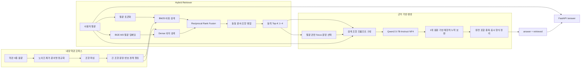
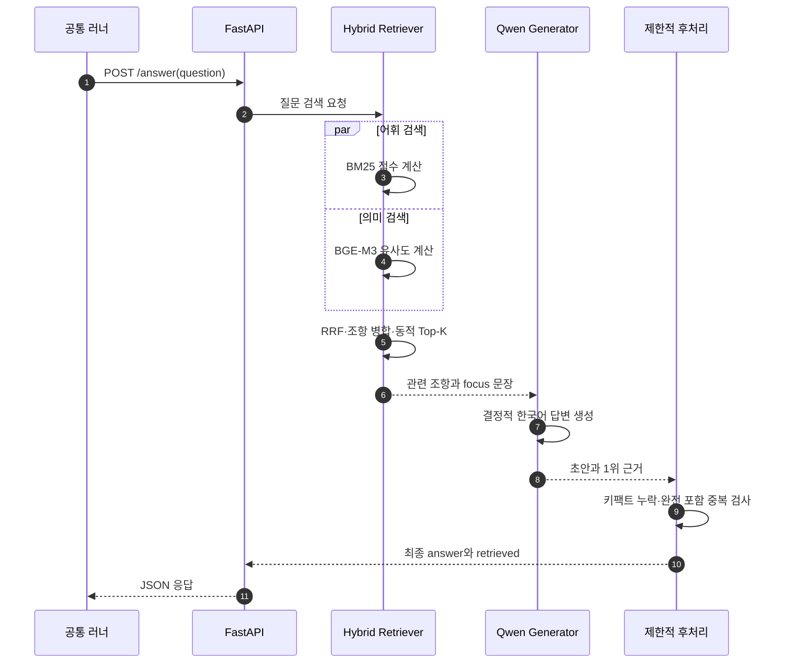

# 팀 10 카카오 약관 RAG 결과기

이 폴더는 카카오 약관 질문에 답하고 사용한 근거 문서·조항을 반환하는 팀 10 결과기를 관리합니다. 학생 평가기는 별도 `../eval_generator/`에서 관리합니다.

## 목표와 평가 기준

결과기는 질문마다 한국어 답변과 최대 4개의 검색 근거를 반환합니다.

```python
def answer_question(question: str) -> dict[str, object]:
    return {
        "answer": "약관 원문에 근거한 답변",
        "retrieved": [["카카오계정 약관", 10]],
    }
```

공식 연습 평가는 MRR 20점, 핵심 내용 F1 30점, 통합 LLM 평가 50점입니다. 응답 시간은 기록되지만 예선 점수에는 직접 반영되지 않아 검색 정확도, 키팩트 보존, 환각 방지와 실행 안정성을 우선했습니다.

## 폴더 구조

```text
result_generator/
├── README.md
├── src/
│   ├── source.ipynb          # 현재 개발 소스
│   ├── source_original.ipynb # 운영진 원본, 수정 금지
│   └── version.md            # 실험별 변경·비교·점수·한계
├── result/
│   ├── result_generator_10.ipynb # 실행·제출 후보
│   └── answers_public_10.json    # 현재 공개 답변
├── resource/
│   ├── info.md
│   ├── gold_questions_public10.json
│   ├── kakao/                # 기준 약관 4종
│   └── answer/               # 실험 답변과 practice 결과
└── 제출용/                   # 단계별 제출본 보존
```

프로젝트 전체 일자별 회고는 결과기 폴더 밖의 `../daily/`에서 관리합니다.

## 기준 약관

운영진이 제시한 문서명과 시행일을 바탕으로 팀이 원문을 찾아 검증했습니다.

| 약관 | 기준 시행일 |
|---|---:|
| 카카오계정 약관 | 2026-05-29 |
| 카카오 위치정보 이용약관 | 2026-07-16 |
| 카카오 통합서비스약관 | 2026-05-29 |
| 카카오 통합 약관 | 2022-08-25 |

메뉴, URL, 클릭형 부가 콘텐츠 등 출제 조항이 아닌 노이즈를 제거하고 문서명·조번호·제목·본문으로 정형화했습니다. 제출 노트북에서는 정제 코퍼스를 내장해 외부 경로나 Google Drive에 의존하지 않습니다.

## RAG 처리 흐름

```text
내장 약관 코퍼스
  → 조항 파싱 및 긴 조항 청킹
  → BM25 어휘 검색 + BGE-M3 의미 검색
  → RRF 순위 결합
  → 동일 조항 병합 및 동적 Top-K
  → 질문 관련 focus 문장 선택
  → Qwen2.5-7B-Instruct 생성
  → 제한적 누락 보완
  → 중복·표시 형식 정리
  → answer + retrieved 반환
```

### 전체 아키텍처



이 구조에서 검색기는 답을 생성하지 않고 근거 후보만 정렬합니다. 생성기는 선택된 근거 안에서 답을 만들고, 후처리는 1위 원문에 실제로 존재하는 누락 정보만 제한적으로 보완합니다.

### 요청 한 건의 실행 순서



### Retriever

- BM25는 같은 명사·수치·법률 표현 검색에 사용합니다.
- BGE-M3는 표현이 다른 의미 유사 질문을 보완합니다.
- 서로 다른 검색 점수는 직접 합산하지 않고 RRF로 결합합니다.
- 같은 문서·조번호의 여러 청크는 하나로 병합합니다.
- 1위 대비 점수가 낮은 후보를 제거하는 동적 Top-K를 사용합니다.
- 선택적 CrossEncoder 리랭커는 T4 메모리와 지연 비용 때문에 기본 비활성화 상태입니다.

### Generator

- Qwen2.5-7B-Instruct를 NF4 4비트로 로드합니다.
- 샘플링을 끈 결정적 생성을 사용합니다.
- 검색 조항과 질문 관련 focus 문장을 함께 전달합니다.
- 핵심 명사·수치·기간·조건·예외·법적 효과를 원문 표현에 가깝게 보존합니다.
- 질문의 전제가 원문과 반대일 때 약관 결론을 우선합니다.

### 누락 및 중복 보완

1위 근거 원문을 다시 검사해 답변에 없는 중요 법적 효과가 있을 때만 한 문장을 제한적으로 보완합니다. 문항 ID나 공개 정답 번호는 사용하지 않습니다. 실험 40에서는 짧은 문장이 더 긴 문장 안에 완전히 포함되는 경우에만 중복 문장을 제거하며 의미 유사도만으로 문장을 삭제하지 않습니다.

## 현재 기준선

| 실험 | MRR | F1 | LLM | 총점 | 핵심 변경 |
|---|---:|---:|---:|---:|---|
| 24 | 1.0000 | 0.6622 | 96.650 | 88.191 | focus 원문 강조 |
| 28 | 1.0000 | 0.6785 | 97.850 | 89.279 | 누락 원문 제한 보완 |
| 37 | 1.0000 | 0.7652 | 98.150 | 92.032 | 자연스러운 단일 문단 출력 |
| 39 | 1.0000 | 0.8080 | 99.350 | **93.915** | P07·P10 핵심 효과 보완 |
| 40 | 1.0000 예상 | 공식 평가 미확인 | 공식 평가 미확인 | 공식 평가 미확인 | P02 완전 포함 중복 제거 |

공식 최고 확정값은 실험 39의 93.915점입니다. 학생 평가기의 약관 원문 기반 시험에서는 실험 40이 실험 39보다 약 0.6444점 높았지만 이는 공식 결과기 점수가 아니므로 별도로 구분합니다.

## Colab 실행

1. T4 GPU 런타임을 새로 시작합니다.
2. `result/result_generator_10.ipynb`를 엽니다.
3. 1번 셀에서 패키지, 내장 코퍼스, 검색 인덱스, Qwen 모델과 FastAPI를 준비합니다.
4. 2번 공통 러너를 수정하지 않고 실행합니다.
5. 생성된 답변 JSON을 `resource/answer/`에 보관합니다.
6. 공식 practice 결과를 받으면 `src/version.md`에 변경 이유·비교 대상·점수·회귀를 기록합니다.

모델이 이미 메모리에 있는 세션에서 1번 셀을 반복 실행하면 CUDA OOM이 발생할 수 있습니다. 모델 구조를 바꿀 때는 새 런타임을 사용하고, 단순 러너 재실행은 기존 서버를 재사용합니다.

## 개발 원칙

- `src/source_original.ipynb`는 수정하지 않습니다.
- 공통 러너 영역은 경로나 계약을 바꾸지 않습니다.
- 공개 QID와 공개 문항 수를 구현 조건으로 하드코딩하지 않습니다.
- 한 실험에서 가능한 한 핵심 변수 하나를 변경합니다.
- 사용자에게서 받은 Colab 결과만 공식 측정값으로 기록합니다.
- 실패와 회귀도 `src/version.md`에 남깁니다.
- 자세한 대회 규칙은 `resource/info.md`, 일자별 회고는 `../daily/`를 참고합니다.
