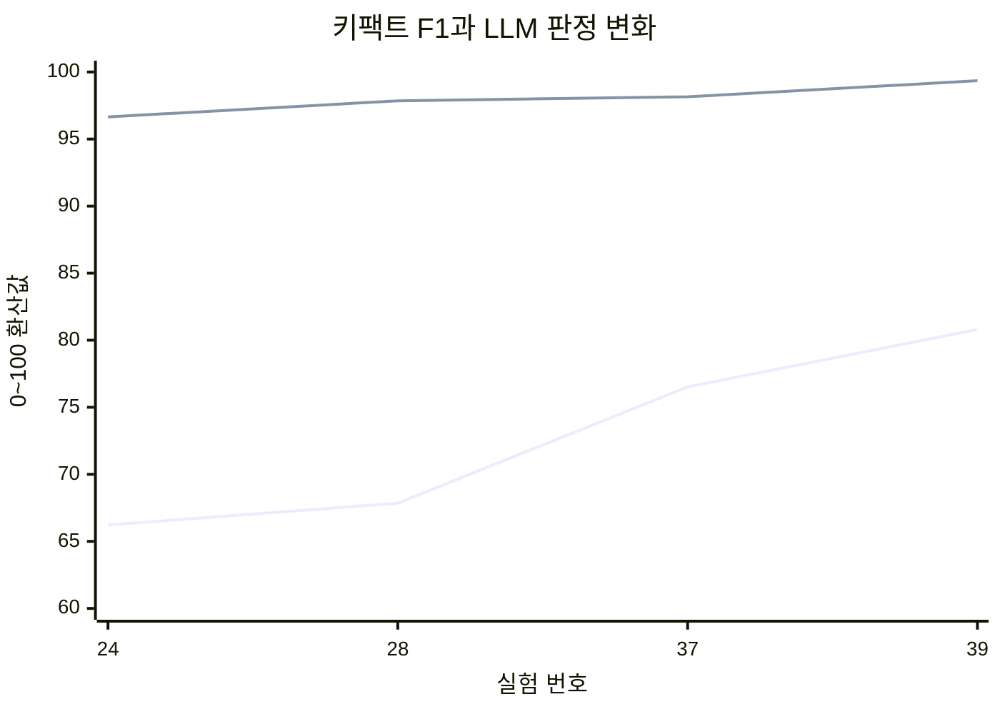
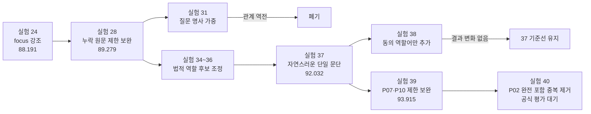

# 팀 10 RAG 결과기 변경 기록

이 문서는 `source.ipynb`의 변경 이유, 비교 대상, 정확도와 응답속도 측정 결과를 버전별로 기록합니다. 실제 실행과 측정은 사용자가 새 Google Colab T4 런타임에서 수행합니다.

## 한눈에 보는 현재 상태

| 구분 | 현재 값 |
|---|---|
| 팀 번호 | 10 |
| 현재 구현 | 실험 40 — 실험 39 + P02 반복 공지 절 제거 |
| 최고 공식 평가 | 실험 39, `93.915 / 100` |
| 공식 최고 MRR | `1.0000 / 1.0000` |
| 공식 최고 키팩트 F1 | `0.8080` |
| 공식 최고 LLM 판정 | `99.350 / 100` |
| 보존 기준선 | `source_37.ipynb` |
| 현재 판단 | 실험 40 평가 전까지 실험 39를 공식 최고 기준선으로 유지 |

> **측정값 표기 원칙:** `공식`은 사용자가 제공한 연습 평가 JSON의 실측값, `예상`은 답변 비교에 따른 가설입니다. 예상값은 공식 점수와 섞어 결론 내리지 않습니다.

## 핵심 버전·실험 요약

| 버전/실험 | 핵심 개선 또는 변경 | 상태 | 총점 | 직전 공식 기준 대비 | 판단 |
|---|---|---:|---:|---:|---|
| v0.1 | 약관 4종을 조 단위로 정형화·압축 내장 | 검증 | 미측정 | 비교 불가 | 검색 기반 확보 |
| v0.2 | BM25 Retriever 독립 기준선 | 검증 | 미측정 | 비교 불가 | 검색 계약 확인 |
| v0.4 | Qwen2.5-7B NF4 생성기 연결 | 검증 | 미측정 | 비교 불가 | T4 생성 기준선 |
| 실험 8 | 동적 Top-K로 불필요한 검색 근거 축소 | 채택 | 미측정 | 비교 불가 | 검색 품질·속도 개선 |
| 실험 9 | 3B FP16으로 모델 축소 | 폐기 | 미측정 | 비교 불가 | P08 정답 역전 |
| 실험 24 | 질문 대응 원문 focus 강조 | 공식 | `88.191` | 최초 공식 기준 | 후속 개선 기준선 |
| 실험 28 | 누락 핵심 원문 1문장 후처리 | 공식 | `89.279` | `+1.088점` (`+1.23%`) | 당시 최고점 |
| 실험 31 | 질문 명사 가중치 | 폐기 | 미측정 | 비교 불가 | P09 관계 역전 |
| 실험 34 | 법적 역할 기반 최소 절 보완 | 보류 | 미측정 | 비교 불가 | 일부 개선·P07 오선택 |
| 실험 35 | focus 축소·내부 후보 확대 | 폐기 | 미측정 | 비교 불가 | 표시 노출·P10 파손 |
| 실험 36 | focus 복원·역할 없는 후보 차단 | 보류 | 미측정 | 비교 불가 | P02·P07 개선, P10 누락 |
| 실험 37 | 줄바꿈·장식 따옴표·목록 번호를 자연스러운 단일 문단으로 정리 | 공식 최고 | `92.032` | 실험 28 대비 `+2.753점` (`+3.08%`) | 확정 기준선 |
| 실험 38 | 동의 효력 역할어만 추가 | 실패 | 37과 동일 예상 | `0점` (`0.00%`) | 결과 변화 없음 |
| 실험 39 | P07 비가입·P10 동의 간주 결론절을 1위 원문에서 제한 보완 | 공식 최고 | `93.915` | 실험 37 대비 `+1.883점` (`+2.05%`) | 최종 후보 채택 |
| 실험 40 | P02 누락 보완 문장의 반복 공지 절만 제거 | 평가 대기 | 미측정 | 실험 39 대비 개선 예상 | P02 단일 변수 검증 |

### 공식 점수 변화

| 비교 | 총점 변화 | 상대 변화율 | MRR 변화 | 키팩트 F1 변화 | LLM 판정 변화 |
|---|---:|---:|---:|---:|---:|
| 실험 24 → 28 | `+1.088점` | `+1.23%` | 만점 유지 | `0.6622 → 0.6785` | `96.650 → 97.850` |
| 실험 28 → 37 | `+2.753점` | `+3.08%` | 만점 유지 | `0.6785 → 0.7652` | `97.850 → 98.150` |
| 실험 37 → 39 | `+1.883점` | `+2.05%` | 만점 유지 | `0.7652 → 0.8080` | `98.150 → 99.350` |
| 실험 24 → 37 | `+3.841점` | `+4.36%` | 만점 유지 | `0.6622 → 0.7652` | `96.650 → 98.150` |
| 실험 24 → 39 | `+5.724점` | `+6.49%` | 만점 유지 | `0.6622 → 0.8080` | `96.650 → 99.350` |

상대 변화율은 `(새 점수 - 기준 점수) / 기준 점수 × 100`으로 계산했습니다. 예선 점수에 포함되지 않는 응답시간은 채택 판단의 보조 자료로만 유지합니다.

### 공식 총점 추이 그래프

```mermaid
xychart-beta
    title "팀 10 공식 연습 총점 추이"
    x-axis "실험 번호" [24, 28, 37, 39]
    y-axis "총점" 86 --> 95
    line [88.191, 89.279, 92.032, 93.915]
```

실험 24부터 39까지 MRR 만점을 유지하면서 총점이 `88.191 → 93.915`로 상승했습니다. 증가분 `5.724점`은 주로 키팩트 누락 감소와 LLM 완결성·명료성 개선에서 발생했습니다.

### 핵심 지표 변화 그래프



첫 번째 선은 키팩트 F1을 100점 척도로 표시한 값이고, 두 번째 선은 LLM 판정 원점수입니다. 실험 37과 39의 총점 상승은 검색 순위 변화가 아니라 핵심 사실 회수율 상승에서 비롯됐음을 보여줍니다.

### 주요 실험 의사결정 흐름



이 흐름은 모든 변경이 누적 채택된 것이 아니라 회귀가 확인된 가지는 폐기하고, 공식 점수가 확인된 안정 기준선에서 다시 분기했음을 보여줍니다.

## 문서 읽는 순서

1. 위의 `한눈에 보는 현재 상태`에서 최종 후보와 공식 최고점을 확인합니다.
2. `핵심 버전·실험 요약`에서 주요 기술 선택과 성패를 비교합니다.
3. 아래 `버전 요약`과 각 실험 상세 기록에서 변경 근거·실패 원인·Colab 결과를 확인합니다.
4. 측정되지 않은 실험은 예상값이 아니라 상세 기록의 성공·실패 문항으로만 판단합니다.

## 운영 원칙

- 사용자가 **“시작”**이라고 하기 전에는 1번 셀의 결과기 구현을 시작하지 않습니다.
- 노트북은 `1번 셀: 팀 구현` + `2번 셀: 운영진 공통 러너`의 두 셀 구조를 유지합니다.
- 2번 셀은 `_SP_TEAM = "10"` 한 줄 외에는 수정하지 않습니다.
- 변경은 한 번에 핵심 변수 하나를 바꾸는 것을 원칙으로 하여 개선 원인을 설명할 수 있게 합니다.
- 공개 10문항에 하드코딩하지 않고, 같은 결과기가 비공개 30문항에도 일반화되도록 관리합니다.
- 실패, null, 후보 누락, 후보 중복이 없고 반환 형식이 유효한지 항상 확인합니다.

## 고정 계약 체크리스트

- [ ] `answer_question(question: str)` 함수명과 입력 형식 유지
- [ ] 반환값에 문자열 `answer` 포함
- [ ] `retrieved`에 실제 사용 근거를 관련도 순으로 1~4개 포함
- [ ] 문서명은 지정된 네 가지 공식 명칭만 사용하고 조번호는 식별 가능한 형태로 반환
- [ ] 전역 FastAPI `app`, `GET /health`, `POST /answer` 유지
- [ ] 생성형 LLM은 Qwen2.5-Instruct 계열 사용
- [ ] 새 Colab T4에서 위에서 아래로 한 번 실행되는 자기완결형 구성
- [ ] Google Drive, 사전 업로드 파일, 개인 PC 경로, 외부 생성형 LLM API 등에 의존하지 않음
- [ ] 질문과 무관하게 약관 전문을 매번 프롬프트에 넣지 않음
- [ ] 문항 수와 공개 문항 ID를 코드에 고정하지 않음
- [ ] 공통 러너의 답변 JSON 생성·측정·저장 로직을 수정하지 않음

## 평가기준 대응 원칙

모든 실험과 변경 기록은 아래 다섯 평가기준에 직접 답할 수 있어야 합니다.

| 평가기준 | 기록해야 할 핵심 내용 | 증거 |
|---|---|---|
| 개선 목표와 접근 방향 | 기준선의 병목, 목표 지표, 개선 가설, 전체 접근 순서 | 기준선 점수와 목표값 |
| 개선 과정과 기술적 선택 | 실제 변경점, 선택 이유, 검토한 대안과 제외 이유 | 버전 간 설정 차이와 비교표 |
| 실험 설계와 근거 | 독립변수·통제변수, 동일 실행환경, 평가 문항과 반복 횟수 | 재현 가능한 Colab 조건과 측정값 |
| 품질과 속도의 균형에 대한 판단 | 정확도 향상 대비 지연시간·메모리 비용, 최종 채택 기준 | 품질·속도 변화량과 트레이드오프 판단 |
| 실패와 한계, 추가 개선 방향 | 실패 사례, 원인 추정과 확인 여부, 일반화 한계, 후속 실험 | 문항별 오류 분석과 다음 가설 |

측정값이 없는 판단은 사실이 아닌 **가설**로 표시하고, 사용자가 제공한 Colab 결과만 실제 측정값으로 기록합니다.

문제 맥락이 동적이므로 모든 개선이 하나의 시작점에서 출발한다고 가정하지 않습니다. 필요하면 복수 기준선을 독립적인 출발점으로 만들고 동일 조건에서 비교합니다. 전체 평균뿐 아니라 질문 유형과 맥락별 성능을 확인하여, 서로 다른 시작점이나 경로가 각각 어떤 상황에 유리한지 기록합니다.

## 초기~중기 버전 요약 원본

| 버전 | 날짜 | 상태 | 핵심 변경 | 비교 대상 | 정확도/품질 | 응답속도 | 결론 |
|---|---|---|---|---|---|---|---|
| v0.0 | 2026-08-10 | 구현 대기 | 공식 기본 틀과 팀 10 공통 러너 준비 | 해당 없음 | 미측정 | 미측정 | “시작” 입력 대기 |
| v0.1 | 2026-08-10 | 코퍼스 준비 | 기준 약관 4종을 72개 조항으로 정제·압축 내장 | 로컬 파일/URL 의존 방식 | 공개 정답 근거 12/12 존재 확인 | 미측정 | 채택, Retriever 구현 준비 |
| v0.2 | 2026-08-10 | Retriever 독립 구현 | 순수 Python BM25 조항 검색 기준선 | Dense/Hybrid 구현 전 기준점 | 로컬 공개 Hit@1·MRR·Recall@4 각 1.00 | Colab 미측정 | 채택, `answer_question()` 연결 대기 |
| v0.3 | 2026-08-10 | 검색 연결 진단 | BM25 Top-4를 `answer_question()` 반환 계약에 연결 | 미연결 v0.2 | 형식 통과·정답 근거 12/12 | Colab 미측정 | 진단용 채택, Qwen 교체 필요 |
| v0.4 | 2026-08-10 | 생성기 연결 | Qwen2.5-7B-Instruct NF4 4-bit를 BM25 Top-4와 연결 | 3B/7B, BF16/4-bit | 정적 계약 검증 완료·Colab 품질 미측정 | Colab 미측정 | T4 품질 우선 시작점 |
| v0.4.1 | 2026-08-10 | 호환성 정리 | 최신 Transformers 권장 인자 `dtype` 사용 | deprecated `torch_dtype` | 동작 의미 동일 | 재측정 불필요 | 채택 |
| v0.4.2 | 2026-08-10 | 코드 가독성 정리 | 버전 표기 제거·튜닝 파라미터 상단 집중·함수 설명 보강 | 분산된 상수와 버전 마커 | 실행 로직 동일 | 재측정 불필요 | 채택 |
| 실험 1 | 2026-08-10 | Colab 기준선 측정 | Qwen 7B NF4·BM25 Top-4·최대 320 토큰 | 최초 실측 | Retrieval Recall@4 12/12, 응답 10/10 생성 | P50 18.8879초, P95 32.8281초 | 검색 유지, 누락·속도 개선 |
| 실험 2 | 2026-08-10 | Colab 측정·보류 | 복수 요구 확인·예/아니오 결론·기준 시행일·최대 192 토큰 | 실험 1 | Recall@4 12/12, P03·P10 절단·P08 모순 | P50 18.1527초, P95 24.7992초 | 속도 개선이나 품질 실패 |
| 실험 3 | 2026-08-10 | Colab 측정·보류 | 256 토큰·미완성 문장 이어쓰기·사실판단 지침·모순/추측 억제 | 실험 1·2 | Recall@4 12/12, P08 해소, P03·P05·P09·P10 문제 | P50 15.9081초, P95 33.2430초 | OOM 없이 완주, 품질 보류 |
| 재실행 메모리 보완 | 2026-08-10 | 코드 반영 | 동일한 GPU Qwen·토크나이저 재사용 | 재실행 중 중복 로드 OOM | 생성 품질 변경 없음 | 재로드 시간 제거 | 설정 변경 시에만 해제·재로드 |
| 동시 생성 OOM 보완 | 2026-08-10 | 코드 반영 | Cell 2 동시 요청은 유지하고 GPU `generate()`만 잠금 직렬화 | 동시 2개 생성 중 18MiB 할당 실패 | 생성 로직 동일 | 지연 재측정 필요 | 안정성 우선 |
| 실험 4 (3B) | 2026-08-10 | Colab 측정·폐기 | `Qwen2.5-7B-Instruct`→`Qwen2.5-3B-Instruct` | 7B 실험 3 | P08 오답·P04/P10 환각·반복 | P50 16.5659초, P95 35.1248초 | 7B로 복귀 |
| 실험 5 | 2026-08-10 | Colab 측정·폐기 | 질문의 명시적 목록 개수 추출·번호 목록 완성 검증 | 7B 실험 3 | P03이 내용 없는 `5.`로 종료 | P50 15.8522초, P95 31.2697초 | 빈 번호를 완성으로 오판 |
| 실험 6 | 2026-08-10 | Colab 측정·조건부 채택 | 빈 번호 제외·목록 미완성은 토큰 한도와 무관하게 이어쓰기 | 실험 5·3 | P03 5개 완성, 다른 9문항 동일, 5번 부연 환각 | P50 15.7908초, P95 34.3614초 | 목록 완성 유지·부연 억제 필요 |
| 실험 7 | 2026-08-10 | Colab 측정·채택 | 목록형 근거 제한·항목당 원칙적 1문장·필요 시만 추가 문장 | 실험 6 | P03 5개 유지·근거 반대 부연 제거·다른 9문항 동일 | P50 15.8175초, P95 33.8132초 | 품질 개선·P95 소폭 개선으로 채택 |
| 실험 8 | 2026-08-10 | Colab 측정·채택 | BM25 1위 점수의 50% 이상만 선택하는 동적 Top-1~4 | 실험 7 고정 Top-4 | Hit@K 10/10·정답 근거 12/12 유지, P05 개선 | P50 13.2017초, P95 28.4032초 | 검색 품질 유지·속도 개선으로 채택 |
| 실험 9 | 2026-08-10 | Colab 측정·조건부 유지 | Qwen2.5-3B-Instruct 비양자화 FP16 | 실험 8의 7B NF4·실험 4의 3B NF4 | Recall 12/12 유지, P08 정답 역전·P10 효력 불완전 | P50 8.9035초, P95 12.9687초 | 3B FP16 유지 후 프롬프트 품질 보완 |
| 실험 10 | 2026-08-10 | Colab 측정·폐기 | 판단형의 근거 요약→마지막 결론 순서 | 실험 9 공통 프롬프트 | P08 교정, P05·P10 미해결·전역 출력 회귀 | P50 8.5062초, P95 19.0600초 | 가설은 지지됐으나 범위·장황성 실패 |
| 실험 8 복귀 | 2026-08-10 | 코드 반영 | 7B NF4·실험 8 전역 프롬프트 복원 | 실험 9·10의 3B FP16 | 실험 8 기준 MRR 1.00·Recall 12/12·P08 통과 | 실험 8 기준 P50 13.2017초, P95 28.4032초 | 예선 품질 점수 우선 안전 기준선 |
| 실험 11 | 2026-08-10 | Colab 측정·전체 폐기 | URL 제거·복합 요구·한정어·사용 근거 선별·보수적 리랭킹 | 실험 8 복귀본 | MRR 1.00 유지·P08 결론 오류·P10 영구 효력 환각 | P50 12.8442초, P95 29.4901초 | URL·근거선별만 성공, 프롬프트 폐기 필요 |
| 계측 로그 정리 | 2026-08-10 | 코드 정리 | RAG 단계·합계 타이머와 출력 제거 | 실험 11 코드 | 답변·검색 로직 변경 없음 | 이후 세부 단계 미출력 | 원래 준비 로그와 고정 영역 유지 |
| 실험 12 | 2026-08-10 | Colab 측정·폐기 | 팀 12 평가 기반 키팩트 포함·부연 억제 프롬프트 | 실험 11 | MRR 1.00 유지·P08 모순 지속·P10 영구 효력 환각 | P50 13.0514초, P95 30.4452초 | 품질 실패·근거 선별 적용 여부 점검 필요 |
| 실험 13 | 2026-08-10 | Colab 재측정·폐기 | 실험 12 계열 재실행 | 실험 12 | P08 모순 동일·P10 영구 효력 환각 재현 | P50 13.0423초, P95 29.8864초 | 프롬프트 실패 재현, 즉시 부분 롤백 필요 |

---

## v0.0 — 작업공간 초기화

### 변경 내용

- 운영진 배포 노트북을 `source.ipynb`로 준비했습니다.
- 2번 셀의 팀 식별자만 `10`으로 설정했습니다.
- 1번 셀의 `answer_question()`은 `NotImplementedError` 상태를 유지했습니다.

### 선택 이유

- 사용자가 “시작”이라고 하기 전에는 실제 결과기 구현을 시작하지 않기로 했기 때문입니다.
- 공통 러너를 임의로 재작성하지 않고 운영진 원문을 보존하기 위해서입니다.

### 비교 대상

- 운영진 배포 원본과 비교: 2번 셀의 `_SP_TEAM` 한 줄만 변경했습니다.

### Colab 테스트 결과

- 실행 환경: 미실행
- 형식 검사: 미실행
- 정확도/총점: 미측정
- 정답 근거 검색 지표: 미측정
- 성공/실패 문항: 미측정
- 평균 응답시간: 미측정
- P50 응답시간: 미측정
- P95 응답시간: 미측정
- 처리량(req/s): 미측정
- 비고: 실제 결과기 미구현 상태이므로 실행하지 않음

### 판단

- 유지. 사용자의 “시작” 입력 후 v0.1 기준선을 구현합니다.

---

## v0.1 — 출제 기준 약관 코퍼스 내장

### 1. 개선 목표와 접근 방향

- 관찰한 기준선 병목: `source.ipynb`에 검색 가능한 약관 데이터가 없고, 로컬 `result_generator/resource/kakao` 경로는 새 Colab에서 사용할 수 없습니다.
- 개선 목표와 목표 지표: 공식 문서명과 조번호가 붙은 조항 단위 코퍼스를 만들고 공개 골드의 모든 정답 근거가 존재하도록 합니다.
- 개선 가설: 정확한 출제 기준 원문을 조항 단위로 구조화하면 이후 Retriever의 검색 오류와 원문 누락을 분리해 측정할 수 있습니다.
- 전체 접근 방향에서 이번 실험의 위치: Retriever와 생성 모델을 연결하기 전 데이터 기반을 고정하는 단계입니다.

### 2. 개선 과정과 기술적 선택

- 변경한 구성/설정:
  - 네 약관의 목차·부록·메뉴 노이즈를 제외하고 본문 조항만 추출했습니다.
  - `카카오계정 약관` 17개, `카카오 위치정보 이용약관` 16개, `카카오 통합서비스약관` 18개, `카카오 통합 약관` 21개로 총 72개 조항을 구성했습니다.
  - 각 조항을 `document_name`, `article_no`, `title`, `text` 필드로 구조화했습니다.
  - JSON을 zlib 레벨 9로 압축하고 Base85 문자열로 변환해 1번 셀에 내장했습니다.
  - 실행 시 SHA-256, 공식 문서명, 조번호 중복, 빈 제목·본문과 문서별 조항 수를 검증합니다.
  - 전체 복원 데이터는 `DOCUMENTS`, `(문서명, 조번호)` 조회는 `DOCUMENT_BY_KEY`로 제공합니다.

#### 원문 정형화 규칙

1. 텍스트 원문은 UTF-8로 읽고 PDF 원문은 페이지별 텍스트를 추출했습니다.
2. 모든 문자열을 Unicode NFC로 정규화했습니다.
3. PDF 추출 결과에 포함된 NUL(`\x00`) 문자를 공백으로 바꿨습니다.
4. PDF 시각적 줄바꿈 때문에 한글 단어가 중간에서 분리된 경우 `한글 + 줄바꿈 + 한글` 패턴을 결합했습니다.
5. 연속된 줄바꿈·탭·공백은 하나의 공백으로 축약했습니다.
6. 제목의 `・` 기호는 `·`로 통일했습니다.
7. 계정약관 앞부분에서 본문보다 먼저 반복되는 목차의 제1조~제17조 시퀀스는 제외하고, 실제 본문 시퀀스를 선택했습니다.
8. 위치정보 약관은 제16조 뒤 `<시행일자>` 이전까지만 본문으로 사용하고, 시행일 이후 사업자 목록 등의 부록은 제외했습니다.
9. PDF 약관은 마지막 조항 뒤 `공고일자` 이전까지만 사용했습니다.
10. 2022년 `카카오 통합 약관`은 PDF 내부의 정확한 21개 조 제목을 기준으로 경계를 잡아 본문 중 다른 조항을 인용한 표현을 새 조항으로 오인하지 않게 했습니다.

#### 구조화 및 청킹 규칙

- 현재 v0.1의 검색 단위는 **조항 1개 = 청크 1개**입니다.
- 한 조항을 항·호 단위로 더 잘게 나누지 않았습니다.
- 서로 다른 조항을 하나의 청크로 합치지 않았습니다.
- 청크 overlap은 사용하지 않았습니다.
- 각 청크의 `text`에는 `제N조 (조 제목)`을 앞에 붙이고 해당 조항의 전체 본문을 포함했습니다.
- 메타데이터는 공식 반환 문서명인 `document_name`, 정수 조번호 `article_no`, 조 제목 `title`을 유지했습니다.
- 현재 조항 길이는 동일하게 자르지 않는 가변 길이입니다. 긴 조항의 세부항 청킹은 이후 별도 시작점으로 비교합니다.

#### 압축 및 복원 규칙

1. 72개 조항 목록을 UTF-8 JSON으로 직렬화했습니다.
2. JSON 구분자의 불필요한 공백을 제거해 원본 크기를 줄였습니다.
3. zlib 압축 레벨 9로 압축했습니다.
4. 압축 바이트를 Python 코드에 안전하게 넣기 위해 Base85 문자열로 인코딩했습니다.
5. Base85 문자열을 1번 셀의 `_EMBEDDED_CORPUS_B85`에 포함했습니다.
6. 실행 시 Base85 디코딩 → zlib 압축 해제 → UTF-8 JSON 파싱 순서로 `DOCUMENTS`를 복원합니다.
7. 압축 전 JSON의 SHA-256은 `8979b69942a1c25b2999b085571807d4b9e925073e8dd3274b782e84865215a5`이며, 실행 시 동일한지 검사합니다.
8. 복원 후 공식 문서명, 양의 정수 조번호, 중복 키, 빈 제목·본문과 문서별 조항 수를 다시 검사합니다.
- 변경하지 않고 통제한 구성/설정: `answer_question()`과 FastAPI 연결 코드는 아직 변경하지 않았고 Retriever·Qwen도 추가하지 않았습니다. `source_original.ipynb`는 수정하지 않았습니다.
- 선택한 기술: 조항 단위 구조화 + zlib 압축 + Base85 인코딩 + SHA-256 무결성 검사.
- 선택 이유: 별도 파일, Google Drive, 개인 경로와 실행 중 네트워크에 의존하지 않는 자기완결형 노트북을 만들기 위해서입니다.
- 비교한 대안과 예상 장단점:
  - 공개 URL 다운로드: 소스는 작지만 URL 변경·사이트 장애·출제일 이후 원문 교체 위험이 있습니다.
  - PDF 바이너리 내장: 원문 보존은 쉽지만 노트북이 커지고 실행 때 PDF 파서가 추가로 필요합니다.
  - 정제 텍스트 내장: 소스가 약간 커지지만 파서 의존성과 네트워크 위험이 없고 검색 인덱스를 즉시 만들 수 있습니다.
- 대안을 선택하지 않은 이유: 평가 실행 실패 위험과 불필요한 초기 처리시간을 줄이기 위해 정제 텍스트 내장을 선택했습니다.
- 구현 중 발생한 주요 문제와 해결 과정:
  - 계정약관에 목차 조항명이 중복되어 본문보다 앞의 짧은 목차 시퀀스를 제외했습니다.
  - 위치정보 약관의 시행일 이후 부록을 검색 코퍼스에서 제외했습니다.
  - PDF의 NUL 문자와 단어 중간 줄바꿈을 정규화했습니다.
  - 처음 확보한 2022년 PDF는 제10조가 `유료 서비스의 이용`인 다른 약관이었습니다. 공개 골드 P09와 불일치를 발견해 카카오 공식 아카이브의 `카카오 통합 약관` 2022-08-25 시행본으로 교체하고 제3·10·13조의 핵심 내용을 다시 확인했습니다.

### 3. 실험 설계와 근거

- 독립변수: 약관을 외부 파일로 두는 상태에서 조항 단위 압축 내장 코퍼스로 변경했습니다.
- 통제변수: 함수 계약, FastAPI 경로, 생성 모델과 검색 방식은 변경하지 않았습니다.
- 실행 환경: 로컬 정적 검증 완료, Colab T4 미실행.
- 평가 데이터와 문항 수: 공개 10문항의 `gold_articles` 12개 문서·조번호 쌍.
- 성공 판정: 네 문서의 조항 번호가 중복 없이 모두 존재하고 공개 정답 근거 12개가 전부 `DOCUMENT_BY_KEY`에 존재해야 합니다.
- 이 설계의 근거: Retriever를 추가하기 전에 검색 대상의 누락과 잘못된 원문을 제거해야 이후 검색 지표를 올바르게 해석할 수 있습니다.

### 4. Colab 테스트 결과

| 지표 | 기준 버전 | 현재 버전 | 변화량 |
|---|---:|---:|---:|
| 구조화 조항 수 | 0 | 72 | +72 |
| 공개 정답 근거 존재 수 | 0/12 | 12/12 | +12 |
| 중복 `(문서명, 조번호)` | 미측정 | 0 | - |
| 원본 JSON 크기 | - | 128,973 bytes | - |
| Base85 압축 데이터 크기 | - | 38,768 chars | - |
| 정확도/총점 | 미측정 | 미측정 | - |
| Retrieval Recall@4 | 미측정 | 미측정 | - |
| 평균/P50/P95 응답시간 | 미측정 | 미측정 | - |

### 5. 품질과 속도의 균형에 대한 판단

- 품질 변화: 아직 Retriever가 없어 답변 품질은 측정하지 않았지만, 공개 정답 근거의 데이터 존재 여부는 12/12로 확인했습니다.
- 속도 변화: zlib 복원과 JSON 파싱만 추가되며 Colab 실측은 아직 없습니다.
- 메모리·안정성 변화: 압축 데이터가 노트북에 포함되어 소스 크기는 증가하지만 네트워크와 로컬 파일 의존성을 제거했습니다.
- 판단: 수십 KB의 압축 문자열 증가보다 평가 환경에서 원문 확보 실패를 방지하는 안정성 이득이 더 큽니다.

### 6. 문항별 관찰과 실패 분석

- 공개 P08의 `카카오 통합 약관 제3조`에서 세부지침 우선 규정을 확인했습니다.
- 공개 P09의 `카카오 통합 약관 제10조`에서 전 세계적·영구적 라이선스와 탈퇴 후 존속 내용을 확인했습니다.
- 공개 P02의 `카카오 통합 약관 제13조`에서 2시간 이상 복구 지연 시 공지 내용을 확인했습니다.
- 실패 원인: 시행일만 같은 다른 2022년 `카카오 통합서비스약관`을 처음 사용해 공개 골드 조번호와 내용이 어긋났습니다.
- 해결: 문서 시행일뿐 아니라 공개 골드의 조 제목과 핵심 사실까지 교차 검증해 공식 아카이브 문서로 교체했습니다.

### 7. 한계와 추가 개선 방향

- 현재는 조항 전체가 검색 단위이며 긴 조항 내부의 세부 항목 청킹 여부는 비교하지 않았습니다.
- PDF 추출 과정의 띄어쓰기 정규화가 모든 문장에 완벽한지는 Retriever 실험에서 추가 확인해야 합니다.
- 공개 정답 조항이 존재한다는 것만 검증했으며 실제 검색 순위는 아직 측정하지 않았습니다.
- 다음 실험: BM25 기준선을 구현하고 공개 10문항의 Hit@1, MRR, Recall@4를 측정합니다.

### 8. 최종 판단

- [x] 채택
- [ ] 보류
- [ ] 폐기
- 결정 이유: 자기완결형 코퍼스와 공개 정답 근거 100% 존재 조건을 충족했습니다.
- 다음 실험: v0.2 BM25 Retriever 기준선.

---

## v0.2 — BM25 Retriever 독립 기준선

### 1. 개선 목표와 접근 방향

- 실험 경로 또는 시작점 ID: `R-BM25-ARTICLE-v0.2`
- 실험 유형: 복수 시작점 중 첫 번째 독립 Retriever 기준선입니다.
- 관찰한 기준선 병목: v0.1에는 검색 가능한 코퍼스만 있고 질문을 관련 조항으로 연결하는 검색기가 없습니다.
- 개선 목표: 외부 검색·형태소 분석 서비스 없이 재현 가능한 조항 검색기를 만들고 공개 10문항에서 Hit@1, MRR, Recall@4를 측정합니다.
- 개선 가설: 약관 질문과 조항은 핵심 법률 용어·숫자·서비스명이 직접 겹치는 경우가 많아 BM25가 빠르고 설명 가능한 강한 기준선이 될 수 있습니다.

### 2. 개선 과정과 기술적 선택

- 선택 기술: 순수 Python BM25Okapi.
- 파라미터: `k1=1.5`, `b=0.75`, 기본 `top_k=4`.
- 검색 대상: v0.1의 조항 단위 청크 72개.
- 검색 텍스트: `공식 문서명 + 조 제목 + 조항 전체 본문`.
- 토큰화: 소문자 변환 후 정규식 `[가-힣]+|[a-z0-9]+`으로 한글 어절과 영문·숫자를 추출합니다.
- 질의 중복 토큰은 집합으로 처리해 같은 단어 반복으로 점수가 과도하게 증가하지 않게 했습니다.
- IDF: `log(1 + (N-df+0.5)/(df+0.5))` 형태를 사용합니다.
- 동점일 때 문서명과 조번호 순으로 정렬해 결과를 재현 가능하게 했습니다.
- 독립 검색 진입점은 `retrieve_articles(question, top_k=4)`입니다.
- `answer_question()`은 의도적으로 연결하지 않고 `NotImplementedError` 상태를 유지했습니다.
- 선택 이유: 설치 비용과 모델 로딩 없이 즉시 실행되며, 이후 Dense·Hybrid·세부항 청킹 시작점과 비교하기 쉬운 설명 가능한 기준선입니다.
- 비교 대안:
  - Dense embedding: 의미적 표현 변화에 강하지만 모델 다운로드·GPU/CPU 비용이 추가됩니다.
  - Hybrid: 더 높은 일반화 가능성이 있지만 BM25와 Dense 각각의 기여를 먼저 분리 측정해야 합니다.
  - 형태소 분석 BM25: 한국어 토큰 품질을 높일 수 있지만 패키지 설치·사전 로딩 비용과 Colab 호환성을 확인해야 합니다.

### 3. 실험 설계와 근거

- 비교 시작점: `v0.1 검색기 없음` 대비 `R-BM25-ARTICLE-v0.2`.
- 독립변수: BM25 검색기 추가.
- 통제변수: 코퍼스, 조항 청킹, 공식 문서명, 공개 질문 원문과 `top_k=4`.
- 평가 데이터: `gold_questions_public10.json`의 공개 10문항과 정답 문서·조번호 12쌍.
- 지표:
  - Hit@1: 첫 검색 결과가 정답 조항인지
  - Hit@4: Top-4에 정답 조항이 하나 이상 있는지
  - MRR: 최초 정답 조항 순위의 역수 평균
  - Macro Recall@4: 문항별 전체 정답 조항 중 Top-4에서 찾은 비율의 평균
- 다중 근거 문항 P02는 세 정답 조항을 모두 Top-4에서 찾아야 Recall@4 1.00으로 판정했습니다.
- 이 테스트는 생성 모델과 FastAPI를 제외한 Retriever 독립 로컬 진단입니다. Colab 결과기 품질·응답속도 측정으로 간주하지 않습니다.

### 4. 로컬 Retriever 테스트 결과

| 지표 | 결과 |
|---|---:|
| 평가 문항 | 10 |
| 정답 문서·조번호 쌍 | 12 |
| Hit@1 | 1.00 |
| Hit@4 | 1.00 |
| MRR | 1.00 |
| Macro Recall@4 | 1.00 |
| Top-4에서 찾은 정답 쌍 | 12/12 |

- P02 검색 순위: `카카오 통합 약관 제13조` → `카카오계정 약관 제8조` → `카카오 통합서비스약관 제7조`로 세 정답 근거가 Top-3에 모두 포함되었습니다.
- 나머지 9문항도 첫 번째 검색 결과가 공개 정답 조항과 일치했습니다.
- Colab 정확도·답변 품질·P50·P95·처리량: 미측정.

### 5. 품질과 속도의 균형에 대한 판단

- 공개 검색 품질은 포화값이지만 공개 10문항에만 대한 결과이므로 비공개 일반화를 보장하지 않습니다.
- 순수 Python과 72개 조항만 사용해 초기화·검색 비용이 작고 외부 패키지 설치가 없습니다.
- 생성 모델이 아직 없으므로 전체 응답속도에 대한 판단은 보류합니다.
- Dense 또는 reranker를 추가할 때는 공개 점수가 이미 1.00이므로 비공개 일반화 기대 이득과 모델 로딩·추론 비용을 근거로 판단해야 합니다.

### 6. 문항별 관찰과 실패 분석

- `basic`, `exact`, `trap` 공개 유형 모두 Hit@1 1.00이었습니다.
- P08처럼 동일한 `약관 외 준칙` 조 제목이 여러 문서에 존재해도 질문의 `카카오 통합 약관` 표현이 올바른 문서를 1위로 올렸습니다.
- 현재 공개 실패 사례는 없지만 이는 데이터가 적고 질문과 원문 용어가 직접 겹치는 영향일 수 있습니다.
- 잠재 실패: 비공개 질문에서 동의어·구어체·간접 표현을 사용하면 단순 어절 BM25의 재현율이 낮아질 수 있습니다.

### 7. 한계와 추가 개선 방향

- 공개 10문항에 대한 완벽한 결과는 비공개 30문항의 완벽한 결과를 의미하지 않습니다.
- 한국어 조사·활용을 분리하지 않아 표현 변화에 민감할 수 있습니다.
- 긴 조항 내부의 관련 문장이 희석될 수 있습니다.
- 다음 시작점 후보: 문자 n-gram BM25, 항·호 단위 BM25, Dense embedding, BM25+Dense Hybrid.
- 다음 단계: 검색 결과를 먼저 검토한 뒤 별도 버전에서 `answer_question()`과 Qwen 생성 단계에 연결합니다.

### 8. 최종 판단

- [x] 채택
- [ ] 보류
- [ ] 폐기
- 결정 이유: 공개 검색 지표가 모두 1.00이며 매우 가볍고 설명 가능한 기준선입니다.
- 연결 상태: Retriever 독립 구현 완료, `answer_question()` 미연결.

---

## v0.3 — `answer_question()` 검색 연결 진단 기준선

### 1. 개선 목표와 접근 방향

- 실험 경로 또는 시작점 ID: `A-EXTRACTIVE-BM25-v0.3`
- 개선 목표: v0.2 Retriever를 고정 진입점 `answer_question(question: str)`에 연결하여 검색·반환 형식·FastAPI 연결 전 단계를 검증합니다.
- 개선 가설: 생성 모델을 추가하기 전에 검색 결과와 반환 계약을 연결하면 이후 오류를 Retriever, 생성기, 서버 계층으로 분리할 수 있습니다.
- 중요 상태: 이 버전은 Qwen2.5-Instruct가 없는 **개발 진단용 기준선**이며 최종 제출용 결과기가 아닙니다.

### 2. 개선 과정과 기술적 선택

- `answer_question()`이 입력 문자열을 검증한 뒤 `retrieve_articles(question, top_k=4)`를 호출하도록 연결했습니다.
- 검색된 네 조항의 공식 문서명과 정수 조번호를 관련도 순으로 `retrieved`에 반환합니다.
- `retrieved`에 포함한 모든 조항을 진단용 `answer` 문자열에도 실제 포함해 “실제 답변에 사용한 근거” 계약을 맞췄습니다.
- 생성 모델이 없다는 사실을 숨기지 않도록 답변 맨 앞에 `[검색 연결 진단 답변 — Qwen 생성 모델 연결 전]` 표시를 넣었습니다.
- 검색 결과가 없으면 빈 후보를 반환하지 않고 `RuntimeError`로 즉시 실패하게 했습니다.
- 선택 이유: 임의 요약이나 규칙 기반 답변으로 생성 품질을 가장하지 않고, Retriever 연결과 스키마만 독립 검증하기 위해서입니다.
- 비교 대안:
  - Top-1만 답변에 사용: 짧지만 P02처럼 복수 근거가 필요한 질문을 잃습니다.
  - Top-4를 `retrieved`에만 쓰고 답변에는 Top-1만 사용: 실제 사용 근거 계약과 어긋납니다.
  - Qwen 즉시 연결: 검색 연결 오류와 모델 로딩·생성 오류가 동시에 발생해 원인 분리가 어려워집니다.

### 3. 실험 설계와 근거

- 독립변수: 독립 Retriever를 `answer_question()` 반환 계약에 연결했습니다.
- 통제변수: 코퍼스, BM25 파라미터, 토큰화, Top-4 순위와 FastAPI 고정 블록.
- 평가 데이터: 공개 10문항.
- 성공 조건:
  - 모든 반환값이 `dict`
  - `answer`가 비어 있지 않은 문자열
  - `retrieved`가 1~4개의 `[문서명, 조번호]`
  - 후보 중복 없음
  - 공개 정답 근거 12쌍이 Top-4에서 유지됨
- 이 테스트는 로컬 함수 단위 검사이며 공통 러너·Colab·Qwen 성능 측정이 아닙니다.

### 4. 로컬 연결 테스트 결과

| 지표 | 결과 |
|---|---:|
| 처리 질문 | 10/10 |
| 반환 스키마 유효 | 10/10 |
| 중복 `retrieved` | 0 |
| 공개 정답 근거 포함 | 12/12 |
| 질문별 `retrieved` 수 | 4 |
| 진단 답변 길이 | 약 1,212~3,942자 |
| Colab 전체 실행 | 미측정 |
| Qwen 답변 품질 | 미측정 |
| P50/P95/처리량 | 미측정 |

### 5. 품질과 속도의 균형에 대한 판단

- Retriever 품질과 반환 안정성을 먼저 확인할 수 있다는 장점이 있습니다.
- 반면 조항 네 개를 그대로 답변에 넣어 답변이 길고 사용자 친화적이지 않습니다.
- 생성 추론이 없어 빠르지만 이 속도는 최종 Qwen 결과기의 속도와 비교할 수 없습니다.
- 따라서 이 버전은 통합 진단용으로만 유지하고 품질 기준선으로 제출하지 않습니다.

### 6. 문항별 관찰과 실패 분석

- P02에서 세 정답 근거가 모두 `retrieved`에 유지되었습니다.
- 공개 10문항 모두 빈 답변, null, 후보 누락과 중복 없이 반환했습니다.
- 실패 또는 한계: 검색된 조항 원문을 그대로 이어 붙이므로 질문에 대한 간결한 결론, 함정 교정과 핵심 사실 중심 답변이 없습니다.

### 7. 한계와 추가 개선 방향

- Qwen2.5-Instruct 계열 생성 모델이 아직 없어 대회의 최종 모델 계약을 충족하지 않습니다.
- Top-4 모두를 항상 생성 문맥으로 쓰는 것이 품질·속도에 최적인지 실험하지 않았습니다.
- 다음 단계에서는 Qwen을 연결하고 선택 조항만 프롬프트에 넣어 답변을 생성합니다.
- Qwen 연결 후 Top-2/3/4 문맥 수, 최대 생성 토큰과 프롬프트 형식을 비교해야 합니다.

### 8. 최종 판단

- [x] 진단용 채택
- [ ] 최종 결과기로 채택
- [ ] 폐기
- 결정 이유: 검색과 반환 계약의 연결을 독립 검증했지만 생성 모델 요건은 아직 충족하지 않습니다.
- 다음 실험: Qwen2.5-Instruct 생성기 연결.

---

## v0.4 — Qwen2.5-7B-Instruct 4-bit 생성기 연결

### 1. 개선 목표와 접근 방향

- 실험 경로 또는 시작점 ID: `G-QWEN2.5-7B-NF4-v0.4`
- 실험 유형: T4 16GB에서 품질을 우선한 생성 모델 시작점입니다.
- 관찰한 기준선 병목: v0.3은 검색 조항을 그대로 이어 붙여 결론·핵심 사실·함정 교정이 없는 진단 답변만 반환합니다.
- 개선 목표: BM25 Top-4 근거만 Qwen2.5-Instruct에 전달해 간결하고 근거 기반인 한국어 답변을 생성합니다.
- 개선 가설: 7B Instruct 모델을 4-bit로 양자화하면 T4 메모리 안에서 3B보다 높은 답변 품질을 기대하면서 BF16 7B의 OOM 위험을 줄일 수 있습니다.

### 2. 모델 크기와 로딩 옵션 선택

#### 선택한 구성

- 모델: `Qwen/Qwen2.5-7B-Instruct`
- 파라미터 수: 공식 모델 카드 기준 7.61B
- 양자화: bitsandbytes NF4 4-bit
- 중첩 양자화: `bnb_4bit_use_double_quant=True`
- 연산 dtype: `torch.float16`
- 장치 배치: 단일 GPU `device_map={"": 0}`
- Attention: PyTorch SDPA
- 입력 상한: 8,192 tokens
- 생성 상한: 320 tokens
- 생성 방식: `do_sample=False` 결정적 생성
- 반복 억제: `repetition_penalty=1.05`
- 캐시: `use_cache=True`
- 패키지 범위: `transformers>=4.46,<5`, `accelerate>=1.0,<2`, `bitsandbytes>=0.45,<1`
- Colab 기본 `torch`는 재설치하지 않습니다.

#### v0.4.1 호환성 보정

- 첫 Colab 로딩에서 ``torch_dtype` is deprecated! Use `dtype` instead!`` 경고를 확인했습니다.
- `AutoModelForCausalLM.from_pretrained()`의 `torch_dtype=torch.float16`을 `dtype=torch.float16`으로 변경했습니다.
- 4-bit 연산 설정인 `bnb_4bit_compute_dtype=torch.float16`은 bitsandbytes의 유효한 별도 옵션이므로 유지했습니다.
- 모델, 양자화 방식과 연산 정밀도는 바뀌지 않으며 경고만 제거하는 호환성 수정입니다.

#### 3B와 7B 비교 근거

| 후보 | 공식 파라미터 | 공식 문맥 길이 | 장점 | 예상 단점 | 판단 |
|---|---:|---:|---|---|---|
| Qwen2.5-3B-Instruct 4-bit | 3.09B | 32,768 | 메모리 여유·빠른 생성 기대 | 복수 근거 종합과 함정 교정 품질이 낮을 수 있음 | 속도 우선 후속 시작점 |
| Qwen2.5-7B-Instruct BF16 | 7.61B | 131,072 | 양자화 손실 없음 | T4 16GB에서 활성값·KV 캐시 여유 부족 | 제외 |
| Qwen2.5-7B-Instruct 4-bit | 7.61B | 131,072 | 7B 품질과 메모리 절감의 균형 | 3B보다 생성 지연 가능 | v0.4 채택 |

- Qwen 공식 A100 벤치마크에서 7B BF16은 입력 6,144에서 GPU 메모리 약 15.38GB, GPTQ-Int4는 약 6.52GB였습니다. 하드웨어와 양자화 구현이 T4+bitsandbytes와 다르므로 이 수치는 T4 실측값이 아니라 메모리 방향을 정하는 참고값으로만 사용했습니다.
- 같은 공식 벤치마크에서 3B GPTQ-Int4는 입력 6,144에서 약 2.67GB였습니다. 따라서 3B는 속도·메모리 우선 비교 시작점으로 유효합니다.
- 7B BF16은 T4 전체 16GB에 너무 근접해 모델 외 활성값과 KV 캐시를 고려하면 위험하므로 제외했습니다.
- GPTQ-Int4 공식 체크포인트도 검토했으나 AutoGPTQ CUDA 확장 호환 실패 시 느린 구현으로 대체될 수 있다는 Qwen 문서의 경고가 있어, Colab에서 설치가 단순한 bitsandbytes 동적 4-bit를 먼저 선택했습니다.
- T4는 BF16 가속보다 FP16이 적합하므로 4-bit 연산 dtype을 FP16으로 설정했습니다.

### 3. RAG 연결 방식과 프롬프트

- `answer_question()`은 BM25에서 Top-4를 검색합니다.
- 각 근거는 `[근거 순위 | 공식 문서명 | 제N조 | 조 제목] + 조항 본문` 형태로 구성합니다.
- 질문을 먼저 배치하고 관련도 순 근거를 이어 붙여 입력이 잘릴 때 낮은 순위 근거부터 손실되도록 했습니다.
- 후보를 하나씩 추가하면서 8,192 tokens 안에 들어오는 근거만 `selected`로 확정합니다.
- Qwen에 실제 전달한 `selected`만 `retrieved`에 반환해 근거 계약을 일치시킵니다.
- 시스템 프롬프트는 다음을 요구합니다.
  - 제공 근거만 사용
  - 숫자·기간·인원·법조문 정확히 유지
  - 복수 하위 질문 누락 방지
  - 잘못된 질문 전제 명시적 교정
  - 근거 밖 추측 금지
  - 결론 우선의 간결한 한국어 답변
- 전체 약관 72개를 생성 모델에 넣지 않고 질문별 선택 근거 최대 4개만 사용합니다.

### 4. 실험 설계와 근거

- 독립변수: v0.3 원문 연결 답변을 Qwen2.5-7B-Instruct NF4 생성 답변으로 교체했습니다.
- 통제변수: 코퍼스, 조항 청킹, BM25 파라미터, Top-4 후보 순위, FastAPI 경로.
- 정적 성공 조건:
  - Qwen2.5-Instruct 계열 모델 ID
  - 4-bit 로딩 설정 존재
  - `answer_question()`이 Retriever와 생성기를 순서대로 호출
  - Qwen에 실제 사용한 근거만 1~4개 반환
  - 빈 생성 결과는 오류로 처리
- Colab 실험 조건:
  - 새 T4 런타임
  - 1번 셀 위에서 아래로 한 번 실행
  - 공통 러너의 공개 10문항과 HTTP 성능 측정
  - 이후 동일 조건에서 3B 4-bit 시작점과 비교

### 5. 현재 검증 결과

| 항목 | 결과 |
|---|---|
| 노트북 Python 문법 | 통과 |
| Qwen2.5-7B-Instruct 모델 ID | 확인 |
| NF4 4-bit·double quant·FP16 설정 | 확인 |
| BM25 → Qwen → 반환 계약 연결 | 확인 |
| FastAPI 함수·경로 존재 | 확인 |
| `source_original.ipynb` 변경 | 없음 |
| Colab 모델 다운로드·로딩 | 미실행 |
| 공개 답변 품질 | 미측정 |
| GPU 메모리 | 미측정 |
| 평균/P50/P95/처리량 | 미측정 |

### 6. 품질과 속도의 균형에 대한 판단

- 현재 선택은 3B보다 답변 품질을 우선하고 BF16 7B보다 실행 안정성을 우선한 중간 지점입니다.
- 7B 4-bit가 T4에서 허용 가능한 속도인지, 3B 대비 실제 품질 이득이 있는지는 Colab 동일 조건 실험 전에는 확정하지 않습니다.
- 입력을 8,192 tokens, 출력을 320 tokens로 제한해 긴 문맥·생성으로 인한 지연과 KV 캐시 증가를 통제했습니다.
- 결정적 생성으로 반복 실험의 변동을 줄이고 샘플링 비용과 환각 가능성을 낮췄습니다.

### 7. 실패 가능성과 추가 개선 방향

- bitsandbytes와 Colab CUDA 조합에 따라 4-bit 로딩 호환 문제가 발생할 수 있습니다.
- 7B 다운로드 시간과 48회 내외의 공통 러너 생성 호출이 전체 실험시간을 늘릴 수 있습니다.
- Top-4의 긴 조항이 모두 필요한 것은 아니므로 문맥 수 2/3/4 비교가 필요합니다.
- 생성 상한 320 tokens가 P03처럼 다섯 항목을 요구하는 질문에 충분한지 확인해야 합니다.
- 다음 비교 시작점:
  - `G-QWEN2.5-3B-NF4`: 속도·메모리 우선
  - `G-QWEN2.5-7B-NF4-CONTEXT3`: 문맥 Top-3로 지연 단축
  - 7B 4-bit에서 출력 192/256/320 tokens 비교

### 8. 최종 판단

- [x] Colab 시험 후보로 채택
- [ ] 최종 결과기로 확정
- [ ] 폐기
- 결정 이유: 공식 메모리 자료상 T4에 여유를 남기면서 7B 품질을 확보할 가능성이 높은 구성입니다.
- 확정 조건: 사용자가 제공하는 Colab 공개 답변 품질, 성공률, GPU 메모리와 P50/P95 결과를 3B 시작점과 비교해야 합니다.

---

## v0.4.2 — 코드 가독성과 튜닝 지점 정리

### 변경 내용

- 실행 코드에서 `v0.1`, `v0.2`, `v0.4` 같은 구현 버전 표기를 제거했습니다. 버전 이력은 이 문서에서만 관리합니다.
- `source.ipynb` 상단에 `한눈에 보는 성능 튜닝 파라미터` 구역을 추가했습니다.
- 검색·모델·양자화·입력 길이·출력 길이·생성 방식 관련 상수를 한곳으로 모았습니다.
- 모든 함수와 `BM25Retriever.__init__()`에 역할, 주요 입력과 반환값을 설명하는 한국어 docstring을 추가했습니다.
- BM25 생성자와 검색 함수가 상단의 `BM25_K1`, `BM25_B`, `RETRIEVAL_TOP_K`를 사용하도록 중복 숫자를 제거했습니다.
- Qwen 생성 옵션도 `MAX_NEW_TOKENS`, `GENERATION_DO_SAMPLE`, `GENERATION_TEMPERATURE`, `GENERATION_REPETITION_PENALTY`에서 가져오도록 정리했습니다.
- 샘플링을 켠 경우에만 `temperature`를 모델에 전달합니다.

### 한눈에 수정할 수 있는 값

| 목적 | 파라미터 | 현재 값 | 비교 후보 |
|---|---|---:|---|
| 단어 반복 영향 | `BM25_K1` | 1.5 | 1.0 / 1.5 / 2.0 |
| 긴 조항 길이 보정 | `BM25_B` | 0.75 | 0.4 / 0.75 / 1.0 |
| Qwen 입력 근거 수 | `RETRIEVAL_TOP_K` | 4 | 2 / 3 / 4 |
| 모델 크기 | `GENERATION_MODEL_ID` | Qwen2.5-7B-Instruct | Qwen2.5-3B-Instruct |
| 4-bit 형식 | `QUANTIZATION_TYPE` | nf4 | 기본 유지 권장 |
| 중첩 양자화 | `USE_DOUBLE_QUANT` | True | True / False |
| 최대 입력 길이 | `MAX_INPUT_TOKENS` | 8192 | 4096 / 6144 / 8192 |
| 최대 답변 길이 | `MAX_NEW_TOKENS` | 320 | 192 / 256 / 320 |
| 샘플링 | `GENERATION_DO_SAMPLE` | False | 정확성 기준 False |
| 샘플링 온도 | `GENERATION_TEMPERATURE` | 0.2 | 샘플링 시에만 적용 |
| 반복 억제 | `GENERATION_REPETITION_PENALTY` | 1.05 | 1.0 / 1.05 / 1.1 |
| 답변 지침 | `_SYSTEM_PROMPT` | 근거 기반·결론 우선 | 프롬프트 실험별 기록 |

### 파인튜닝과 설정 튜닝의 구분

- 위 파라미터를 바꾸는 작업은 검색·추론 설정 튜닝이며 모델 가중치를 학습하지 않습니다.
- 실제 파인튜닝은 학습 데이터, 손실함수, optimizer와 LoRA/QLoRA adapter 학습 과정이 필요합니다.
- 현재 결과기에는 가중치 파인튜닝 코드를 포함하지 않았습니다. 대회 시간·T4 자원·일반화 위험을 고려해 우선 RAG 검색과 프롬프트·추론 설정을 비교합니다.

### 검증

- 노트북 Python 문법 검사 통과
- 모든 함수와 생성자의 docstring 존재 확인
- 실행 코드 내 `v0.` 버전 문자열 0건 확인
- 코퍼스·BM25·Qwen·FastAPI 실행 로직은 유지
- `source_original.ipynb`는 수정하지 않음

---

## 새 버전 기록 템플릿

아래 블록을 복사해 다음 버전을 기록합니다.

### vX.Y — 변경 제목

#### 1. 개선 목표와 접근 방향

- 실험 경로 또는 시작점 ID:
- 단일 기준선 상향 실험인지, 복수 시작점 비교 실험인지:
- 관찰한 기준선 병목:
- 개선 목표와 목표 지표:
- 개선 가설:
- 전체 접근 방향에서 이번 실험의 위치:

#### 2. 개선 과정과 기술적 선택

- 변경한 구성/설정:
- 변경하지 않고 통제한 구성/설정:
- 이 방법을 선택한 근거:
- 기준 버전:
- 비교한 대안과 예상 장단점:
- 대안을 선택하지 않은 이유:
- 구현 중 발생한 주요 문제와 해결 과정:

#### 3. 실험 설계와 근거

- 비교할 시작점과 각 시작점의 정의:
- 시작점을 여러 개 둔 이유:
- 독립변수(이번에 바꾼 것):
- 통제변수(같게 유지한 것):
- 실행 환경(Colab GPU·런타임 등):
- 평가 데이터와 문항 수:
- 워밍업·반복 횟수·동시 요청 수:
- 성공 판정 및 품질 평가 방식:
- 이 설계로 가설을 검증할 수 있는 이유:

#### 4. Colab 테스트 결과

| 지표 | 기준 버전 | 현재 버전 | 변화량 |
|---|---:|---:|---:|
| 정확도/총점 |  |  |  |
| Retrieval Recall@K 또는 근거 적중률 |  |  |  |
| 성공 문항 수 |  |  |  |
| 실패/null/누락/중복 수 |  |  |  |
| 평균 응답시간(s) |  |  |  |
| P50 응답시간(s) |  |  |  |
| P95 응답시간(s) |  |  |  |
| 처리량(req/s) |  |  |  |
| 전체 실행시간(s) |  |  |  |
| GPU 최대 메모리(선택) |  |  |  |

#### 5. 품질과 속도의 균형에 대한 판단

- 품질 변화:
- 속도 변화:
- 메모리·안정성 변화:
- 얻은 품질 대비 지불한 속도 비용:
- 정확도와 속도가 충돌할 때 적용한 우선순위:
- 최종 채택 여부와 정량적 기준:

#### 6. 문항별 관찰과 실패 분석

- 개선된 문항과 이유:
- 악화된 문항과 이유:
- `basic`/`exact`/`trap` 유형별 관찰:
- 시작점별로 유리하거나 불리했던 질문 맥락:
- 모든 맥락에 공통으로 우세한 시작점이 있었는지:
- 잘못 검색된 문서·조항:
- 환각 또는 핵심 사실 누락:
- 실패를 재현했는가:
- 확인된 원인과 아직 추정인 원인:

#### 7. 한계와 추가 개선 방향

- 공개 10문항 기준 결과의 일반화 한계:
- 현재 구조의 기술적 한계:
- 시간·GPU·규정으로 시도하지 못한 사항:
- 다음에 검증할 구체적 가설:
- 기대 효과와 예상 위험:

#### 8. 최종 판단

- [ ] 채택
- [ ] 보류
- [ ] 폐기
- 결정 이유:
- 다음 실험:

---

## 실험 1 — Colab 최초 기준선

### 실험 파일과 구성

- 결과 파일: `result_generator/resource/answer/answers_public_10_1.json`
- 실행 환경: Google Colab T4
- 검색: 순수 Python BM25, `k1=1.5`, `b=0.75`, Top-4
- 생성: Qwen2.5-7B-Instruct, NF4 4-bit, double quantization, FP16 compute
- 최대 생성 길이: 320 tokens
- 성능 프로토콜: 워밍업 2회, 본 측정 12요청×3회, 동시성 2, 3회 중앙값

### 측정 결과

| 지표 | 실험 1 |
|---|---:|
| 공개 문항 응답 생성 | 10/10 |
| Retrieval Hit@4 | 10/10 (100%) |
| 정답 근거 Recall@4 | 12/12 (100%) |
| 성공률 | 12/12 (100%) |
| 실패·타임아웃·문서명 위반 | 0건 |
| Throughput | 0.0912 req/s |
| Wall time | 131.5876초 |
| P50 latency | 18.8879초 |
| P95 latency | 32.8281초 |

### 품질 관찰과 한계

- 검색기는 공개 10문항의 정답 근거를 모두 Top-4 안에 포함했으므로 현재 BM25 설정을 유지합니다.
- P02는 `2시간` 조건은 맞지만 즉시 상황을 파악하고 신속히 복구하려는 부가 내용이 생략됐습니다.
- P10은 서류·첨부·제출·권리 내용은 맞지만, 보호의무자의 동의를 본인의 동의로 본다는 효력이 명시적으로 분리되지 않았습니다.
- P08 결론은 맞지만 함정형 질문에 대해 `아니오.`로 즉시 답하지 않아 명확성을 더 높일 수 있습니다.
- P03·P07의 부가 설명은 공개 정답 핵심 사실 대비 일부 생략됐지만, 질문이 직접 요구한 명칭·제공자·예시는 답했습니다.
- 공개 10문항만으로 전체 30문항의 일반화 성능을 단정할 수 없습니다.

### 판단

- 검색 정확도는 유지 대상입니다.
- 품질 개선은 Retriever 교체보다 복수 요구사항 누락 방지와 함정형 답변 형식에 집중합니다.
- 속도 병목은 생성 단계로 판단하고 최대 생성 길이 320→192를 우선 비교합니다.

---

## 실험 2 준비 — 누락·함정형·속도·시행일 보완

### 변경 내용과 선택 근거

- 복수 요구 누락 방지: 답변 전 대상·조건·숫자·방법·효력을 내부적으로 점검하도록 시스템 지침을 보강했습니다.
- 함정형 명확성: 예·아니오 판단 질문은 첫 문장에서 직접 결론을 밝히도록 했습니다.
- 속도: `MAX_NEW_TOKENS` 320→192. 모델·양자화·Top-4를 통제하여 생성 길이 변경의 효과를 분리합니다.
- 기준 시행일: 네 문서에 대회 기준 시행일을 메타데이터로 부여하고 모델 근거 표시에도 포함했습니다. 인터넷의 현재 최신본이 아니라 대회 지정 기준본을 사용합니다.

### 실험 1과의 통제·비교

- 유지: Qwen2.5-7B-Instruct, NF4 4-bit, BM25 `k1=1.5`, `b=0.75`, Top-4, 코퍼스 본문.
- 변경: 시스템 지침, 최대 생성 토큰, 시행일 메타데이터.
- 성공 기준: Retrieval Recall@4 12/12 유지, P02·P08·P10 명시성 개선, P50/P95 지연 감소, 새로운 핵심 누락 없음.
- Colab 결과: `result_generator/resource/answer/answers_public_10_2.json`.

### 실험 2 측정 결과

| 지표 | 실험 1 | 실험 2 | 변화 |
|---|---:|---:|---:|
| 정답 근거 Recall@4 | 12/12 | 12/12 | 유지 |
| 처리량(req/s) | 0.0912 | 0.1000 | +9.65% |
| Wall time(s) | 131.5876 | 120.0586 | -8.76% |
| P50(s) | 18.8879 | 18.1527 | -3.89% |
| P95(s) | 32.8281 | 24.7992 | -24.46% |
| 실패·타임아웃·문서명 위반 | 0 | 0 | 유지 |

### 실험 2 실패 분석

- P03·P10이 192 토큰 한도에서 문장 중간에 절단됐습니다. P95 개선의 일부는 완성 속도가 아니라 강제 절단에서 얻은 것이므로 순수한 성능 향상으로 채택하지 않습니다.
- P08은 `아니오.`로 시작했지만 후속 설명에서 근거와 반대되는 결론을 생성했습니다.
- P03·P04·P05·P06에도 불필요한 `예.`가 붙어 예·아니오 지침의 적용 범위가 너무 넓었습니다.
- P07에 `�`로 표시된 깨진 문자가 1건 발생했습니다.
- P10에 근거가 명시하지 않은 법정대리인 서류 예시가 추가됐습니다.
- 판정: 192 토큰과 범위가 넓은 예·아니오 지침은 폐기합니다. 시행일 메타데이터와 복수 요구 점검 방향은 유지합니다.

---

## 실험 3 준비 — 256 토큰과 문장 완성 보장

### 변경 내용

- 기본 생성 한도를 192→256으로 올렸습니다.
- 256 토큰을 모두 쓴 경우에만 마지막 문장이 `.`, `!`, `?`, `。`로 끝났는지 확인합니다.
- 문장이 미완성이면 최대 128 토큰을 추가로 허용하되, 첫 문장 종결 부호에서 즉시 멈춰 불필요한 지연을 줄입니다.
- 예·아니오는 질문의 핵심이 명시적인 사실 판단일 때만 적용하고, 명칭·숫자·순서·방법 질문에는 사용하지 않습니다.
- 근거에 없는 예시·서류명 생성을 금지하고, 최종 결론이 인용 근거와 반대되지 않는지 점검하도록 지침을 보강했습니다.

### Colab 재실행 OOM과 보완

- 증상: checkpoint 4개 중 3개를 로드한 시점에 1.02GiB 추가 할당이 실패했습니다. 오류 시점에 PyTorch 할당량은 13.94GiB였습니다.
- 원인 판단: 이전 실험의 `_QWEN_MODEL`이 GPU에 남은 상태에서 같은 셀을 다시 실행해 새 모델을 중복 적재한 것이 가장 유력합니다. 미할당 예약 메모리는 192.86MiB에 불과해 단순 파편화보다 기존 할당이 핵심입니다.
- 보완: GPU에 이미 같은 `GENERATION_MODEL_ID`의 4-bit Qwen이 있으면 모델과 토크나이저를 그대로 재사용합니다. 모델 종류나 양자화 조건이 다른 경우에만 기존 모델을 해제하고 GC·CUDA 캐시 정리 후 재로드합니다.
- 품질 영향: 모델·양자화·검색·생성 설정은 바꾸지 않으므로 답변 품질에 영향이 없습니다.

### Cell 2 동시 생성 OOM과 보완

- 증상: Cell 2의 동시성 2 성능 측정 중 `_QWEN_MODEL.generate()` 첫 forward에서 18MiB 추가 할당이 실패했습니다. 오류 시점의 GPU 여유 메모리는 1.81MiB였습니다.
- 원인: FastAPI가 Cell 2의 두 HTTP 요청을 서로 다른 작업 스레드에서 처리하며 7B 모델의 입력 activation과 KV cache가 동시에 생성됐습니다. 로드 중 OOM과 달리 이번 traceback은 답변 생성 함수 내부에서 발생했습니다.
- 보완: 공통 러너의 동시성·측정 로직은 수정하지 않고, Cell 1에서 GPU 생성 구간만 `threading.Lock`으로 직렬화합니다. BM25 검색과 HTTP 요청 수신은 동시로 진행됩니다.
- 트레이드오프: OOM과 요청 실패를 방지하는 대신 동시 요청 중 한 개가 GPU 생성 순서를 기다리므로 P50/P95와 처리량은 다시 측정해야 합니다.

### 실험 3 판정 기준

- Retrieval Recall@4 12/12 유지.
- P03·P10의 문장 중간 절단 0건.
- P08의 결론·근거 모순 해소.
- P03·P04·P05·P06의 불필요한 `예.` 제거.
- 근거에 없는 보충 예시와 깨진 문자 0건.
- 실험 1의 P50 18.8879초·P95 32.8281초보다 빠르거나, 품질 향상이 충분하면 속도 비용을 별도로 판단합니다.

### 실험 3 Colab 결과

- 결과 파일: `result_generator/resource/answer/answers_public_10_3.json`
- 모델: Qwen2.5-7B-Instruct, NF4 4-bit
- 실패·타임아웃·문서명 위반: 0건

| 지표 | 실험 1 | 실험 2 | 실험 3 | 실험 1 대비 |
|---|---:|---:|---:|---:|
| 정답 근거 Recall@4 | 12/12 | 12/12 | 12/12 | 유지 |
| 처리량(req/s) | 0.0912 | 0.1000 | 0.1020 | +11.84% |
| Wall time(s) | 131.5876 | 120.0586 | 117.6714 | -10.58% |
| P50(s) | 18.8879 | 18.1527 | 15.9081 | -15.78% |
| P95(s) | 32.8281 | 24.7992 | 33.2430 | +1.26% |

### 실험 3 문항별 품질 판단

- 개선: P08은 `아니오.` 후 세부지침이 우선한다고 일관되게 답해 실험 2의 결론·근거 모순이 해소됐습니다.
- 개선: 문장 중간 절단과 `�` 깨진 문자는 0건이고, OOM 없이 전체 측정을 완주했습니다.
- 미해결: P03은 문장은 완성했지만 요구한 5개 항목 중 4개만 출력했습니다. 현재 이어쓰기는 `문장 완성`만 보장하고 `목록 완성`은 보장하지 못합니다.
- 미해결: P05는 법조문·6개월은 맞지만 질문이 물은 기록 장소 `위치정보시스템`을 명시하지 않았습니다.
- 오류: P09의 라이선스 존속 결론은 맞지만 근거를 `제10조 5항`으로 표기했습니다. 공개 정답 기준의 핵심 근거는 제10조 2항입니다.
- 미해결: P10은 서류·첨부·제출·권리는 답했지만 `본인의 동의가 있는 것으로 본다`는 효력을 명시적으로 답하지 않았습니다.
- 미해결: P03·P04·P05·P06에 여전히 불필요한 `예.`가 붙었습니다. 프롬프트 지침만으로는 안정적으로 제어되지 않았습니다.

### 실험 3 최종 판정

- OOM 없이 완주하고 평균적 처리 속도는 개선됐습니다.
- 다만 P95는 실험 1보다 1.26% 느려졌고 P03 목록 누락과 P09 조항 오표기가 발생했으므로 최종 설정으로는 보류합니다.
- 다음 비교는 이 결과를 7B 기준선으로 삼아, 이미 준비한 3B 모델의 속도·메모리 이점과 품질 손실을 측정합니다.

---

## 3B 비교 실험 준비

### 변경 내용

- 생성 모델 ID만 `Qwen/Qwen2.5-7B-Instruct`에서 `Qwen/Qwen2.5-3B-Instruct`로 변경했습니다.
- BM25 `k1=1.5`, `b=0.75`, Top-4, NF4 4-bit, double quantization, FP16 compute, 256 기본 생성 토큰, 미완성 문장 이어쓰기, 프롬프트는 고정했습니다.
- GPU 생성 직렬화도 그대로 유지합니다. 첫 3B 실험에서는 모델 크기 외의 동시성 변수를 바꾸지 않습니다.

### 비교 목적과 판정 기준

- 목적: 7B 대비 응답속도·GPU 메모리 안정성 개선량과 답변 품질 손실을 동시에 측정합니다.
- 검색 기준: Retrieval Recall@4 12/12 유지. Retriever가 같으므로 변화가 있다면 구성 오류로 봅니다.
- 품질 기준: P02의 관련 의무, P03의 5개 내용, P08의 `아니오`와 세부지침 우선, P10의 서류·제출·효력이 빠지거나 모순되지 않아야 합니다.
- 속도 기준: 7B 실험 3의 P50·P95·통과량과 동일한 Cell 2 프로토콜로 비교합니다.
- 안정성 기준: OOM·HTTP 500·타임아웃 0건을 요구합니다.
- 현재 상태: Colab 측정 완료. 결과는 아래와 같습니다.

### 실험 4 Colab 결과 — 3B

- 결과 파일: `result_generator/resource/answer/answers_public_10_4.json`
- 모델: Qwen2.5-3B-Instruct, NF4 4-bit
- 실패·타임아웃·문서명 위반: 0건

| 지표 | 7B 실험 3 | 3B 실험 4 | 3B 변화 |
|---|---:|---:|---:|
| 정답 근거 Recall@4 | 12/12 | 12/12 | 유지 |
| 처리량(req/s) | 0.1020 | 0.0917 | -10.10% |
| Wall time(s) | 117.6714 | 130.8563 | +11.21% |
| P50(s) | 15.9081 | 16.5659 | +4.13% |
| P95(s) | 33.2430 | 35.1248 | +5.66% |

### 3B 품질 분석

- 개선: P05에서 `제16조 제2항`·`위치정보시스템`·`6개월`을 모두 포함했습니다.
- 개선: P09의 라이선스 존속 결론은 맞고 잘못된 항 번호를 임의로 적지 않았습니다.
- 미해결: P03은 7B와 동일하게 5개 중 4개만 출력했습니다.
- 오답: P08은 근거 문장에 `세부지침에 따른다`고 적히었는데도 반대로 `본 약관이 우선`이라고 결론 내렸습니다.
- 환각: P04에 근거에 없는 `문자 메시지`, `이메일`, `즉시 통지`를 추가했습니다.
- 환각·반복: P10에 `필요한 최소 기간 동안 개인위치정보 보유`를 추가했고 같은 내용을 세 번 반복했습니다.
- 형식 문제: P07·P08에 불필요하거나 잘못된 `예.`가 붙었습니다.

### 7B·3B 최종 선택

- **7B를 기본 모델로 선택합니다.**
- 3B는 작은 모델이지만 현재 직렬화·프롬프트·256 토큰 조건에서 7B보다 처리량·Wall time·P50·P95가 모두 악화됐습니다.
- 속도 이점이 확인되지 않은 반면, P08 정답 반전과 P04·P10 환각/반복으로 품질 손실이 명확했습니다.
- `source.ipynb`는 Qwen2.5-7B-Instruct로 복귀했습니다. 다음 실험부터는 7B를 고정하고 생성 후 검증·동적 토큰·검색 입력 축소를 한 번에 하나씩 비교합니다.

---

## 실험 5 준비 — 명시적 목록 개수 완성 검증

### 개선 목표

- 실험 3의 P03은 `5가지`를 요구했지만 4개만 출력했습니다.
- 기존 로직은 마지막 문장이 문장부호로 끝나면 완성으로 판단해, 4번 문장이 완성된 P03의 5번 누락을 감지하지 못했습니다.

### 변경 내용

- 질문의 `5가지`, `3개` 형식에서 2~20 범위의 명시적 항목 수를 추출합니다.
- `6개월`처럼 기간을 나타내는 표현은 목록 6개로 잘못 해석하지 않도록 제외합니다.
- 요구 개수가 있으면 Qwen에게 `1.`부터 마지막 번호까지 모두 답하도록 질문별 지침을 추가합니다.
- 256 토큰을 모두 쓴 답변은 문장부호뿐 아니라 `1..N` 번호가 연속으로 존재하는지 검사합니다.
- 목록이 덜 생성됐다면 기존 추가 생성 한도 128 토큰 안에서 마지막 번호의 문장이 끝날 때까지 이어 쓸니다.

### 통제 변수와 비교 기준

- 고정: Qwen2.5-7B-Instruct, BM25 `k1=1.5`, `b=0.75`, Top-4, NF4 4-bit, 256+128 토큰, 기존 프롬프트, GPU 생성 직렬화.
- 독립변수: 명시적 목록 개수 지침과 완성 판정.
- 성공 기준: P03이 1~5번 항목을 모두 포함하고 문장 중간에서 절단되지 않아야 합니다.
- 회귀 기준: 다른 문항의 핵심 사실·Recall@4·성공률이 실험 3보다 악화되지 않아야 합니다.
- 속도 판단: P03에서만 조건부 추가 생성이 발생할 수 있으므로 P95 증가 가능성을 함께 측정합니다.

### 실험 5 Colab 결과

- 결과 파일: `result_generator/resource/answer/answers_public_10_5.json`
- 모델: Qwen2.5-7B-Instruct, NF4 4-bit
- 실패·타임아웃·문서명 위반: 0건

| 지표 | 7B 실험 3 | 실험 5 | 변화 |
|---|---:|---:|---:|
| 정답 근거 Recall@4 | 12/12 | 12/12 | 유지 |
| 처리량(req/s) | 0.1020 | 0.1037 | +1.67% |
| Wall time(s) | 117.6714 | 115.7612 | -1.62% |
| P50(s) | 15.9081 | 15.8522 | -0.35% |
| P95(s) | 33.2430 | 31.2697 | -5.94% |

### 실험 5 실패 원인

- P03은 `1.`~`4.` 내용을 생성한 후 내용이 없는 `5.`만 출력하고 종료했습니다.
- 검증기가 번호 표식의 존재만 세어 `5.` 뒤에 실제 항목 내용이 없는데도 5개 목록이 완성됐다고 오판했습니다.
- 나머지 문항의 검색 결과와 답변은 실험 3과 실질적으로 동일했습니다. 따라서 목록 지침의 회귀는 확인되지 않았지만 P03 목표도 달성하지 못했습니다.
- 속도 지표는 소폭 개선됐지만 P03 답변이 미완성이므로 품질을 보존한 순수한 성능 개선으로 채택하지 않습니다.

---

## 실험 6 준비 — 빈 목록 항목 제외와 조건부 이어쓰기

### 변경 내용

- `5.`처럼 번호만 있고 뒤에 실제 문자가 없는 항목은 완성 개수에서 제외합니다.
- 전체 번호를 찾은 뒤 각 번호와 다음 번호 사이의 내용을 검사하여 `1..N`의 연속된 실제 항목 수를 계산합니다.
- 명시적 목록이 부족하면 `generated_token_count >= MAX_NEW_TOKENS` 조건과 관계없이 이어쓰기를 실행합니다.
- 목록이 아닌 일반 답변은 기존처럼 256 토큰을 모두 사용하고 문장이 잘린 경우에만 이어 씁니다.
- 모델이 EOS로 먼저 종료한 목록도 이어 쓸 수 있도록 이어쓰기 입력의 마지막 EOS를 제거합니다.

### 통제 변수와 판정 기준

- 고정: 7B, BM25, Top-4, 프롬프트, 256+128 토큰, 직렬화.
- 독립변수: 목록 항목의 실제 내용 검사와 목록 미완성 시 이어쓰기 조건.
- 성공 기준: P03의 `5.` 뒤에 `기타 회사가 제공하는 서비스`가 포함되고 완전한 문장으로 끝나야 합니다.
- 회귀 기준: 나머지 9문항의 핵심 사실·성공률·Recall@4가 실험 5보다 악화되지 않아야 합니다.

### 실험 6 Colab 결과

- 결과 파일: `result_generator/resource/answer/answers_public_10_6.json`
- 모델: Qwen2.5-7B-Instruct, NF4 4-bit
- 실패·타임아웃·문서명 위반·깨진 문자: 0건

| 지표 | 실험 3 | 실험 5 | 실험 6 | 실험 5 대비 |
|---|---:|---:|---:|---:|
| 정답 근거 Recall@4 | 12/12 | 12/12 | 12/12 | 유지 |
| 처리량(req/s) | 0.1020 | 0.1037 | 0.1012 | -2.41% |
| Wall time(s) | 117.6714 | 115.7612 | 118.6051 | +2.46% |
| P50(s) | 15.9081 | 15.8522 | 15.7908 | -0.39% |
| P95(s) | 33.2430 | 31.2697 | 34.3614 | +9.89% |

### 품질 비교

- P03은 실험 5의 빈 `5.`에서 `5. 기타 회사가 제공하는 서비스`로 변경되어 요구한 5개 명칭이 모두 완성됐습니다.
- P01·P02·P04~P10의 검색 결과와 최종 답변은 실험 5와 동일했으므로 새로운 문항 회귀는 관찰되지 않았습니다.
- 다만 P03의 5번 설명에 `카카오계정 약관에서 명시하지 않았지만`이라는 부정확한 부연이 추가됐습니다. 약관은 해당 표현을 다섯 번째 항목으로 실제 열거합니다.
- P05의 `위치정보시스템` 누락, P09의 `제10조 5항` 오표기, P10의 `본인의 동의가 있는 것으로 본다` 효력 누락은 목록 실험 범위 밖이므로 실험 3 이후 그대로 남아 있습니다.

### 판단

- 목록의 형식적 완성 보장은 목표를 달성했고 다른 9문항의 회귀가 없었으므로 유지할 가치가 있습니다.
- P95는 실험 5 대비 9.89%, 실험 3 대비 3.36% 증가했습니다. P03의 조건부 이어쓰기 비용으로 판단합니다.
- 현재 판정은 **조건부 채택**입니다. 비공개 문항의 목록형 빈도와 부연 환각 가능성이 확인되지 않았으므로, 목록 항목의 불필요한 설명 억제 또는 합성 목록 회귀 검사가 필요합니다.

---

## 실험 7 준비 — 목록형 답변의 근거 제한과 간결화

### 개선 목표

- 실험 6의 P03은 다섯 개 명칭을 모두 출력했지만, 5번에 `약관에서 명시하지 않았지만`이라는 근거와 반대되는 부연을 생성했습니다.
- 목록 개수를 채우는 것보다 각 항목의 근거 일치를 우선하고, 불필요한 생성 토큰을 줄이는 것이 목표입니다.

### 변경 내용

- 명시적 개수가 있는 목록형 질문에만 추가 지침을 적용합니다.
- 각 항목의 명칭과 설명은 검색 근거에서 확인되는 내용만 사용합니다.
- 근거에 없는 예시·해석·배경 설명으로 요구 개수를 억지로 채우지 않도록 명시했습니다.
- 각 항목은 원칙적으로 한 문장으로 간결하게 답합니다.
- 질문이 요구한 조건·예외·효력을 한 문장에 담을 수 없는 경우에만 추가 문장을 허용합니다.

### 통제 변수와 판정 기준

- 고정: 7B, BM25 `k1=1.5`, `b=0.75`, Top-4, 256+128 토큰, 목록 개수·빈 항목 검사, 직렬화.
- 독립변수: 목록형 질문에 추가되는 근거 제한·문장 수 지침.
- 성공 기준: P03의 1~5번이 모두 존재하고, 5번을 포함한 모든 항목의 명칭·설명이 제공된 근거와 일치해야 합니다.
- 환각 실패 기준: `명시하지 않았지만`과 같은 근거 반대 표현, 근거에 없는 예시·해석·배경 설명이 하나라도 있으면 실패로 판정합니다.
- 속도 판단: 실험 6의 P50 15.7908초·P95 34.3614초와 비교하여 간결화가 특히 P95의 조건부 이어쓰기 비용을 줄이는지 확인합니다.

### 실험 7 Colab 결과

- 결과 파일: `result_generator/resource/answer/answers_public_10_7.json`
- 모델: Qwen2.5-7B-Instruct, NF4 4-bit
- 실패·타임아웃·문서명 위반·깨진 문자: 0건

| 지표 | 실험 6 | 실험 7 | 변화 |
|---|---:|---:|---:|
| 정답 근거 Recall@4 | 12/12 | 12/12 | 유지 |
| 처리량(req/s) | 0.1012 | 0.1016 | +0.40% |
| Wall time(s) | 118.6051 | 118.1268 | -0.40% |
| P50(s) | 15.7908 | 15.8175 | +0.17% |
| P95(s) | 34.3614 | 33.8132 | -1.60% |

### 품질 비교

- P03은 1~5번 항목을 모두 유지했습니다.
- 실험 6의 5번 문장에 있던 `카카오계정 약관에서 명시하지 않았지만`이 제거됐습니다. 이는 근거와 반대되던 부연이었으므로 명확한 개선입니다.
- 5번은 `기타 회사가 제공하는 서비스: 회사가 추가로 제공하는 카카오계정 서비스입니다.`로 출력됐습니다. 핵심 명칭은 근거와 일치하고 부연도 근거 범위를 벗어나지 않는 요약으로 판단했습니다.
- P01·P02·P04~P10의 `retrieved`와 `answer`는 실험 6과 완전히 동일하여 새로운 회귀가 없었습니다.
- 다만 현재 공개 10문항 중 명시적 개수 목록은 P03 하나이므로, 비공개 목록형 문항에서의 일반화 성능은 아직 확인되지 않았습니다.

### 최종 판정

- **채택**합니다.
- 목록 개수·빈 항목 검증을 유지하면서 근거 반대 부연을 제거했고, 다른 9문항을 변경하지 않았습니다.
- P50은 0.17% 느려졌지만 P95는 1.60% 개선되었고 처리량·Wall time도 소폭 개선되어 유의미한 속도 손실이 없습니다.

---

## 실험 8 준비 — BM25 점수 기반 동적 Top-K

### 개선 목표

- 실험 7은 모든 질문에 최대 4개 근거를 전달하여, 정답 조항 하나가 명확한 질문에서도 불필요한 입력 토큰을 사용합니다.
- 팀 12의 첫 결과는 문항별로 1~2개 근거를 반환하면서 P50 3.0521초·P95 3.9614초를 기록했습니다. 다만 결과 JSON만으로 팀 12의 모델·추론 엔진·선택 규칙은 확정할 수 없으므로, 우리 구조에서 동적 Top-K만 독립 실험합니다.

### 변경 내용

- BM25는 기존처럼 최대 4개 후보와 `retrieval_score`를 계산합니다.
- 1위 점수에 `RETRIEVAL_MIN_SCORE_RATIO=0.50`을 곱한 값을 문항별 임계값으로 사용합니다.
- 점수가 임계값 이상인 조항만 유지하되, 최소 1개·최대 4개를 보장합니다.
- 공개 문항 ID·정답 문서명·조항 번호를 선택 규칙에 사용하지 않습니다.

### 선택 근거와 비교 대안

- 고정 Top-1은 가장 빠르지만 P02처럼 복수 약관에 같은 근거가 존재하는 질문을 놓칠 수 있습니다.
- 고정 Top-2는 구조가 간단하지만 단일 근거 질문에 불필요하고, 세 개 근거가 의미 있는 질문을 제한합니다.
- 절대 BM25 임계값은 질문 길이·표현에 따라 점수 규모가 달라지므로 1위 대비 상대 비율을 선택했습니다.

### 통제 변수와 판정 기준

- 고정: Qwen2.5-7B-Instruct, NF4 4-bit, BM25 `k1=1.5`·`b=0.75`, 코퍼스, 프롬프트, 목록 검증, 256+128 토큰, GPU 직렬화.
- 독립변수: 고정 Top-4 대신 BM25 1위 대비 50% 임계값의 동적 Top-1~4.
- 검색 성공 기준: 문항 단위 Hit@K 10/10과 정답 근거 Recall 12/12를 유지합니다.
- 품질 성공 기준: 실험 7에서 맞은 핵심 사실이 누락·모순·환각으로 악화되지 않아야 합니다.
- 속도 성공 기준: 실험 7의 P50 15.8175초·P95 33.8132초·처리량 0.1016 req/s보다 개선되어야 합니다.

### 데이터 전처리 후속 검토

- 현재 코퍼스는 이미 문서명·시행일·조항 번호·제목·본문으로 정형화되어 있어 동적 Top-K를 실험하기에 충분합니다.
- 다음 전처리 후보는 한국어 조사·어미 정규화, 숫자·기간·법조문 토큰 강조, 긴 조항의 항·문장 단위 관련 구간 우선 배치입니다.
- 전처리를 동시에 바꾸면 동적 Top-K와 전처리 중 어느 변경이 속도·품질에 기여했는지 분리할 수 없으므로 실험 8 후 별도로 진행합니다.

### 실험 8 Colab 결과

- 결과 파일: `result_generator/resource/answer/answers_public_10_8.json`
- 모델과 생성 조건은 실험 7과 동일하며, 검색 근거 선택만 고정 Top-4에서 동적 Top-1~4로 변경했습니다.
- 실패·타임아웃·문서명 위반·환경 경고: 0건

| 지표 | 실험 7 | 실험 8 | 변화 |
|---|---:|---:|---:|
| 문항 단위 Hit@K | 10/10 | 10/10 | 유지 |
| 정답 근거 Recall | 12/12 | 12/12 | 유지 |
| 평균 선택 근거 수 | 4.0개 | 2.0개 | -50.00% |
| 처리량(req/s) | 0.1016 | 0.1256 | +23.62% |
| Wall time(s) | 118.1268 | 95.5500 | -19.11% |
| P50(s) | 15.8175 | 13.2017 | -16.54% |
| P95(s) | 33.8132 | 28.4032 | -16.00% |

### 동적 Top-K 분포

- Top-1: P01, P04, P05, P10 — 4문항
- Top-2: P03, P06, P07 — 3문항
- Top-3: P02, P08 — 2문항
- Top-4: P09 — 1문항
- P02의 정답 조항 3개는 모두 유지됐으며, 동적 선택 때문에 빠진 정답 근거는 없습니다.

### 답변 품질 비교

- P01과 P03은 근거 수가 줄었어도 실험 7 답변과 완전히 동일합니다.
- P05는 실험 7에서 빠졌던 `위치정보시스템`을 정확히 포함하여 개선됐습니다.
- P04·P06·P08은 표현이 간결해지거나 바뀌었지만 핵심 정답은 유지했습니다.
- P02는 근거 원문에 있는 공지 URL까지 출력했습니다. 사실 오류는 아니지만 질문이 요구하지 않은 정보이므로 향후 간결성 관점에서 제거 후보입니다.
- P07은 핵심 제공 주체와 예시를 유지했으나 문장 구조가 다소 어색합니다.
- P09의 `제10조 5항` 오표기는 실험 7과 동일하게 남았습니다.
- P10은 제출 서류·첨부물·제출처·이용자 권리는 포함하지만, `본인의 동의가 있는 것으로 본다`는 효력을 명확하게 표현하지 못했습니다. 실험 7에도 있던 미해결 문제이며 동적 Top-K로 생긴 신규 회귀는 아닙니다.

### 최종 판정

- **채택**합니다.
- 정답 검색 Hit@K 10/10과 Recall 12/12를 그대로 유지하면서 평균 근거 수를 절반으로 줄였습니다.
- P50과 P95가 모두 약 16% 개선되고 처리량도 23.62% 증가하여 품질과 속도의 균형이 명확히 좋아졌습니다.
- 다음 품질 후보는 P09 조항·항 번호 오표기 방지와 P10의 복합 효력 누락 방지이며, 다음 속도 후보는 단계별 계측 결과에 따라 결정합니다.

---

## 실험 9 준비 — Qwen2.5-3B-Instruct FP16

### 개선 목표와 접근

- 실험 4의 3B는 NF4 4-bit였고 답변도 길어져, 3B 모델 크기 자체와 양자화·출력 길이의 영향을 분리하기 어려웠습니다.
- 실험 8에서 동적 Top-K와 간결화가 적용된 상태를 유지하고, 생성 모델을 3B 비양자화 FP16으로 바꿔 다시 측정합니다.
- 3B FP16은 약 60억 바이트 규모의 가중치를 사용하므로 T4 16GB에서 7B FP16보다 충분한 생성 여유를 기대할 수 있습니다.

### 변경 내용

- `Qwen/Qwen2.5-7B-Instruct` NF4 4-bit를 `Qwen/Qwen2.5-3B-Instruct` FP16으로 교체했습니다.
- `BitsAndBytesConfig`, 4-bit 양자화 설정 및 `bitsandbytes` 설치를 제거했습니다.
- 모델 재사용 서명에 모델 ID와 정밀도를 함께 넣어 기존 7B NF4 객체를 3B FP16으로 오인해 재사용하지 않도록 했습니다.
- `dtype=torch.float16`, 단일 T4 배치, SDPA, 생성 직렬화는 유지합니다.

### 프롬프트·생성 파라미터 통제

- 동적 Top-K, 시스템 프롬프트, `MAX_NEW_TOKENS=256`, 조건부 추가 128토큰, 결정적 생성, `repetition_penalty=1.05`를 그대로 유지합니다.
- 첫 3B FP16 결과 전에는 프롬프트나 생성 파라미터를 동시에 바꾸지 않습니다. 결과 확인 후 3B에서 나타난 오류 유형에 맞춰 별도 실험합니다.
- `temperature=0.2`는 `do_sample=False`이므로 현재 생성에는 적용되지 않습니다.

### 비교 대상과 판정 기준

- 주 비교: 실험 8의 7B NF4. 검색 조건과 답변 제약이 동일합니다.
- 보조 비교: 실험 4의 3B NF4. 양자화하지 않은 3B에서 P08 역전·P04/P10 환각이 사라지는지 확인합니다.
- 검색 기준: Hit@K 10/10, 정답 근거 Recall 12/12 유지.
- 품질 기준: P08의 `아니오` 유지, P03 목록 5개 완성, P04·P10 신규 환각 없음. P05의 `위치정보시스템`도 유지해야 합니다.
- 속도 기준: 실험 8의 P50 13.2017초, P95 28.4032초, 처리량 0.1256 req/s보다 개선되어야 합니다.
- 단계별 계측에서 `first_generate`와 `continuation`을 확인하여 모델 계산과 추가 생성 비용을 구분합니다.

### 실험 9 Colab 결과

- 결과 파일: `result_generator/resource/answer/answers_public_10_9.json`
- 실패·타임아웃·문서명 위반·환경 경고: 0건
- 검색 결과와 동적 Top-K 분포는 실험 8과 동일했습니다.

| 지표 | 실험 8: 7B NF4 | 실험 9: 3B FP16 | 변화 |
|---|---:|---:|---:|
| 문항 단위 Hit@K | 10/10 | 10/10 | 유지 |
| 정답 근거 Recall | 12/12 | 12/12 | 유지 |
| 평균 선택 근거 수 | 2.0개 | 2.0개 | 유지 |
| 처리량(req/s) | 0.1256 | 0.1994 | +58.76% |
| Wall time(s) | 95.5500 | 60.1889 | -37.01% |
| P50(s) | 13.2017 | 8.9035 | -32.56% |
| P95(s) | 28.4032 | 12.9687 | -54.34% |

### 품질 비교

- P03은 요구한 다섯 항목을 모두 완성했고 전체적으로 짧아졌습니다.
- P06·P07·P09는 핵심 정답을 유지하면서 간결해졌습니다. 특히 P09의 잘못된 `제10조 5항` 인용은 사라졌습니다.
- P08은 정답이 `아니오`에서 `예`로 뒤집혀 본 약관이 세부지침보다 우선한다고 답했습니다. 실험 4의 3B NF4에서도 발생한 동일 오류이므로, 4-bit 양자화보다 3B 모델의 지시·근거 판별 능력과 연관된다는 근거가 강해졌습니다.
- P05는 `위치정보시스템`과 6개월을 유지했지만 원문의 `자동으로 기록·보존`에서 `자동으로`가 누락됐습니다.
- P10은 서면동의서·증명 서면·제출처·이용자 권리는 포함했지만 `본인의 동의가 있는 것으로 본다`는 효력을 누락했고, `그 동의는 ... 권리를 모두 가집니다`라는 비문이 발생했습니다.
- P02는 핵심 2시간을 맞혔지만 질문에 필요하지 않은 장애 예시가 늘어 답변이 장황해졌습니다.

### 최종 판정

- **속도 우선 기준선으로 조건부 유지**합니다.
- 속도는 모든 주요 지표에서 크게 개선됐지만, 정답 방향이 뒤집힌 P08과 P10 효력 누락은 다음 프롬프트 실험에서 반드시 보완해야 합니다.
- FP16에서도 실험 4와 같은 P08 오류가 재현되어 `3B NF4의 품질 저하는 양자화 때문`이라는 가설은 지지되지 않았습니다.
- 사용자의 선택에 따라 3B FP16을 유지하고, 모델을 다시 바꾸기보다 근거 충돌 판단·복합 요구 완성 지침을 조정합니다.

---

## 병목 진단 준비 — 요청별 단계 시간 계측

### 목적

- Cell 2에서 관측되는 지연이 BM25 검색, 프롬프트 토큰화, Qwen 생성, 동시 요청의 Lock 대기 중 어디에서 발생하는지 수치로 분리합니다.
- 답변 로직·검색 순위·프롬프트·생성 파라미터와 API 반환 형식은 변경하지 않았습니다.

### 추가한 측정값

- `prompt_tokenize`: 동적 Top-K 선택, 프롬프트 구성 및 토큰화 시간.
- `first_generate`: 최초 `generate()` 호출 시간.
- `continuation`: 문장·목록 완성을 위한 조건부 추가 `generate()` 시간. 추가 생성이 없으면 0ms입니다.
- `decode`: 최종 토큰을 문자열로 변환하는 시간.
- `bm25`: `retrieve_articles()` 전체 시간.
- `qwen_total`: 프롬프트 준비부터 생성·디코딩까지의 전체 시간.

### 비교 및 판정 방법

- `bm25`가 `answer_question_total`에서 차지하는 비율이 작으면 BM25는 주요 병목이 아닙니다.
- `first_generate` 또는 `continuation`이 크면 모델 추론·출력 길이가 병목입니다.
- 고정 FastAPI 영역의 Lock 대기시간은 그 영역을 수정하지 않기 위해 직접 계측하지 않습니다. Cell 2 지연과 `answer_question_total`의 차이를 참고하되, 이 값에는 Lock 대기와 HTTP 오버헤드가 함께 포함됩니다.
- 실제 수치와 결론은 Colab 실행 결과를 받은 뒤 기록합니다.

### 고정 FastAPI 영역 보존 정리

- `source_original.ipynb`를 대조한 결과 `_GENERATION_LOCK`은 원본 고정 FastAPI 영역에 처음부터 포함된 코드입니다.
- 고정 영역에 추가했던 HTTP Lock 계측과 함수 설명은 모두 제거하여 해당 영역을 원본과 정확히 일치시켰습니다.
- 자유 구현 영역에 추가했던 중복 `_QWEN_GENERATION_LOCK`은 제거했습니다. 원본 `_GENERATION_LOCK`이 `answer_question()` 전체를 이미 직렬화하므로 동작과 OOM 보호는 동일합니다.
- 원본 Lock을 제거해야만 동시 생성 실험이 가능하지만 이는 고정 영역 수정 금지 조건과 충돌하므로 수행하지 않습니다.

### 실험 9 단계별 계측 결과

공개 10문항의 최초 순차 실행 로그를 집계했습니다.

| 단계 | 평균 | 중앙값 | 최대 | `answer_question()` 평균 대비 |
|---|---:|---:|---:|---:|
| BM25 검색 | 0.99ms | 0.68ms | 2.78ms | 0.014% |
| 프롬프트 구성·토큰화 | 18.40ms | 12.54ms | 51.94ms | 0.263% |
| 첫 Qwen 생성 | 6,976.58ms | 4,686.60ms | 18,841.68ms | 99.704% |
| 조건부 추가 생성 | 0ms | 0ms | 0ms | 0% |
| 디코딩 | 0.17ms | 0.17ms | 0.32ms | 0.002% 미만 |
| `answer_question()` 전체 | 6,997.26ms | 4,697.14ms | 18,887.03ms | 100% |

동시성 2의 성능 측정 36요청도 별도로 집계했습니다.

- Qwen 첫 생성 평균: 5,159.02ms
- `answer_question()` 평균: 5,171.60ms
- 고정 FastAPI Lock 대기 평균: 4,407.96ms
- HTTP endpoint 전체 평균: 9,579.70ms
- 전체 endpoint 시간 중 Lock 대기의 합계 비중: 46.01%

### 병목 결론

- BM25는 평균 1ms 미만으로 주요 병목이 아닙니다. 검색 구현을 캐시나 벡터 DB로 바꿔도 체감 속도 개선은 거의 없습니다.
- 실제 계산 병목은 Qwen의 첫 `generate()`이며, 최초 순차 실행에서 RAG 전체 시간의 약 99.70%를 차지합니다.
- 추가 생성은 모든 요청에서 0ms였으므로 현재 128토큰 문장 완성 장치는 이번 속도 저하의 원인이 아닙니다.
- 동시성 2에서는 원본 FastAPI Lock 대기가 endpoint 시간의 약 46%를 차지합니다. 그러나 고정 영역을 수정할 수 없으므로 직접적인 동시 생성 최적화 대상에서 제외합니다.
- 다음 속도 개선은 출력 토큰 수 감축, 더 효율적인 추론 엔진·어텐션 구현 또는 짧고 정확한 3B 프롬프트에 집중해야 합니다.

---

## 실험 10 준비 — 판단형의 근거 우선 출력 절차

### 개선 가설

- 기존 프롬프트에는 전제 검증과 결론·근거 일치 지침이 이미 있었지만, 3B는 NF4와 FP16에서 모두 P08의 근거를 읽고도 반대 결론을 냈습니다.
- 판단형에서 첫 토큰부터 예·아니오 결론을 요구하면 작은 모델이 질문의 표면적 방향을 먼저 선택하고 뒤 문장을 그 결론에 맞춰 생성할 수 있습니다.
- 지침을 반복 강화하는 대신 실제 출력 순서를 `근거 규정 요약 → 질문 방향과 비교 → 마지막 결론`으로 바꾸면 자기회귀 초기 결론 고정을 줄일 수 있다는 가설을 검증합니다.

### 변경 내용

- 판단형 종결 표현이 있으면서 `무엇·어떤·몇·어디·언제·누가·왜·어떻게` 등의 정보 요구 의문사가 없는 질문만 순수 판단형으로 분류합니다.
- 명시적 목록 개수 질문도 판단형에서 제외합니다.
- 판단형에는 근거 규정을 먼저 한 문장으로 요약하고, 마지막 문장을 `따라서 아니오.` 또는 `따라서 예.`로 시작하도록 요구합니다.
- 근거 요약과 결론 외의 예시·배경·반복 설명을 금지하여 핵심 내용 F1 정밀도와 LLM 명료성을 보호합니다.
- 공개 10문항 정적 분류 결과는 P08만 판단형이고 P01~P07·P09·P10은 기존 경로를 사용합니다.

### 예선 채점 기준과의 연결

- MRR 20점: 검색 순서와 동적 Top-K는 바꾸지 않으므로 이번 독립변수가 아닙니다.
- 핵심 내용 F1 30점: 근거 요약을 한 문장으로 제한하고 무관한 설명을 금지해 핵심 재현율을 확보하면서 정밀도 손실을 억제합니다.
- 통합 LLM 평가 50점: 근거를 먼저 명시해 근거성과 완결성을 높이고, 마지막 결론이 근거와 반대되는 오류를 줄이는 것이 목표입니다.
- 응답속도는 예선 점수에 직접 포함되지 않으므로 정확도 회복을 우선하되, 출력이 두 문장을 넘지 않게 하여 생성 지연도 통제합니다.

### 통제 변수와 판정 기준

- 고정: 3B FP16, 동적 Top-K 1~4, BM25 파라미터, 256+128 토큰, 결정적 생성, 코퍼스와 고정 FastAPI 영역.
- 독립변수: 순수 판단형에만 적용하는 실제 출력 순서.
- 성공: P08이 세부지침 우선을 먼저 근거로 밝히고 마지막에 `따라서 아니오.` 결론을 내야 합니다.
- 회귀 방지: P02 정답 근거 3개, P03 다섯 항목, P05의 법 제16조 제2항·위치정보시스템·자동 기록·보존·6개월, P06의 계약 순서, P10의 두 효력을 유지해야 합니다.
- 검색 기준: Hit@K 10/10과 정답 근거 Recall 12/12 유지.
- 속도 기록: 실험 9의 P50 8.9035초·P95 12.9687초와 비교하지만 품질 게이트보다 우선하지 않습니다.

### 실험 10 Colab 결과

- 결과 파일: `result_generator/resource/answer/answers_public_10_10.json`
- 실패·타임아웃·문서명 위반·환경 경고: 0건
- 검색 결과는 실험 9와 완전히 동일하며 공개 MRR 1.00, Hit@K 10/10, 정답 근거 Recall 12/12, 평균 근거 수 2.0개를 유지했습니다.

| 지표 | 실험 9 | 실험 10 | 변화 |
|---|---:|---:|---:|
| 공개 MRR | 1.00 | 1.00 | 유지 |
| 정답 근거 Recall | 12/12 | 12/12 | 유지 |
| 답변 총 문자 수 | 1,317자 | 1,725자 | +30.98% |
| 처리량(req/s) | 0.1994 | 0.1696 | -14.94% |
| Wall time(s) | 60.1889 | 70.7394 | +17.53% |
| P50(s) | 8.9035 | 8.5062 | -4.46% |
| P95(s) | 12.9687 | 19.0600 | +46.97% |

### 품질 결과

- P08은 `세부지침에 따른다`는 근거를 먼저 밝히고 마지막에 `따라서 아니오.`로 끝내어 정답 방향을 교정했습니다. 생성 순서 가설은 지지됐습니다.
- 그러나 P08은 같은 의미를 세 차례 반복하며 57자에서 228자로 늘었습니다. 핵심 내용 F1 정밀도와 LLM 명료성에 불리합니다.
- P05는 실험 9와 동일하여 `자동으로`가 계속 누락됐습니다.
- P10도 실험 9와 동일하여 `본인의 동의가 있는 것으로 본다`는 효력 누락과 비문이 그대로입니다.
- P04는 요구 답에 앞서 서비스 변경·제한·중지 가능성을 추가해 81자에서 146자로 늘었습니다.
- P09는 정답은 유지했지만 메타 형식의 근거 표기와 원문 반복이 추가되어 126자에서 301자로 늘었습니다.
- P02·P03·P04·P06·P09의 답변이 바뀌었습니다. 판단형 분류는 P08에만 적용됐지만, 전역 시스템 프롬프트에서 `예/아니오 첫 문장`과 `결론 우선` 문구도 변경했기 때문에 독립변수의 적용 범위가 P08로 완전히 격리되지 않았습니다.

### 최종 판정과 다음 설계

- **현재 구현은 폐기**합니다. P08 교정 가설은 성공했지만 F1 정밀도·명료성·P95와 다른 문항의 회귀 방지 기준을 통과하지 못했습니다.
- 다음 실험에서는 비판단형이 실험 9와 완전히 같은 시스템 프롬프트를 받도록 해야 합니다.
- 판단형에서만 별도의 시스템 프롬프트를 선택하고, 출력은 `근거 규정 한 문장 + 따라서 예/아니오 결론 한 문장`의 정확히 두 문장으로 제한해야 합니다.
- 동일 의미 반복, 메타 근거 표기, URL·배경 예시를 금지하여 F1 정밀도를 보호해야 합니다.

---

## 실험 8 기준선 복귀 — 7B NF4와 전역 프롬프트 복원

### 복귀 시점 선택

- 실험 8은 동적 Top-K를 적용한 뒤 공개 MRR 1.00과 정답 근거 Recall 12/12를 유지한 마지막 채택본입니다.
- 7B는 동일 전역 프롬프트에서 P08을 실험 3·6·7·8에 걸쳐 반복해서 올바르게 판단했습니다.
- 실험 9의 3B FP16은 속도는 개선했지만 P08 정답 역전, P05 핵심 한정어 누락, P10 효력 누락·비문이 발생했습니다.
- 실험 10은 P08을 교정했지만 답변 장황화와 다른 문항의 전역 회귀로 F1 정밀도·LLM 명료성·P95가 악화됐습니다.
- 예선 점수는 MRR 20점, 핵심 내용 F1 30점, 통합 LLM 평가 50점이며 속도는 직접 반영되지 않으므로 실험 8이 가장 안전한 복귀점입니다.

### 복원 내용

- 생성 모델을 `Qwen2.5-7B-Instruct` NF4 4-bit·FP16 연산으로 복원했습니다.
- `BitsAndBytesConfig`, double quantization, T4 단일 GPU 로딩을 복원했습니다.
- 실험 10의 판단형 분류기와 조건부 출력 절차를 제거했습니다.
- 전역 프롬프트의 `명시적 사실판단만 예/아니오 첫 문장`과 `결론 우선` 문구를 실험 8 상태로 복원했습니다.
- 동적 Top-K, 목록 완성, 256+128 토큰, 결정적 생성, 단계별 자유 구현 영역 계측은 유지했습니다.
- 고정 FastAPI 영역은 원본과 동일하게 유지했습니다.

### 판단

- 이 복귀는 새 성능 개선 실험이 아니라 검증된 품질 기준선 복원입니다.
- 제출 후보는 다시 실험 8의 7B NF4이며, 이후 변경은 MRR·F1·LLM 품질 회귀가 없는 경우에만 채택합니다.

---

## 실험 11 준비 — 예선 점수 중심 통합 개선

### 개선 목표

- 핵심 내용 F1의 재현율을 위해 복합 질문의 요구 요소와 의미 결정 한정어를 빠짐없이 보존합니다.
- F1 정밀도와 LLM 명료성을 위해 URL과 답변에서 지지되지 않는 근거를 제거합니다.
- 공개 정답에 의존하지 않고 질문에 명시된 메타데이터만 활용해 비공개 MRR 일반화를 강화합니다.
- 모델·생성 길이·동적 Top-K 기준은 실험 8로 고정합니다.

### 1. 카카오계정 약관 URL 제거와 코퍼스 재생성

- `result_generator/resource/kakao/카카오계정 약관_20260529.txt`에서 카카오 기업사이트, 공지사항, 고객센터, 운영정책, 개인정보처리방침 URL을 제거하고 문장 의미는 유지했습니다.
- 기존 내장 데이터에만 남아 있던 제2조 카카오계정 웹사이트 URL도 제거했습니다.
- 정형화된 72개 조항 JSON을 다시 직렬화하고 zlib 레벨 9 압축·Base85 인코딩하여 `_EMBEDDED_CORPUS_B85`를 재생성했습니다.
- 새 SHA-256을 함께 갱신했으며 디코딩·해시·72개 조항 검증과 카카오계정 약관 URL 0건을 확인했습니다.
- 기대 효과: P02처럼 질문에 필요하지 않은 URL이 답변에 포함되어 F1 정밀도와 명료성을 낮추는 현상을 원천에서 제거합니다.

### 2. 복합 질문 요구 요소 추출

- 질문 표현에서 법적 근거·조항, 인원, 시간·기간, 장소·시스템, 서류, 첨부물, 제출처, 순서, 효력, 대상, 방법을 일반 규칙으로 추출합니다.
- 두 요소 이상이면 `[복합 요구 필수]` 지침을 질문별로 추가하여 각 요소를 근거와 일치시켜 빠짐없이 답하도록 합니다.
- 공개 문항별 정답이나 정답 문구를 사용하지 않습니다.
- 특히 P05는 법적 근거·기간·기록 시스템, P10은 서류·첨부물·제출처·효력을 명시적으로 점검합니다.

### 3. 핵심 한정어 보존

- 시스템 프롬프트에 `자동으로·사전에·즉시·이상/이하·전부/일부·허용/금지·우선/존속`처럼 의미를 결정하는 한정어를 생략하거나 완화하지 않도록 추가했습니다.
- 기대 효과: P05의 `자동으로 기록·보존` 같은 키팩트 누락을 줄이고 정확성·완결성을 함께 높입니다.

### 4. 실제 사용 근거 선별

- 생성 후 답변의 정보성 토큰과 각 입력 조항의 토큰을 코퍼스 IDF로 가중 비교합니다.
- 최고 지지 점수의 60% 이상인 조항만 `retrieved`에 유지하되, 검색 1위는 MRR 안정성을 위해 항상 보존합니다.
- 실험 8 답변을 이용한 로컬 재현에서는 평균 후보가 2.0개에서 1.2개로 줄었고 공개 MRR 1.00을 유지했습니다.
- P02처럼 동일 답을 실제로 함께 지지하는 정답 조항 3개는 모두 유지됐고, P09는 정답 제10조만 남았습니다.

### 5. 비공개 MRR 일반화 리랭킹

- BM25 검색 풀을 Top-12로 넓힌 뒤 질문에 공식 문서명이 직접 쓰이면 해당 문서, `제N조`가 직접 쓰이면 해당 조항에만 보너스를 줍니다.
- 제목·일반 숫자 보너스도 검토했으나 공개 P09 정답을 1위에서 2위로 내려 MRR을 1.00에서 0.95로 악화시켜 제거했습니다.
- 제목과 본문 어휘는 기존 BM25가 이미 반영하므로, 리랭킹에는 오판 가능성이 낮은 명시적 메타데이터만 사용합니다.
- 리랭킹 보너스가 동적 Top-K 수를 부풀리지 않도록 후보 유지 임계값은 원래 BM25 점수를 기준으로 계산합니다.

### 로컬 검증

- 내장 코퍼스: 72개 조항, SHA-256 일치, 카카오계정 약관 URL 0건.
- 공개 검색: Hit@K 10/10, 정답 근거 Recall 12/12, MRR 1.00.
- 생성 전 동적 Top-K: 문항별 `1,3,2,1,1,2,2,3,4,1`, 평균 2.0개로 실험 8과 동일합니다.
- 고정 FastAPI 영역과 `source_original.ipynb`는 변경하지 않았습니다.

### 실험 설계상 한계와 판정 기준

- 이번 변경은 사용자가 요청한 다섯 개선을 함께 적용한 통합 실험이므로, 점수 변화가 생기면 개별 변경의 기여도를 한 번에 분리할 수 없습니다.
- 채택 게이트: 공개 MRR 1.00·Recall 12/12 유지, P08 정답 방향 유지, P02 URL 제거, P05 `자동으로`, P10 두 효력 완성, 신규 환각·형식 오류 0건.
- F1 관점에서는 핵심 요소의 추가가 재현율을 높이되 답변 총길이와 무관한 설명이 늘지 않아야 합니다.
- 속도는 기록하되 예선 점수에 직접 반영되지 않으므로 품질 게이트 이후에 판단합니다.

### 팀 12 공개 평가 결과 비교

- 답변: `result_generator/resource/answer/answers_public_12_1.json`
- 평가: `result_generator/resource/answer/practice_result_12_1.json`
- 공개 MRR: 1.00
- 핵심 내용 F1: 0.67232
- Gemini 패널 점수: 97.25/100
- 최종 품질 점수: 88.795/100
- 이 연습 평가 결과는 Gemini 단일 judge만 실행됐으며, 실제 예선의 Flash·Pro 통합 결과와 완전히 같다고 볼 수는 없습니다.

| 문항 | Keyfact F1 | Keyfact Recall | LLM 점수 | 주요 관찰 |
|---|---:|---:|---:|---|
| P01 | 0.9697 | 1.0000 | 100.0 | 짧고 모든 키팩트 포함 |
| P02 | 0.5714 | 0.5000 | 94.0 | 2시간은 맞지만 신속한 복구 노력 누락 |
| P03 | 0.7107 | 0.6000 | 98.0 | 5개 명칭은 완성, 일부 설명 축약 |
| P04 | 0.8148 | 1.0000 | 100.0 | 간결성과 완결성 균형 우수 |
| P05 | 0.7805 | 0.6667 | 94.0 | 위치정보시스템 누락 |
| P06 | 0.7391 | 0.5000 | 100.0 | LLM은 완전 판정했지만 토큰 Recall은 낮음 |
| P07 | 0.5417 | 0.6667 | 100.0 | 설명은 정확하나 F1 정밀도·재현율 손실 |
| P08 | 0.4286 | 0.5000 | 86.5 | 충돌 결론은 맞지만 제3조·미규정 사항 규칙 누락 |
| P09 | 0.4000 | 0.5000 | 100.0 | 핵심은 맞지만 사용 범위 부연이 F1 정밀도를 크게 낮춤 |
| P10 | 0.7667 | 0.6667 | 100.0 | 복합 요구를 모두 포함해 LLM 만점 |

### 팀 12에서 얻은 설계 근거

- MRR은 첫 정답 근거만 1위면 이후 후보가 있어도 1.00이므로, 우리 구현의 검색 1위 보존이 가장 중요합니다.
- P10의 높은 평가는 서류·첨부물·제출처·본인 동의 간주·이용자 권리를 모두 명시해야 한다는 실험 11의 복합 요구 추출 방향을 뒷받침합니다.
- P05 감점은 `위치정보시스템` 같은 구체 요소 보존의 필요성을 확인합니다.
- P09는 LLM 100점이어도 F1 0.4였으므로, 정답 이후의 사용 범위·서브라이선스·연구개발 부연은 제거해야 합니다.
- P02·P08은 질문의 직접 결론만 맞히는 것으로 부족하고 같은 근거 조항의 평가 키팩트를 적절히 포함해야 F1 재현율과 완결성이 올라갑니다.
- 목표 답변은 `짧기만 한 답변`이 아니라 `필수 키팩트는 모두 포함하고 그 밖의 설명은 없는 답변`입니다.

### 팀 12 평가 기반 프롬프트 보완

- 같은 조항에서 질문의 직접 결론을 완성하는 조건·범위·기간·효력·연결 의무는 답에 포함하도록 했습니다.
- 반대로 질문이 요구하지 않은 URL, 내부 `[근거 N]` 표기, 사례, 배경, 이용 목적, 부수적 권한, 서브라이선스, 연구개발 설명은 출력하지 않도록 했습니다.
- 의미 결정 한정어 예시에 `전 세계적·영구적`을 추가하여 P09 유형의 라이선스 범위·기간 누락을 방지합니다.
- 핵심 요구 지침을 복합 질문에만 적용하던 조건에서, 추출된 요구가 하나라도 있는 모든 질문에 적용하도록 변경했습니다.
- 복구 질문은 기준 시간뿐 아니라 같은 규정의 복구 노력·공지 의무를, 기록·보존 질문은 `자동` 여부를, 우선순위 질문은 판단 방향과 적용 원칙을, 효력 질문은 성립·존속·범위·기간을 점검합니다.
- `중단`이라는 단어만으로 복구 의무를 요구하면 P09의 서비스 사용 중단을 장애 복구로 오분류하므로, 복구 의무 트리거는 `복구`로 제한했습니다.
- 이 규칙들은 공개 문항 ID나 정답 문장을 사용하지 않고 질문의 의미 유형만 분류합니다.

### 실험 11 Colab 결과

- 결과 파일: `result_generator/resource/answer/answers_public_10_11.json`
- 실패·타임아웃·문서명 위반·환경 경고: 0건

| 지표 | 실험 8 | 실험 11 | 변화 |
|---|---:|---:|---:|
| 공개 MRR | 1.00 | 1.00 | 유지 |
| 정답 근거 Recall | 12/12 | 12/12 | 유지 |
| 평균 반환 근거 수 | 2.0개 | 1.2개 | -40.00% |
| 답변 총 문자 수 | 1,585자 | 1,609자 | +1.51% |
| 처리량(req/s) | 0.1256 | 0.1193 | -5.02% |
| Wall time(s) | 95.5500 | 100.5973 | +5.28% |
| P50(s) | 13.2017 | 12.8442 | -2.71% |
| P95(s) | 28.4032 | 29.4901 | +3.83% |

### 구성요소별 결과

- URL 제거: 성공. P02에서 공지사항 URL이 사라지고 답변이 155자에서 70자로 줄었습니다. 다만 `상황 파악 즉시 최대한 빠른 복구 노력` 키팩트는 여전히 누락됐습니다.
- P05 한정어 보존: 성공. 법 제16조 제2항, 위치정보시스템, `자동으로 기록·보존`, 6개월을 모두 포함했습니다.
- 실제 사용 근거 선별: 성공. 평균 `retrieved`가 2.0개에서 1.2개로 줄면서 MRR 1.00과 Recall 12/12를 유지했습니다. P02의 정답 근거 3개는 유지하고 P03·P06·P07·P08·P09는 답을 직접 지지하는 1개만 남겼습니다.
- 보수적 리랭킹: 공개 MRR 1.00을 유지했습니다. 공개 문항에서는 순위 개선이 없으므로 비공개 일반화 효과는 아직 미측정입니다.
- 복합 요구·효력 프롬프트: 실패. 아래 핵심 회귀를 만들었습니다.

### 핵심 품질 회귀

- P08은 설명에서 `세부지침이 우선`이라고 정확히 썼지만 첫 결론을 `예`로 출력했습니다. 결론과 근거가 논리적으로 반대이므로 명백한 오답입니다.
- P09는 `전 세계적이고 영구적`을 복구했지만 질문에 필요하지 않은 서비스 운영·개선·홍보·신규 개발 목적을 추가해 F1 정밀도 손실이 예상됩니다.
- P10은 제출 서류·첨부물·제출처는 유지했으나 `본인의 동의가 있는 것으로 본다`와 이용자 권리를 누락했습니다.
- P10에 원문 근거가 없는 `제출일로부터 영구적으로 유효`를 생성했습니다. 이는 효력 요구를 일률적으로 `범위·기간`까지 확장한 프롬프트가 만든 중대한 환각입니다.
- P06은 핵심 계약 성립 과정을 더 완전하게 포함해 개선됐지만 위의 P08·P10 실패를 상쇄하지 못합니다.

### 최종 판정

- **실험 11 전체는 폐기**합니다.
- 개별 채택 후보: URL을 제거한 재생성 코퍼스, 답변 기반 사용 근거 선별, 공개 MRR을 유지한 보수적 메타데이터 리랭킹.
- 폐기 대상: 모든 질문에 핵심 요구를 강제한 프롬프트, 같은 조항의 연결 의무 확장, 효력 질문에 성립·존속·범위·기간을 일률적으로 요구한 규칙.
- 다음 복구는 실험 8 프롬프트로 돌아가되 URL 제거·근거 선별·리랭킹만 유지하는 부분 롤백이 적절합니다.

---

## 코드 정리 — RAG 단계별 계측 로그 제거

- 속도 병목 확인을 위해 임시로 추가했던 `[RAG 단계]`와 `[RAG 합계]` 출력을 모두 제거했습니다.
- 프롬프트 토큰화, 첫 생성, 추가 생성, 디코딩, BM25, Qwen 전체, `answer_question()` 전체에 사용하던 `perf_counter()` 타이머도 함께 제거했습니다.
- 더 이상 사용하지 않는 `ENABLE_STAGE_PROFILING` 설정과 `_profile_time` import를 제거했습니다.
- 약관 준비, 검색 준비, 기존 모델 재사용, 생성 준비, 1번 셀 준비 로그는 유지했습니다.
- 계측 제거는 답변·검색·근거 선별 로직을 변경하지 않습니다.
- 고정 FastAPI 영역은 `source_original.ipynb`와 정확히 동일함을 다시 확인했습니다.

---

## 실험 12 — 팀 12 평가 기반 프롬프트 재검증

### Colab 결과

- 결과 파일: `result_generator/resource/answer/answers_public_10_12.json`
- 실패·타임아웃·문서명 위반·환경 경고: 0건

| 지표 | 실험 11 | 실험 12 | 변화 |
|---|---:|---:|---:|
| 공개 MRR | 1.00 | 1.00 | 유지 |
| 정답 근거 Recall | 12/12 | 12/12 | 유지 |
| 평균 반환 근거 수 | 1.2개 | 2.0개 | +66.67% |
| 답변 총 문자 수 | 1,609자 | 1,685자 | +4.72% |
| 처리량(req/s) | 0.1193 | 0.1130 | -5.28% |
| Wall time(s) | 100.5973 | 106.2038 | +5.57% |
| P50(s) | 12.8442 | 13.0514 | +1.61% |
| P95(s) | 29.4901 | 30.4452 | +3.24% |

### 품질 판정

- P01·P03·P04·P05·P06은 핵심 답변을 유지했습니다. P05는 법 제16조 제2항·위치정보시스템·자동 기록·보존·6개월을 모두 포함합니다.
- P02는 URL 제거를 유지했지만 `상황 파악 즉시 최대한 빠르게 복구하도록 노력`한다는 연결 키팩트를 여전히 생성하지 않았습니다.
- P08은 `예`로 시작한 뒤 `세부지침이 우선`이라고 설명하여 실험 11의 논리 모순이 그대로 재현됐습니다.
- P09는 전 세계적·영구적이라는 핵심 범위를 포함했지만 서비스 운영·개선·홍보·신규 개발 목적을 계속 출력해 F1 정밀도 손실이 예상됩니다.
- P10은 이용자 권리를 회복했지만 `본인의 동의가 있는 것으로 본다`는 핵심 효력을 명시하지 못했습니다.
- P10은 원문에 없는 `동의는 영구적으로 존속`을 다시 생성했습니다. 효력 범위·기간을 강제한 프롬프트가 환각을 반복한다는 증거입니다.

### 근거 선별 결과

- 실험 12의 문항별 반환 수 `1,3,2,1,1,2,2,3,4,1`은 생성 전 동적 Top-K와 정확히 같습니다.
- 현재 코드로 실험 12 답변을 다시 점수화한 결과 모든 후보가 최고 지지 점수의 60% 기준을 통과했습니다. 즉 함수가 빠진 것이 아니라 현재 어휘 중첩 방식이 유사 조항을 사용 근거로 구분하지 못한 것입니다.
- 특히 P03 답변은 실험 11과 동일한데 반환 근거가 1개에서 2개로 변했습니다. 실험 11 실행 시점과 현재 선별 조건의 차이는 결과 JSON만으로 확정할 수 없습니다.
- 사용 근거 선별은 실험 12에서 근거 수를 줄이지 못했으므로 채택 효과가 재현되지 않았습니다. IDF 어휘 중첩 방식은 별도 개선 또는 제거가 필요합니다.

### 최종 판정

- **폐기**합니다.
- 팀 12 평가를 반영해 키팩트 범위를 넓힌 프롬프트는 P02 누락을 고치지 못했고 P08·P10의 중대 오류를 반복했습니다.
- 다음 단계는 실험 8 프롬프트로 부분 롤백하고 URL 제거·보수적 리랭킹만 우선 유지하는 것입니다. 사용 근거 선별은 현재 방식의 분별력이 확인되지 않았으므로 별도 독립 실험으로 다시 검증해야 합니다.

### 팀 11 첫 결과와 실험 12 비교

- 비교 파일: `result_generator/resource/answer/answers_public_11_1.json`
- 파일명은 11팀 결과지만 JSON 내부 `team` 값은 `"10"`으로 기록되어 있어 식별자가 일치하지 않습니다.

| 지표 | 우리 실험 12 | 팀 11 첫 결과 | 판단 |
|---|---:|---:|---|
| 공개 MRR | 1.00 | 1.00 | 동률 |
| 정답 근거 Recall | 12/12 | 11/12 | 우리 우세, 다만 예선 직접 점수는 MRR |
| 평균 반환 근거 | 2.0개 | 2.0개 | 동률 |
| 답변 총 문자 수 | 1,685자 | 1,218자 | 팀 11이 27.72% 짧음 |
| 처리량(req/s) | 0.1130 | 0.2378 | 팀 11이 빠름, 예선 직접 점수 아님 |
| P50(s) | 13.0514 | 7.7180 | 팀 11이 빠름 |
| P95(s) | 30.4452 | 9.5024 | 팀 11이 빠름 |

### 문항별 품질 비교

- P01: 양쪽 모두 담당자 1명과 공유 금지를 포함합니다. 팀 11이 조금 더 간결합니다.
- P02: 양쪽 모두 2시간과 공지를 맞혔지만 신속한 복구 노력은 누락했습니다. 우리는 URL을 제거해 F1 정밀도와 명료성에서 유리합니다.
- P03: 우리는 다섯 서비스의 설명까지 포함하지만 팀 11은 명칭만 나열했습니다. 키팩트 재현율은 우리가 유리합니다.
- P04: 우리는 사유·제한기간과 공지·통지 방법을 모두 포함합니다. 팀 11은 사유·제한기간을 빠뜨려 우리가 우세합니다.
- P05: 양쪽 모두 법 제16조 제2항·위치정보시스템·자동 기록·보존·6개월을 포함합니다. 우리는 중복 표현이 적습니다.
- P06: 양쪽 모두 계약 성립 과정을 포함하지만 우리는 동의·확인·승낙 순서를 명시적으로 다시 정리합니다.
- P07: 양쪽 모두 제공 주체와 카카오 T 택시 예시를 맞혔습니다. 팀 11이 더 간결합니다.
- P08: 양쪽 모두 오답입니다. 우리는 `예`와 `세부지침 우선`이 서로 모순되고, 팀 11은 본 약관 우선이라고 일관되게 잘못 답했습니다.
- P09: 우리는 전 세계적·영구적 키팩트를 포함하지만 이용 목적 부연이 많습니다. 팀 11은 부연은 적지만 전 세계적·영구적을 누락하고 근거를 잘못된 `제2조`로 표기했습니다.
- P10: 팀 11은 서류·첨부물·회사 제출·본인 동의 간주·이용자 권리를 모두 포함해 명백히 우세합니다. 우리는 본인 동의 간주를 누락하고 `영구 존속`을 환각했습니다.

### 종합 판단

- 평가 결과 파일이 없으므로 정확한 F1·LLM 점수 우열은 확정할 수 없습니다.
- 우리 실험 12는 다수 문항의 키팩트 재현율이 높지만 P10의 중대한 환각 때문에 제출 후보가 될 수 없습니다.
- 팀 11 답변은 더 짧고 P10이 우수하지만 P03·P04 누락과 P09 오인용이 있어 그대로 모방할 수 없습니다.
- 가장 유용한 조합은 실험 8의 안정적 P08, 실험 12의 URL 제거·P05, 팀 11의 P10 구조, 그리고 팀 11 수준의 간결성입니다.

---

## 실험 13 — 실험 12 계열 재현성 확인

### 결과

- 결과 파일: `result_generator/resource/answer/answers_public_10_13.json`
- 실패·타임아웃·문서명 위반·환경 경고: 0건

| 지표 | 실험 12 | 실험 13 | 변화 |
|---|---:|---:|---:|
| 공개 MRR | 1.00 | 1.00 | 유지 |
| 정답 근거 Recall | 12/12 | 12/12 | 유지 |
| 평균 반환 근거 수 | 2.0개 | 2.1개 | +5.00% |
| 답변 총 문자 수 | 1,685자 | 1,616자 | -4.09% |
| 처리량(req/s) | 0.1130 | 0.1182 | +4.60% |
| Wall time(s) | 106.2038 | 101.5619 | -4.37% |
| P50(s) | 13.0514 | 13.0423 | -0.07% |
| P95(s) | 30.4452 | 29.8864 | -1.84% |

### 답변 변화와 재현된 실패

- P01·P03·P04·P05·P06·P08 답변은 실험 12와 완전히 동일합니다.
- P02는 띄어쓰기 한 곳만 바뀌어 의미가 동일하며, URL 제거와 2시간 기준을 유지했지만 신속한 복구 노력은 계속 누락됐습니다.
- P07은 핵심 제공 주체와 예시를 유지했지만 반환 근거가 2개에서 3개로 증가했습니다.
- P08은 `예`로 시작한 뒤 `세부지침이 우선`이라고 설명하는 동일한 모순 답변이 재현됐습니다.
- P09는 전 세계적·영구적 범위를 유지했지만 불필요한 서비스 운영·개선·홍보·신규 개발 목적도 그대로입니다.
- P10은 실험 12에서 잠시 포함했던 이용자 권리를 다시 누락했습니다.
- P10은 `제출일로부터 영구적으로 유효`라는 원문에 없는 효력을 다시 생성하여 실험 11의 실패 형태로 돌아갔습니다.

### 판정

- **폐기**합니다.
- P08 오류가 실험 11·12·13에서 연속 재현되고 P10 영구 효력 환각도 세 번 반복되어, 우연한 생성 변동이 아니라 현재 프롬프트 구조의 체계적 실패로 판단합니다.
- `do_sample=False`여도 4-bit GPU 연산과 실행 환경에서 일부 표현·길이 차이는 발생했지만 핵심 실패 방향은 변하지 않았습니다.
- 추가 재실행의 정보 가치는 낮습니다. 다음 작업은 실험 8 프롬프트로 부분 롤백하는 것이 우선입니다.

### 현재 소스 재점검 정정

- `answers_public_10_13.json` 생성 시각은 16:25이고 현재 `source.ipynb` 저장 시각은 16:27이므로 파일 저장은 결과 생성 뒤에 이뤄졌습니다.
- 현재 설정은 `RETRIEVAL_RERANK_POOL=4`, `USED_EVIDENCE_SCORE_RATIO=0.0`입니다.
- 따라서 생성 후 IDF 사용 근거 필터는 의도적으로 비활성화되어 있으며, 실험 13의 평균 반환 근거 2.1개는 오류가 아니라 현재 동적 Top-K 결과입니다.
- 현재 코드를 로컬 실행한 문항별 근거 수는 `1,3,2,1,1,2,3,3,4,1`로 실험 13과 일치하고, 공개 MRR 1.00·Recall 12/12를 유지합니다.
- 리랭킹 풀을 Top-4로 제한했으므로 현재 리랭커는 BM25 Top-4 내부 순서만 바꿀 수 있고, 5위 이하 정답 후보를 구제하는 비공개 일반화 효과는 없습니다.
- 현재 프롬프트에는 실험 11·12의 핵심 요구 추출과 `효력의 성립·존속 여부·범위·기간` 규칙이 여전히 남아 있습니다. P08 모순과 P10 영구 효력 환각의 직접적인 위험도 그대로입니다.

## 자체 합성 검증셋 등록 및 검색 기준선

- 파일: `synthetic_validation.json`
- 목적: 공개 10문항이 다루지 않는 조항에서 검색 회귀와 일반화 성능을 확인하기 위한 내부 검증셋
- 구성: 30문항, 정답 조항 30개가 서로 중복되지 않음
- 공개 정답 조항과의 중복: `카카오 통합 약관 제13조` 1개
- 새로 검증하는 조항: 29개
- 문서별 문항 수: 카카오계정 약관 9개, 카카오 통합서비스약관 7개, 카카오 통합 약관 7개, 위치기반서비스 이용약관 7개
- 유형별 문항 수: `plain` 17개, `confuse` 9개, `named` 4개
- 검증 결과: 30개 정답 문서·조항 표기가 현재 내장 코퍼스 72개 조항과 모두 일치함

### 사용상 한계

- 정답은 운영진 골드셋이 아니라 원문을 읽고 수작업으로 붙인 라벨이므로, 절대 점수나 예상 대회 점수로 사용하지 않는다.
- 이후 검색기·전처리·재정렬 변경 전후의 상대 비교와 회귀 탐지에만 사용한다.
- 공개 골드셋과 검색 평가에 필요한 `id`, `question`, `gold_articles` 구조는 호환된다.
- 다만 공개 골드셋의 `difficulty`, `ptype`, `key_facts` 필드는 없으므로 현재 상태에서는 동일한 검색 MRR 도구는 사용할 수 있지만, 핵심 내용 F1 및 답변 품질 평가를 공개 골드셋과 완전히 같은 방식으로 수행할 수는 없다.

### 현재 검색 기준선

현재 `source.ipynb` 설정(`RETRIEVAL_RERANK_POOL=4`, 동적 Top-K)으로 측정했다.

- MRR: `0.6167`
- 정답 조항 Hit@K: `20/30`
- 정답 조항 1위: `17/30`
- 유형별: `plain` MRR `0.5294`·Hit `10/17`, `confuse` MRR `0.8333`·Hit `8/9`, `named` MRR `0.5000`·Hit `2/4`
- 검색 범위에 들지 못한 문항: `S04, S07, S13, S18, S21, S22, S23, S24, S27, S28`

### 재정렬 후보 수 민감도 확인

소스는 변경하지 않고 후보 수만 임시로 바꾸어 비교했다.

- 후보 4개: MRR `0.6167`, Hit `20/30`, 1위 `17/30`
- 후보 8개: MRR `0.6500`, Hit `22/30`, 1위 `17/30`
- 후보 12개: MRR `0.6500`, Hit `22/30`, 1위 `17/30`
- 후보 20개: MRR `0.6500`, Hit `22/30`, 1위 `17/30`

후보를 8개로 늘리면 `S18`, `S23`은 회복하지만 그 이상 확대해도 개선되지 않았다. 특히 문서명이 명시된 `named` 유형은 후보 확대만으로 개선되지 않았으므로, 단순 후보 수 증가보다 문서명·조항명 인식과 질의 정규화, 문서 내부 조항 판별을 따로 개선해야 한다. 현재 운영 설정은 변경하지 않고 이 수치를 이후 검색 변경의 회귀 기준선으로 사용한다.

## 실험 14 — 현재 소스 재실행

### 실행 조건과 소스 확인

- 결과 파일: `result_generator/resource/answer/answers_public_10_14.json`
- 결과 생성 시각: 2026-08-10 16:36:51
- `source.ipynb` 최종 저장 시각: 2026-08-10 16:27:47
- 모델과 로딩: Qwen2.5-7B-Instruct, NF4 4-bit
- 검색: BM25, 동적 Top-K 1~4, 재정렬 후보 4개
- 생성 길이: `MAX_NEW_TOKENS=256`
- 생성 후 근거 필터: `USED_EVIDENCE_SCORE_RATIO=0.0`으로 비활성화
- 실험 13 이후 소스가 다시 저장되지 않았고 10문항의 `retrieved`도 실험 13과 전부 동일하므로, 실험 14는 코드 변경 실험이 아니라 같은 현재 소스의 재실행으로 분류한다.

### 실험 13 대비 결과

- 검색 결과는 전 문항 동일하므로 공개 MRR `1.00`, 정답 조항 Recall `12/12`를 유지한다.
- P01·P02·P03·P04·P06·P08·P09 답변은 실험 13과 동일하다.
- P05는 `위치정보시스템`, `자동 기록·보존`, `6개월`은 유지했지만 질문이 명시적으로 요구한 법적 근거인 `위치정보의 보호 및 이용 등에 관한 법률 제16조 제2항`을 누락했다.
- P07은 `회사 아닌 카카오 계열사`라는 핵심 표현에서 문자가 깨져 `�카오 계열사`로 출력됐다. 예시는 `카카오 T택시`만 남고 제공 주체인 `㈜카카오모빌리티`가 누락됐으며, 판단 답변 뒤에 불필요한 `예.`가 다시 붙었다.
- P08은 `예.`라고 답하면서 뒤에서는 세부지침이 우선한다고 설명하는 기존의 정반대 결론·내부 모순을 그대로 재현했다.
- P10은 제출처를 `회사` 대신 `카카오`로 바꾸었고, 약관의 실제 효력인 `본인의 동의가 있는 것으로 봄`과 `이용자의 권리를 모두 가짐`을 누락했다. 대신 근거와 다른 `동의하였음을 입증하는 것으로 봅니다`를 생성하고 같은 문장을 다섯 차례 반복했다.
- 전체 답변 길이는 1,616자에서 1,733자로 7.24% 증가했으며, 증가분 대부분은 P10의 반복 출력이다.

### 실행 성능

| 항목 | 실험 13 | 실험 14 | 변화 |
|---|---:|---:|---:|
| 성공률 | 100% | 100% | 동일 |
| 처리량(req/s) | 0.1182 | 0.1135 | -3.98% |
| Wall time(s) | 101.5619 | 105.6956 | +4.07% |
| P50(s) | 13.0423 | 12.2398 | -6.15% |
| P95(s) | 29.8864 | 30.3815 | +1.66% |

속도는 예선 점수에 직접 반영되지 않으며 이번 차이도 같은 설정의 실행 변동 범위로 본다.

### 판정

- **폐기**한다.
- 검색에는 변화가 없지만 핵심 내용 F1과 통합 LLM 평가에 불리한 P05·P07·P10 회귀가 발생했다.
- 특히 P10의 근거와 다른 효력 생성 및 반복 출력은 현재 `효력의 성립·존속 여부·범위·기간` 요구 확장과 256토큰 후속 생성 로직이 안정적이지 않다는 추가 증거다.
- 실험 11~14에서 P08 오답이 계속 유지되므로 현재 프롬프트를 더 재실행하는 것은 개선 실험으로서 가치가 낮다. 실험 8 계열 프롬프트로 부분 롤백한 뒤 단일 변경씩 검증하는 방향을 유지한다.

## 실험 15 — 불필요 출력 제한 및 후속 생성 조건 분리

### 실행 조건과 소스 확인

- 결과 파일: `result_generator/resource/answer/answers_public_10_15.json`
- `source.ipynb` 저장 시각: 2026-08-10 16:38:43
- 결과 생성 시각: 2026-08-10 16:46:12
- 결과 생성 후 소스 변경 없음
- 모델과 검색 설정은 실험 14와 동일: Qwen2.5-7B-Instruct NF4, BM25 동적 Top-K 1~4, 재정렬 후보 4개, `MAX_NEW_TOKENS=256`
- Python 문법 검사를 통과했고 고정 FastAPI 영역은 `source_original.ipynb`와 바이트 단위 해시가 동일하다.

### 변경 내용과 선택 근거

1. 시스템 프롬프트의 `질문의 직접 결론과 같은 조항의 조건·범위·기간·효력·연결 의무까지 포함` 문구를 제거했다.
2. 질문이 직접 요구하지 않은 URL, 내부 근거 표기, 사례, 배경, 이용 목적, 부수적 권한, 서브라이선스 및 연구개발 설명을 출력하지 않도록 제한했다.
3. 후속 생성 조건을 명시적 목록의 항목 수 부족과 일반 문장의 실제 토큰 한도 절단으로 분리했다. 목록은 부족할 때만 이어 쓰고, 일반 답변은 256토큰을 모두 사용하면서 문장이 끝나지 않은 경우에만 이어 쓰도록 했다.
4. 실험 14의 P10 반복 출력과 P09의 질문 밖 이용 목적을 줄이되, 명시적 목록 완성 기능은 유지하기 위해 선택했다.

### 검색 결과

- 실험 13·14·15의 10문항 `retrieved`는 전부 동일하다.
- 공개 MRR `1.00`, 정답 조항 Recall `12/12`를 유지한다.
- 이번 변화는 검색 개선이 아니라 생성 프롬프트와 후속 생성 조건의 영향이다.

### 문항별 평가

- P01·P04·P06은 실험 14와 동일하고 핵심 내용을 유지했다.
- P02는 2시간과 공지 방법은 맞지만 골드 핵심인 `상황을 파악하는 즉시 최대한 빠른 시일 내에 복구하도록 노력`을 계속 누락한다.
- P03은 요구한 5개 항목을 모두 출력했지만 `카카오계정 정보 통합 관리` 설명에서 전문기관을 통한 실명확인·본인인증 요청 및 계정 정보 저장 내용을 누락했다. 실험 14보다 간결해졌지만 완결성은 하락했다.
- P05는 법 제16조 제2항, 위치정보시스템 자동 기록, 6개월 보관을 모두 포함하여 실험 14의 누락을 회복했다.
- P07은 ㈜카카오모빌리티와 카카오 T택시 예시를 회복했지만 `회사 아닌`이라는 핵심 한정어가 빠졌고 `�카오 계열사` 문자 깨짐과 불필요한 두 번째 `예.`가 남았다. 소스와 내장 코퍼스에는 대체문자 `�`가 없으므로 생성 출력 문제로 본다.
- P08은 `예.`라고 답하면서 세부지침이 우선한다고 설명하여 정답과 반대이고 내부적으로도 모순된다. 실험 11~15의 체계적 실패가 유지됐다.
- P09는 라이선스의 존속, 전 세계적·영구적 효력은 맞지만 질문이 요구하지 않은 운영·개선·홍보·신규 서비스 개발 목적을 그대로 출력하여 새 제한 지침이 효과를 내지 못했다.
- P10은 실험 14의 동일 문장 다섯 차례 반복은 제거했고 이용자 권리와 제9조를 포함했다. 그러나 제출처를 약관 표현인 `회사` 대신 `카카오`로 바꾸고, `본인의 동의가 있는 것으로 봄`을 `동의하였음을 입증하는 것으로 간주`한다고 잘못 표현했으며, 원문에 없는 `제출일로부터 영구적으로 유효`를 다시 생성했다.

### 실행 성능

| 항목 | 실험 14 | 실험 15 | 변화 |
|---|---:|---:|---:|
| 성공률 | 100% | 100% | 동일 |
| 답변 총 문자 수 | 1,733자 | 1,528자 | -11.83% |
| 처리량(req/s) | 0.1135 | 0.1272 | +12.07% |
| Wall time(s) | 105.6956 | 94.3076 | -10.77% |
| P50(s) | 12.2398 | 12.9536 | +5.83% |
| P95(s) | 30.3815 | 24.9480 | -17.88% |

반복 제거로 전체 출력량과 꼬리 지연은 개선됐지만 속도는 예선 점수에 직접 반영되지 않으므로 품질 실패를 상쇄하지 않는다.

### 판정

- **폐기**한다.
- P05 회복과 P10 반복 제거는 유효한 개선이지만, P08 정반대 결론과 P10 영구 효력 환각이라는 핵심 게이트 실패가 남았다.
- P09의 질문 밖 목적도 제거되지 않아 새 전역 제한 문구만으로는 7B의 출력 범위를 안정적으로 통제하지 못했다.
- 후속 생성 조건 분리 자체는 목록 완성 기능을 보존하면서 반복 위험을 낮췄으므로 다음 버전에 유지할 가치가 있다.
- 다음 변경은 프롬프트 전역 문구 추가가 아니라 P08 판단 순서와 `효력` 요구 매핑의 과잉 확장을 직접 수정해야 한다.

## 실험 16 — 판단 방향 요구 제거와 같은 조항 완결 문구 복원

### 소스 우선 확인

- `source.ipynb` 저장 시각: 2026-08-10 16:50:29
- 결과 파일 `result_generator/resource/answer/answers_public_10_16.json` 생성 시각: 2026-08-10 16:56:38
- 소스 저장 후 결과가 생성됐으며 결과 생성 뒤 소스 변경은 없다.
- 노트북 JSON과 Python 문법이 정상이다.
- 고정 FastAPI 연결 영역은 `source_original.ipynb`와 바이트 단위 해시가 동일하다.
- Qwen2.5-7B-Instruct NF4, BM25 동적 Top-K 1~4, 재정렬 후보 4개, `MAX_NEW_TOKENS=256`, 근거 사후 필터 비활성 설정은 유지됐다.

### 실험 15 대비 실제 변경

1. 시스템 프롬프트에 `질문의 직접 결론과, 같은 조항에서 그 결론을 완성하는 조건·범위·기간·효력·연결 의무까지만 포함` 문구를 다시 추가했다.
2. `_extract_question_requirements()`에서 `우선`, `적용되나요`를 감지해 `근거가 정한 판단 방향과 적용 원칙`을 강제하던 규칙을 제거했다.
3. 나머지 차이는 공백과 함수 인자 줄바꿈 등 실행 결과에 영향을 주지 않는 서식 변경이다.
4. 실험 목적은 P08에 주입되던 판단 방향 요구가 오히려 결론 오류를 유발하는지 확인하면서, 복합 질문의 같은 조항 내 완결성을 회복하는 것이다.

### 검색 결과

- 실험 15와 16의 10문항 `retrieved`는 모두 동일하다.
- 공개 MRR `1.00`, 정답 조항 Recall `12/12`를 유지한다.
- 결과 변화는 검색이 아니라 프롬프트 변경과 생성 변동에서 발생했다.

### 문항별 평가

- P01·P04·P06은 실험 15와 동일하고 핵심 사실을 유지했다.
- P02는 2시간과 공지 방법은 맞지만 `상황을 파악하는 즉시 최대한 빠른 시일 내에 복구하도록 노력`을 계속 누락했다.
- P03은 실험 15에서 누락했던 전문기관의 실명확인·본인인증 요청 및 카카오계정 정보 저장을 다시 포함해 5개 항목의 완결성을 회복했다.
- P05는 법 제16조 제2항, 위치정보시스템 자동 기록·보존, 6개월을 모두 포함해 정답을 유지했다.
- P07은 `회사 아닌 카카오 계열사`, `㈜카카오모빌리티`, `카카오 T택시`를 모두 포함했고 실험 14·15의 대체문자 `�`와 불필요한 두 번째 `예.`가 사라졌다.
- P08은 판단 방향 요구 규칙을 제거했지만 `예.`로 시작한 뒤 `세부지침에 따른다`고 답했다. 정답과 반대이며 내부 모순도 그대로이므로 해당 요구 매핑은 근본 원인이 아니었다.
- P09는 존속 및 전 세계적·영구적 효력을 포함했지만 질문 밖의 운영·개선·홍보·신규 서비스 개발 목적도 계속 출력했다.
- P10은 제출 서류·첨부물·회사 제출은 맞지만 `본인의 동의가 있는 것으로 봄`과 `이용자의 권리를 모두 가짐`을 누락했다. 대신 회사가 이용·제공할 수 있게 하는 효력이라고 부정확하게 설명하고 원문에 없는 `제출일로부터 영구적으로 유효`를 다시 생성했다.

### 실행 성능

| 항목 | 실험 15 | 실험 16 | 변화 |
|---|---:|---:|---:|
| 성공률 | 100% | 100% | 동일 |
| 답변 총 문자 수 | 1,528자 | 1,610자 | +5.37% |
| 처리량(req/s) | 0.1272 | 0.1186 | -6.76% |
| Wall time(s) | 94.3076 | 101.1527 | +7.26% |
| P50(s) | 12.9536 | 12.8580 | -0.74% |
| P95(s) | 24.9480 | 29.8938 | +19.82% |

출력량 증가와 함께 처리량 및 꼬리 지연이 실험 15보다 악화됐지만, 속도는 예선 점수에 직접 반영되지 않으므로 품질을 우선해 판정한다.

### 판정

- **폐기**한다.
- P03·P05·P07은 양호하지만 P08의 정반대 결론과 P10의 영구 효력 환각이라는 핵심 게이트 실패가 유지됐다.
- P08 실패가 `우선/적용되나요` 요구 매핑 제거 후에도 동일하므로, 원인은 요구 추출기가 아니라 근거를 판단하기 전에 `예/아니오`와 결론을 먼저 생성하도록 하는 구조에 있다는 가설이 강화됐다.
- `같은 조항의 범위·기간·효력·연결 의무` 문구 복원은 P03 완결성에는 도움이 됐지만 P10에서 질문에 없는 기간을 채우려는 환각을 다시 강화했다.
- 다음 실험에서는 P08 판단형에 한해 근거 방향을 먼저 결정하도록 생성 순서를 바꾸고, `효력` 요구를 `성립·존속·범위·기간`으로 확장하지 말고 질문 표현 그대로 제한해야 한다.

## 비교 자료 — 11팀 두 번째 결과

### 소스 우선 확인

- 비교 파일: `result_generator/resource/answer/answers_public_11_2.json`
- 현재 `source.ipynb` 저장 시각: 2026-08-10 17:00:55
- 비교 파일 생성 시각: 2026-08-10 17:07:00
- 현재 소스는 실험 16 이후 다시 저장됐으며 문법은 정상이고 고정 FastAPI 영역은 원본과 동일하다.
- 현재 소스는 실험 16 프롬프트에서 다음 세 문구를 제거한 상태다: 한정어 보존 예시 문구, 같은 조항의 조건·범위·기간·효력·연결 의무 포함 문구, 질문 밖 URL·사례·이용 목적 등 출력 금지 문구.
- 모델·검색·생성 설정은 7B NF4, 동적 Top-K 1~4, 재정렬 후보 4개, 256토큰으로 유지됐다.
- 이 현재 소스는 11팀 파일의 구현 소스라는 의미가 아니며, 다음 우리 팀 실행 전 상태로만 기록한다.

### 파일 식별 주의

- 파일명은 `answers_public_11_2.json`이지만 JSON 내부 `team` 값은 `10`이다.
- 앞선 `answers_public_11_1.json`도 내부 `team` 값이 `10`이므로 파일명 기준으로 11팀 비교 자료로 취급하되, 내부 메타데이터만으로 팀 소유를 검증할 수는 없다.

### 검색 및 성능

- 공개 10문항 모두 정답 조항이 `retrieved` 1위에 있어 MRR은 `1.00`이다.
- 답변 총 문자 수: 1,466자
- 성공률: 100%
- 처리량: 0.1367 req/s
- Wall time: 87.8034초
- P50: 12.2658초
- P95: 25.6709초
- 11팀 첫 결과의 1,218자·0.2378 req/s·P50 7.718초보다 답변이 상세해지면서 느려졌다.
- 우리 실험 16의 1,610자·0.1186 req/s·P50 12.858초·P95 29.8938초보다는 짧고 빠르지만, 속도는 예선 점수에 직접 반영되지 않는다.

### 답변 품질

- P01·P03·P04·P05·P06은 핵심 사실을 충실히 포함한다. 특히 P03은 5개 항목의 명칭과 설명을 모두 제시해 11팀 첫 결과보다 크게 개선됐다.
- P02는 2시간과 공지 방법은 맞지만 신속한 복구 노력은 누락했고, 평가용 원문에서 제거하기로 한 URL을 답변에 포함해 정밀도 측면에서 불리하다.
- P07은 카카오 계열사와 카카오 T택시를 포함하지만 `회사 아닌`이라는 구분과 제공 주체 `㈜카카오모빌리티`를 누락했다.
- P08은 `본 약관이 우선하는 것이 아니라 세부지침이 우선`이라고 명확히 바로잡아 정답이다. 우리 실험 16보다 결정적으로 우수한 부분이다.
- P09는 탈퇴 후에도 라이선스가 존속한다는 사실만 답해 정확하고 간결하지만, 골드 핵심인 `전 세계적이고 영구적`이라는 범위를 누락했다.
- P10은 서면동의서·보호의무자 증명 서면·회사 제출과 이용자 권리는 포함했지만 `본인의 동의가 있는 것으로 봄`이라는 핵심 효력을 명시적으로 답하지 않았다.

### 비교 결론

- 11팀 두 번째 결과는 첫 결과보다 완결성이 크게 좋아졌고 P08 함정 문항을 정확하게 처리한다.
- 우리 실험 16과 비교하면 P08과 P10의 환각 억제는 우수하지만 P07·P09·P10의 핵심 요소 재현율은 부족하다.
- 참고할 핵심은 판단형 질문에서 억지로 `예/아니오`를 먼저 출력하지 않고 `근거 결론 → 따라서 질문 전제 부정` 순서로 답한 P08 구조다.
- 반대로 답변을 짧게 만드는 것만 따라가면 P09·P10처럼 핵심 요소가 누락되어 F1 재현율과 LLM 완결성이 떨어질 수 있으므로, 정확한 질문 요구 요소 추출은 유지해야 한다.

## 실험 17 — 전역 제한 문구 제거

### 소스 우선 확인

- `source.ipynb` 저장 시각: 2026-08-10 17:00:55
- 결과 파일 `result_generator/resource/answer/answers_public_10_17.json` 생성 시각: 2026-08-10 17:09:13
- 결과는 현재 소스가 저장된 뒤 생성됐고 결과 생성 후 소스 변경은 없다.
- 노트북 JSON과 Python 문법이 정상이다.
- 고정 FastAPI 연결 영역은 `source_original.ipynb`와 바이트 단위 해시가 동일하다.
- 모델·검색·생성 설정은 Qwen2.5-7B-Instruct NF4, BM25 동적 Top-K 1~4, 재정렬 후보 4개, `MAX_NEW_TOKENS=256`, 근거 사후 필터 비활성으로 유지됐다.

### 실험 16 대비 실제 변경

시스템 프롬프트에서 다음 세 문장을 함께 제거했다.

1. `자동으로·사전에·전 세계적·영구적·우선·존속` 등의 한정어를 생략하거나 완화하지 말라는 문장
2. 직접 결론과 같은 조항의 조건·범위·기간·효력·연결 의무까지 포함하라는 문장
3. 질문이 요구하지 않은 URL·사례·배경·이용 목적·부수적 권한·서브라이선스·연구개발 설명을 출력하지 말라는 문장

P08의 잘못된 판단과 P10의 기간·효력 과잉 생성을 유발할 가능성이 있는 전역 지침을 걷어내 모델의 기본 근거 해석을 확인하려는 실험이다. 세 문장을 동시에 제거했으므로 개별 문구의 인과효과를 분리할 수 없다는 한계가 있다.

### 검색 결과

- 실험 16과 17의 10문항 `retrieved`는 모두 동일하다.
- 공개 MRR `1.00`, 정답 조항 Recall `12/12`를 유지한다.
- 문항별 변화는 전부 생성 단계에서 발생했다.

### 문항별 평가

- P01·P03·P04는 실험 16과 동일하며 핵심 내용을 유지했다.
- P02는 2시간 및 공지 방법은 맞지만 신속한 복구 노력은 계속 누락했다.
- P05는 법 제16조 제2항, 위치정보시스템 자동 기록·보존, 6개월을 모두 포함해 정답을 유지했다.
- P06은 카카오계정 선행 생성 및 동의→확인→승낙 순서를 모두 유지했다.
- P07은 `회사 아닌 카카오 계열사`, `㈜카카오모빌리티`, `카카오 T택시`를 포함했지만 `�카오 계열사` 대체문자 오류가 다시 발생했다.
- P08은 `아니오.`로 시작하고 세부지침이 우선한다고 명확히 답해 실험 11~16의 체계적 실패를 처음으로 회복했다. 다만 답변 끝의 `카카오 통합서비스약관 제3조`까지 명시한 것은 질문의 직접 근거인 카카오 통합 약관 제3조 외의 불필요한 인용이다.
- P09는 탈퇴 후 존속과 전 세계적·영구적 효력을 포함했지만 질문 밖의 운영·개선·홍보·신규 서비스 개발 목적을 계속 출력했다.
- P10은 서면동의서·증명 서면을 포함했지만 제출처를 `회사`가 아닌 `카카오`로 바꿨다. 핵심 효력인 `본인의 동의가 있는 것으로 봄`을 `동의하였음을 입증하는 것으로 간주`한다고 잘못 표현했고, `이용자의 권리를 모두 가짐`도 약화했다. 원문에 없는 `제출일로부터 유효`와 `카카오의 약관 관리 시스템에 보관`을 새로 생성했다.

### 실행 성능

| 항목 | 실험 16 | 실험 17 | 변화 |
|---|---:|---:|---:|
| 성공률 | 100% | 100% | 동일 |
| 답변 총 문자 수 | 1,610자 | 1,684자 | +4.60% |
| 처리량(req/s) | 0.1186 | 0.1194 | +0.67% |
| Wall time(s) | 101.1527 | 100.5382 | -0.61% |
| P50(s) | 12.8580 | 13.8774 | +7.93% |
| P95(s) | 29.8938 | 28.6138 | -4.28% |

속도 변화는 작고 방향도 지표별로 엇갈리므로 실행 변동 범위로 본다.

### 판정

- **전체 버전은 폐기하되 P08 개선 신호는 보존한다.**
- P08 정답 회복은 큰 개선이지만 P10에서 새로운 근거 외 저장 시스템까지 생성되어 정확성·근거성 게이트를 통과하지 못한다.
- 세 전역 문구를 동시에 제거한 결과라 P08을 고친 정확한 원인을 특정할 수 없다. 다음 실험은 이 상태에서 환각 억제 문구를 하나씩 복원하거나, 더 직접적으로 판단형에만 근거 방향을 먼저 정하도록 제한해야 한다.
- P10의 근본 문제인 `효력 → 성립·존속 여부·범위·기간` 요구 확장은 아직 남아 있다. 이를 질문 표현 그대로의 `법적 효력`으로 축소하는 변경을 우선한다.
- P07 대체문자는 프롬프트만으로 해결되지 않았으므로 최종 출력 정규화 또는 해당 문자 발생 원인을 별도로 다뤄야 한다.

### 과거 단순 프롬프트 결과 재확인

- 실험 17과 비교할 과거 결과는 실험 3·6·7·8이다. 이들은 실험 11에서 한정어·복합 요구·질문 밖 출력 제한 문구를 추가하기 전의 단순 전역 프롬프트 계열이다.
- P08은 실험 3·6·7·8에서 네 번 연속 `아니오`와 세부지침 우선을 정확히 답했다. 따라서 실험 17의 P08 회복은 처음 관측된 현상이 아니라 과거 단순 프롬프트 동작의 재현이다.
- 실험 3·6·7의 P10은 제출 서류·첨부물·회사 제출·보호의무자 권리를 포함했고 영구 효력이나 저장 시스템을 만들지 않았다.
- 실험 8의 P10도 제출 서류·첨부물·회사 제출·이용자 권리를 포함했고 `영구적으로 유효`, `약관 관리 시스템` 같은 원문 외 내용을 생성하지 않았다.
- 과거 P10 역시 `본인의 동의가 있는 것으로 봄`을 가장 명시적인 형태로 재현하지는 못했으므로 완전한 정답은 아니지만, 실험 11~17의 기간·효력 환각보다 안전했다.
- 실험 17은 전역 프롬프트 세 문장만 제거했을 뿐, 실험 11에서 추가된 `_extract_question_requirements()`와 `효력 → 효력의 성립·존속 여부·범위·기간` 동적 요구 주입을 그대로 유지한다. 따라서 실험 8 프롬프트로 완전히 복귀한 결과가 아니다.
- 정정된 결론: P08 회복의 주된 신호는 전역 프롬프트 단순화이고, P10 환각의 가장 직접적인 잔존 후보는 동적 `효력` 요구 확장이다. 다음 단일 변수 실험은 이 매핑만 제거하거나 `질문이 요구한 효력`으로 축소해야 한다.

### 다음 실행 전 현재 소스 상태

- 실험 17 이후 `source.ipynb`가 2026-08-10 17:12:25에 다시 저장됐다.
- 전역 프롬프트는 실험 17의 제거 상태를 유지한다.
- `RETRIEVAL_RERANK_POOL`만 4에서 12로 확대됐으며, 아직 이 현재 소스에 대응하는 새 결과 파일은 없다.
- 따라서 다음 결과는 프롬프트 실험이 아니라 검색 재정렬 후보 확대 실험으로 구분해야 한다.

## 실험 18 사전 판정 기준 — 재정렬 후보 4→12

결과를 확인하기 전에 채택·폐기 기준을 고정한다. 실험 17 대비 독립변수는 `RETRIEVAL_RERANK_POOL` 4개에서 12개로의 확대이며, 모델·프롬프트·동적 Top-K·생성 설정은 동일하게 유지한다.

### 공통 필수 게이트

- HTTP 성공률 100%, 타임아웃·문서명 위반·환경 오류 0건이어야 한다.
- 공개 MRR `1.00`, 정답 조항 Recall `12/12`를 유지해야 한다.
- P08은 `아니오`와 세부지침 우선을 모두 포함해야 한다.
- P10은 서면동의서, 보호의무자 증명 서면, 회사 제출, 본인의 동의로 봄, 이용자의 권리를 모두 가짐을 포함해야 한다.
- P10에 영구 효력, 제출일 효력, 입증으로 간주, 약관 관리 시스템 보관 등 원문에 없는 내용이 없어야 한다.
- 속도는 예선 점수에 포함되지 않으므로 정상 실행 여부만 확인하고 품질 채택 기준으로 사용하지 않는다.

### 실험 18이 실험 17보다 나쁜 경우

1. `retrieved`가 실험 17과 달라졌고 새로 유입된 근거 때문에 정답 순위나 답변 품질이 나빠졌다면 후보 12 확대를 폐기하고 후보 4로 복귀한다.
2. 공개 MRR 또는 Recall이 하락하면 답변 품질과 무관하게 후보 12 확대를 즉시 폐기한다.
3. P08이 다시 반대로 답하거나 P10의 환각이 유지·악화되면 결과 파일은 제출 후보에서 제외한다.
4. `retrieved`가 실험 17과 완전히 같은데 답변만 나빠졌다면 후보 확대의 실패로 단정하지 않는다. 이는 동일 입력에서의 생성 변동으로 기록하고, 후보 12의 검색 판단은 합성 검증셋 결과로 따로 결정한다.
5. 합성 검증 기준은 후보 4의 MRR `0.6167`·Hit `20/30`이다. 후보 12가 이전 민감도 결과인 MRR `0.6500`·Hit `22/30`을 재현하지 못하면 검색 일반화 개선으로 채택하지 않는다.

### 실험 18이 실험 17보다 좋은 경우

1. 공통 필수 게이트를 모두 통과해야 한다. 일부 문항 개선만으로 P08·P10 게이트 실패를 상쇄하지 않는다.
2. P02의 신속한 복구 노력, P07의 회사 아닌 계열사·㈜카카오모빌리티, P09의 존속·전 세계적·영구적 효력 등 기존 누락과 부연도 함께 확인한다.
3. 모의 통합 LLM 점수는 실험 17 기준 `45.40/50`을 넘어야 하며, 비교 목표인 11팀 두 번째 결과의 `47.13/50`에 가까워지거나 넘어서는지를 기록한다.
4. `retrieved`가 실제로 개선되고 답변 품질도 좋아졌다면 후보 12 확대의 효과로 채택한다.
5. `retrieved`가 실험 17과 완전히 같고 답변만 좋아졌다면 후보 12의 효과로 주장하지 않는다. 좋은 출력 결과는 기록하되, 검색 변경의 인과효과는 미확인으로 판정한다.
6. 공개 검색을 유지하면서 합성 검증 MRR `0.6500`·Hit `22/30`을 재현하면 후보 12는 비공개 MRR 일반화 목적의 검색 설정으로 조건부 채택할 수 있다. 단, 생성 품질 회귀가 없어야 한다.

### 최종 의사결정 규칙

- **채택:** 정상 실행 + 공개 MRR/Recall 유지 + 합성 검색 개선 재현 + P08 정답 + P10 환각 제거 + 전체 품질 비회귀.
- **조건부 유지:** 공개 답변은 생성 변동으로 우열이 불명확하지만 `retrieved` 품질과 합성 검증 검색 성능이 개선된 경우.
- **폐기:** 검색 순위 하락, 새 근거로 인한 답변 혼동, 필수 실행 실패 또는 P08/P10 핵심 게이트 악화.

## 실험 18 — 재정렬 후보 확대와 문자 2-gram 검색

### 소스 우선 확인

- `source.ipynb` 저장 시각: 2026-08-10 17:12:25
- 결과 파일 `result_generator/resource/answer/answers_public_10_18.json` 생성 시각: 2026-08-10 17:23:44
- 결과는 현재 소스 저장 후 생성됐고 결과 생성 후 소스 변경은 없다.
- 노트북 JSON과 Python 문법이 정상이며 고정 FastAPI 영역은 `source_original.ipynb`와 바이트 단위 해시가 동일하다.
- 모델·프롬프트·생성 설정은 실험 17과 동일하다.

### 사전 계획 대비 실제 독립변수 정정

사전 계획에서는 재정렬 후보 `4→12`만을 독립변수로 기록했지만 실제 소스에는 다음 두 검색 변경이 함께 적용됐다.

1. `RETRIEVAL_RERANK_POOL`: 4개에서 12개로 확대
2. `RETRIEVAL_CHAR_NGRAM=2`: 기존 어절 토큰에 공백을 제거한 연속 문자 2-gram을 추가

따라서 실험 18은 후보 확대 단독 실험이 아니라 `후보 12 + 문자 2-gram` 통합 검색 실험이다. 두 변경의 개별 기여도는 이 결과만으로 분리할 수 없다.

### 공개 검색 결과

- 공개 MRR: `1.00`
- 정답 조항 1위 적중: `10/10`
- 평균 반환 근거 수: 실험 17의 2.1개에서 1.9개로 감소
- P02는 정답 조항인 카카오계정 약관 제8조가 2위에서 1위로 이동했고, 기존 1위 정답인 카카오 통합 약관 제13조도 2위에 유지됐다.
- P03은 불필요한 카카오계정 약관 제4조가 제거됐다.
- P04에는 불필요한 카카오 통합 약관 제16조가 새로 추가됐다.
- P06의 2위 근거가 카카오계정 약관 제9조에서 카카오 통합서비스약관 제5조로 바뀌었지만 정답 1위에는 영향이 없다.
- P07·P08은 불필요한 세 번째 근거가 제거됐다.
- P09는 정답 제10조가 1위를 유지하고 하위 비정답 조항 순서만 바뀌었다.

### 합성 30문항 검색 결과

| 지표 | 기존 후보 4·어절 검색 | 실험 18 | 변화 |
|---|---:|---:|---:|
| MRR | 0.6167 | 0.7667 | +0.1500 |
| Hit@K | 20/30 | 25/30 | +5문항 |
| 1위 적중 | 17/30 | 21/30 | +4문항 |

- `confuse`: MRR `0.9444`, Hit `9/9`
- `named`: MRR `0.8750`, Hit `4/4`
- `plain`: MRR `0.6471`, Hit `12/17`
- 미검색 문항은 `S04, S07, S13, S18, S24` 5개다.
- 이전 후보 12 단독 민감도 결과인 MRR `0.6500`, Hit `22/30`보다도 높으므로 문자 2-gram 추가가 일반화 개선에 기여했을 가능성이 높다. 다만 개별 기여도를 확정하려면 후보 4·문자 2-gram 또는 후보 12·문자 n-gram 0 대조 실험이 필요하다.

### 답변 품질

- P01·P04·P05·P06은 핵심 사실을 유지했다.
- P02는 2시간과 공지 방법은 맞지만 신속한 복구 노력은 계속 누락했다.
- P03은 5개 항목과 주요 설명을 포함했지만 5번을 `명시적으로 열거한 범주에 포함되지 않은 서비스`라고 원문에 없는 의미로 설명했다.
- P07은 실험 17의 대체문자 오류는 사라졌지만 `회사 아닌` 구분과 제공 주체 `㈜카카오모빌리티`를 누락했다.
- P08은 `아니오`와 세부지침 우선을 유지해 필수 게이트를 통과했다.
- P09는 탈퇴 후 존속과 영구성을 포함했지만 `전 세계적`을 누락하고 질문 밖 운영·개선·홍보·신규 개발 목적을 포함했다.
- P10은 실험 17과 답변 및 `retrieved`가 완전히 동일하다. `회사` 대신 `카카오`, 본인 동의 간주의 오해, 제출일 효력, 약관 관리 시스템 보관이라는 오류가 그대로이므로 검색 변경과 무관한 생성 규칙 문제임이 재확인됐다.

### 실행 성능

| 항목 | 실험 17 | 실험 18 | 변화 |
|---|---:|---:|---:|
| 성공률 | 100% | 100% | 동일 |
| 답변 총 문자 수 | 1,684자 | 1,595자 | -5.29% |
| 처리량(req/s) | 0.1194 | 0.1277 | +6.95% |
| Wall time(s) | 100.5382 | 93.9449 | -6.56% |
| P50(s) | 13.8774 | 12.2152 | -11.98% |
| P95(s) | 28.6138 | 28.7137 | +0.35% |

속도는 채점 점수에 포함되지 않으며 검색 토큰 증가에도 실행 안정성 문제가 없었다는 확인 용도로만 사용한다.

### 사전 기준에 따른 판정

- **결과 파일은 폐기한다.** P10 필수 품질 게이트를 통과하지 못했고 P03·P07·P09에도 정밀도 또는 재현율 회귀가 있다.
- **검색 변경은 조건부 채택한다.** 공개 MRR `1.00`을 유지하면서 합성 MRR과 Hit가 크게 개선됐고 평균 공개 반환 근거 수도 감소했다.
- P10이 실험 17과 완전히 같으므로 해당 실패를 후보 12나 문자 2-gram 탓으로 돌릴 근거는 없다. 다음 생성 개선에서도 현재 검색 설정을 유지할 수 있다.
- 다만 후보 확대와 문자 2-gram을 동시에 바꿨으므로 기술 선택 근거를 명확히 하려면 추후 한 번의 분리 대조가 필요하다.
- 다음 우선순위는 검색이 아니라 `_extract_question_requirements()`의 `효력의 성립·존속 여부·범위·기간`을 제거하거나 질문 표현 그대로의 효력으로 축소하는 것이다.

## 실험 19 준비 — 효력 요구의 과잉 확장 제거

### 변경 전 소스 확인

- 실험 18 이후 사용자가 추가한 `MAX_QUESTION_REQUIREMENTS=3`과 요구 라벨 상한 처리가 현재 소스에 존재한다.
- 검색은 후보 12개와 문자 2-gram을 유지하며, 모델·프롬프트·생성 설정도 실험 18과 동일하다.
- 노트북 JSON과 Python 문법이 정상이고 고정 FastAPI 영역은 원본과 동일하다.

### 단일 변경

- `_extract_question_requirements()`에서 `('효력', '존속') → '효력의 성립·존속 여부·범위·기간'` 규칙 한 줄을 제거했다.
- 다른 요구 추출 규칙, `MAX_QUESTION_REQUIREMENTS=3`, 검색 설정, 전역 프롬프트 및 생성 로직은 변경하지 않았다.
- P09의 효력 질문에는 별도 동적 요구 라벨이 주입되지 않는다.
- P10에는 `기록·보관·제출되는 장소나 시스템`, `요구되는 서류`, `첨부해야 하는 대상` 세 라벨이 주입된다.
- 질문 원문과 전역 프롬프트의 `질문이 직접 요구한 효력을 포함` 지침은 유지되므로 효력 답변을 제거하는 것이 아니라, 근거에 없는 성립·존속·범위·기간을 모두 채우도록 유도하는 확장만 제거한 것이다.

### 선택 근거와 비교 기준

- 실험 11~18의 P10에서 `영구적으로 유효`, `제출일로부터 유효`, `약관 관리 시스템 보관` 등이 반복됐다.
- 실험 3·6·7·8의 단순 프롬프트 계열에는 이 확장 규칙이 없었고 P10에서 해당 기간·저장 시스템 환각이 발생하지 않았다.
- 검색 설정은 실험 18의 합성 MRR `0.7667`, Hit `25/30`을 유지해야 한다.
- 생성 성공 기준은 P08 정답 유지와 P10의 서면동의서·증명 서면·회사 제출·본인 동의 간주·이용자 권리 포함이다.
- P10에 영구 효력·제출일 효력·입증 간주·약관 관리 시스템이 다시 나오면 실패로 판정한다.
- P09는 탈퇴 후 존속과 전 세계적·영구적 범위를 포함하되 질문 밖 운영 목적을 최소화해야 한다.

## 실험 19 — 효력 요구 과잉 확장 제거 결과

### 소스 우선 확인

- `source.ipynb` 저장 시각: 2026-08-10 17:28:14
- 결과 파일 `result_generator/resource/answer/answers_public_10_19.json` 생성 시각: 2026-08-10 17:36:12
- 결과는 소스 저장 후 생성됐고 결과 생성 후 소스 변경은 없다.
- `효력의 성립·존속 여부·범위·기간` 규칙은 제거됐으며 후보 12, 문자 2-gram, `MAX_QUESTION_REQUIREMENTS=3`, 7B NF4 및 나머지 프롬프트는 유지됐다.
- 노트북 JSON과 Python 문법이 정상이며 고정 FastAPI 영역은 원본과 동일하다.

### 검색 결과

- 실험 18과 19의 10문항 `retrieved`는 완전히 동일하다.
- 공개 MRR `1.00`, 정답 조항 1위 `10/10`, 평균 반환 근거 1.9개를 유지한다.
- 검색 코드도 동일하므로 실험 18에서 측정한 합성 MRR `0.7667`, Hit `25/30`, 1위 `21/30` 기준을 유지한다.
- 따라서 답변 변화는 효력 확장 규칙 제거와 동일 모델 생성에서 발생했다.

### 문항별 평가

- P01·P02·P03·P04·P06·P07·P08은 실험 18과 동일하다.
- P02는 신속한 복구 노력을 계속 누락한다.
- P03은 5개 항목을 모두 포함하지만 5번 서비스에 원문에 없는 범주 해석을 덧붙인다.
- P05는 표현만 바뀌었고 법 제16조 제2항, 위치정보시스템 자동 기록, 6개월을 모두 포함한다.
- P07은 카카오 계열사와 카카오 T택시는 포함하지만 `회사 아닌` 구분과 ㈜카카오모빌리티를 누락한다.
- P08은 `아니오`와 세부지침 우선을 유지해 정답이다.
- P09는 탈퇴 후 존속과 전 세계적·영구적 라이선스를 모두 포함해 실험 18에서 누락한 `전 세계적`을 회복했다. 제10조 제1항의 지적재산권 보유 설명은 원문에 근거하지만 질문의 직접 범위에는 불필요하여 F1 정밀도와 명료성에 소폭 불리하다.
- P10은 영구 효력, 제출일 효력, 입증 간주, 약관 관리 시스템 보관을 모두 제거했다. 이는 효력 확장 규칙이 환각의 직접 원인이었다는 가설을 강하게 지지한다.
- 다만 P10은 제출처를 약관 표현인 `회사` 대신 `카카오`로 답했고, `본인의 동의가 있는 것으로 봄`을 누락했다. `이 동의는 ... 이용자의 권리를 모두 가집니다`라는 문장도 주어가 부정확하다.

### 실행 성능

| 항목 | 실험 18 | 실험 19 | 변화 |
|---|---:|---:|---:|
| 성공률 | 100% | 100% | 동일 |
| 답변 총 문자 수 | 1,595자 | 1,570자 | -1.57% |
| 처리량(req/s) | 0.1277 | 0.1267 | -0.78% |
| Wall time(s) | 93.9449 | 94.7424 | +0.85% |
| P50(s) | 12.2152 | 12.7487 | +4.37% |
| P95(s) | 28.7137 | 28.7610 | +0.16% |

속도 차이는 작고 예선 점수에도 포함되지 않으므로 품질 판정에 사용하지 않는다.

### 판정

- **효력 확장 제거는 채택한다.** P10의 반복적이고 심각한 환각이 모두 사라졌고 P08 및 검색 성능에 회귀가 없다.
- **실험 19 결과는 최근 버전 중 가장 안전한 후보지만 최종 채택 게이트는 아직 미통과다.** P10의 `본인 동의 간주` 누락과 제출처 표현 오류가 남아 있기 때문이다.
- 다음 변경은 효력을 다시 확장하지 않고, 질문에 `효력`이 있을 때 `근거에 직접 명시된 법적 효과만 답하고 기간·장소를 추측하지 않음`처럼 좁은 요구를 주입하는 방식이 적절하다.
- P10만을 위한 정답 문장 하드코딩은 하지 않고, 모든 효력 질문에 적용 가능한 `근거 직접 표현 보존` 규칙으로 실험한다.

## 실험 20 — 좁은 효력 요구 재도입

### 소스 우선 확인

- `source.ipynb` 저장 시각: 2026-08-10 17:43:12
- 결과 파일 `result_generator/resource/answer/answers_public_10_20.json` 생성 시각: 2026-08-10 17:57:03
- 결과는 소스 저장 후 생성됐고 결과 생성 후 소스 변경은 없다.
- 노트북 JSON과 Python 문법이 정상이며 고정 FastAPI 영역은 원본과 동일하다.
- 모델·검색·프롬프트·생성 설정은 실험 19와 동일하다.

### 실험 19 대비 실제 변경

1. `MAX_QUESTION_REQUIREMENTS`를 3에서 4로 확대했다.
2. `효력` 또는 `존속` 질문에 `근거에 직접 명시된 법적 효과(기간·장소·성립 조건은 추측 금지)`를 주입하는 좁은 규칙을 추가했다.

두 변경이 동시에 적용됐으므로 요구 개수 확대와 효력 문구의 개별 영향을 완전히 분리할 수 없다. 다만 P09·P10에서 새 효력 라벨이 실제 네 번째 요구로 주입된다.

### 검색 결과

- 실험 19와 20의 10문항 `retrieved`는 완전히 동일하다.
- 공개 MRR `1.00`, 정답 조항 1위 `10/10`, 평균 반환 근거 1.9개를 유지한다.
- 검색 로직도 동일하므로 결과 차이는 생성 요구 주입에서 발생했다.

### 문항별 평가

- P01·P02·P03·P04·P06·P07·P08은 실험 19와 동일하다.
- P05는 표현만 달라졌고 법 제16조 제2항, 위치정보시스템 자동 기록·보존, 6개월을 모두 유지했다.
- P08은 `아니오`와 세부지침 우선을 유지했다.
- P09는 탈퇴 후 라이선스 존속은 맞지만 실험 19가 포함했던 `전 세계적이고 영구적` 범위를 모두 누락했다. 간결성은 높아졌지만 골드 핵심 내용 재현율이 하락했다.
- P10은 서면동의서와 증명 서면을 포함했지만 제출처를 계속 `카카오`라고 표현했다.
- P10은 `본인의 동의가 있는 것으로 봄`과 `이용자의 권리를 모두 가짐`을 모두 누락했다.
- P10은 금지 문구에 `성립 조건은 추측 금지`가 있음에도 `동의로 성립되며`, `서면동의서에 기재된 내용에 따라 적용`된다는 원문에 없는 설명을 생성했다.

### 실행 성능

| 항목 | 실험 19 | 실험 20 | 변화 |
|---|---:|---:|---:|
| 성공률 | 100% | 100% | 동일 |
| 답변 총 문자 수 | 1,570자 | 1,466자 | -6.62% |
| 처리량(req/s) | 0.1267 | 0.1360 | +7.34% |
| Wall time(s) | 94.7424 | 88.2489 | -6.85% |
| P50(s) | 12.7487 | 11.6848 | -8.35% |
| P95(s) | 28.7610 | 27.5128 | -4.34% |

답변 단축으로 속도는 개선됐지만 예선 점수에 포함되지 않으며 P09·P10의 완결성·정확성 하락을 상쇄하지 않는다.

### 판정

- **폐기한다.** 실험 19보다 P09 핵심 내용 재현율이 낮고 P10 정확성·완결성도 악화됐다.
- `추측 금지`를 포함한 좁은 효력 요구도 7B가 `성립`이라는 단어를 따라 근거 밖 설명을 만드는 것을 막지 못했다.
- 효력 질문에 별도 추상 라벨을 주입하는 방식 자체가 불안정하므로 실험 19처럼 해당 규칙을 완전히 제거하는 편이 안전하다.
- 다음 소스는 `MAX_QUESTION_REQUIREMENTS=3`과 효력 규칙 없음으로 실험 19 상태를 복원하는 것이 권장된다.

## 결과 비교 — 실험 19와 11팀 3번

- `answers_public_11_3.json`은 `answers_public_11_2.json`과 SHA-256 및 전체 바이트가 완전히 동일하다.
- 두 결과 모두 공개 MRR `1.00`이다.
- 운영진 Gemini의 실제 점수가 아니라 공개 골드와 동일 가중치로 수동 모의 평가했다.
- 동일한 엄격 척도에서 실험 19는 정확성 37.60, 근거성 24.00, 완결성 17.40, 명료성 14.10으로 총 `93.10/100`, 즉 `46.55/50`이다.
- 11팀 3번은 정확성 38.00, 근거성 24.00, 완결성 16.40, 명료성 14.25로 총 `92.65/100`, 즉 `46.33/50`이다.
- 실험 19는 P02의 URL 미출력과 P09의 전 세계적·영구적 범위 포함으로 앞선다.
- 11팀 3번은 P10 제출처를 정확히 `회사`로 표현하고 전체 답변이 조금 더 간결하다는 장점이 있다.
- 두 결과 모두 P07의 `회사 아닌`·㈜카카오모빌리티, P10의 `본인의 동의가 있는 것으로 봄`을 누락해 완결성 감점이 크다.
- 차이는 `0.22/50`에 불과해 사실상 동률 범위이며 실제 Gemini 판정에서는 순서가 바뀔 수 있다. 현재 수동 기준에서는 실험 19가 근소 우세다.

## 실험 21 준비 — 선두 예·아니오 제거

### 적용 기준

- 현재 `source.ipynb`는 실험 20의 `MAX_QUESTION_REQUIREMENTS=4`와 좁은 효력 요구 규칙이 남아 있는 상태다.
- 이번 변경은 실험 19 복귀가 아니라 실험 20 소스를 기준으로 선두 이진 접두어의 영향만 확인하는 실험이다.
- 검색·모델·생성 길이·요구 추출의 나머지 부분은 변경하지 않았다.

### 변경 내용

1. 시스템 프롬프트의 `사실 판단일 때 첫 문장을 예 또는 아니오로 시작`하라는 문장을 제거했다.
2. 대신 `답변은 근거가 정한 결론을 완전한 서술문으로 시작`하도록 변경했다.
3. 모델이 관성적으로 답변 맨 앞에 붙인 `예.` 또는 `아니오.`만 제거하는 일반 후처리를 추가했다.
4. 후처리는 문자열 시작 위치에만 적용되므로 문장 중간의 표현과 실제 근거 내용은 변경하지 않는다.

### 선택 이유

- 자기회귀 생성에서 첫 토큰으로 이진 결론을 먼저 고르면 질문의 표면적 전제에 끌린 뒤 후속 문장을 그 결론에 맞춰 합리화할 위험이 있다.
- P08에서 과거 `예. ... 세부지침이 우선`처럼 첫 결론과 근거가 충돌하는 답변이 반복됐다.
- 이진 접두어 없이 근거가 정한 완전한 결론 문장부터 생성하면 정확성과 명료성을 함께 높일 가능성이 있다.
- 단순 후처리만 하면 이미 선택된 생성 방향은 바뀌지 않으므로 프롬프트 지시도 함께 제거했다.

### 검증과 판정 기준

- 노트북 JSON과 Python 문법 검사를 통과했다.
- 고정 FastAPI 영역은 원본과 동일하다.
- `예. 회사는 ...`, `아니오. 세부지침은 ...`, 전각 마침표 형태의 선두 접두어 제거를 확인했다.
- 일반 서술문은 변경되지 않음을 확인했다.
- P08은 접두어 없이도 `본 약관보다 세부지침이 우선`이라는 방향을 명확히 답해야 한다.
- P01·P04 등 판단형 문항도 허용·금지 또는 회사 의무가 문장 자체에서 분명해야 한다.
- P10의 효력 오류는 실험 20 기반 규칙이 남아 있으므로 별도 확인하며, 이번 결과가 나쁘면 이진 접두어 제거와 효력 규칙의 영향을 구분해야 한다.

### 실험 21 추가 변경 — 긍정형 효력 라벨

- 사용자 요청에 따라 기존 `근거에 직접 명시된 법적 효과(기간·장소·성립 조건은 추측 금지)` 라벨을 제거했다.
- 대체 문구는 `근거 문장이 직접 명시한 법적 효과를 빠짐없이 그대로`이다.
- `성립`, `기간`, `장소`처럼 모델이 따라 생성할 수 있는 위험 어휘와 부정형 `추측 금지` 표현을 효력 라벨에서 완전히 제거했다.
- P09에는 긍정형 효력 라벨 하나가 주입된다.
- P10에는 장소·서류·첨부 대상·긍정형 효력 라벨의 네 요구가 주입된다.
- 노트북 JSON과 Python 문법 검사를 통과했고 고정 FastAPI 영역은 원본과 동일하다.
- 다음 결과는 선두 예·아니오 제거와 긍정형 효력 라벨 교체가 함께 적용되므로 두 변경의 개별 기여도는 한 번에 분리할 수 없다.
- 성공 기준은 P08이 접두어 없이 세부지침 우선을 명확히 답하고, P09가 존속·전 세계적·영구적 범위를 포함하며, P10이 본인 동의 간주와 이용자 권리를 근거 표현 그대로 포함하는 것이다.

## 실험 21 결과 — 선두 이진 접두어 제거와 긍정형 효력 라벨

### 소스 우선 확인

- `source.ipynb` 저장 시각: 2026-08-10 18:14:49
- 결과 파일 `result_generator/resource/answer/answers_public_10_21.json` 생성 시각: 2026-08-10 18:25:05
- 결과는 소스 저장 후 생성됐고 결과 생성 후 소스 변경은 없다.
- 선두 예·아니오 지시 제거, 완전한 서술문 시작 지시, 선두 접두어 후처리, 긍정형 효력 라벨이 모두 적용됐다.
- 노트북 JSON과 Python 문법이 정상이며 고정 FastAPI 영역은 원본과 동일하다.

### 검색 결과

- 실험 20과 21의 10문항 `retrieved`는 완전히 동일하다.
- 공개 MRR `1.00`, 정답 조항 1위 `10/10`, 평균 반환 근거 1.9개를 유지한다.
- 모든 품질 변화는 생성 단계에서 발생했다.

### 선두 접두어 제거 결과

- 10문항 모두 선두 `예.` 또는 `아니오.`가 제거됐다.
- 그러나 P01·P02·P05·P09에 `결론:`이 새로 붙었고 P01에는 `답변:`까지 추가됐다.
- P07·P08에는 `결론적으로`가 붙으면서 이미 말한 결론을 다시 반복했다.
- 따라서 이진 접두어를 없앤 목표는 달성했지만 모델이 다른 메타 형식으로 결론을 중복 출력하여 F1 정밀도와 LLM 명료성이 악화됐다.

### 문항별 평가

- P01은 동일한 답을 `결론`과 `답변`으로 두 번 반복하고 질문이 요구하지 않은 조·항 표기까지 추가했다.
- P02는 동일한 2시간 공지 내용을 두 번 반복하고 `[근거 1 | 문서명 | 시행일 | 제8조]` 형태의 내부 프롬프트 표기를 그대로 노출했다. 신속한 복구 노력은 여전히 누락했다.
- P03은 5개 항목을 유지했지만 5번을 `카카오계정과 연동된 서비스들`이라고 원문보다 확장했다.
- P04·P05·P06은 핵심 사실을 유지했다. P05의 `결론:`은 불필요하다.
- P07은 ㈜카카오모빌리티를 회복했지만 `회사 아닌` 구분을 명시하지 않았고 같은 결론을 두 번 반복했다.
- P08은 접두어 없이 세부지침 우선을 정확히 답했지만 같은 결론을 반복하고 질문 밖의 일반 준칙까지 추가했다.
- P09는 탈퇴 후 존속과 전 세계적·영구적 범위를 회복했다. 그러나 저작권 보유 설명은 질문 밖 내용이고, 존속 근거를 `제10조 5항`이라고 적은 것은 실제 제10조 제2항 내부 문장과 맞지 않는 오표기다.
- P10은 서류·첨부물과 이용자 권리를 포함했지만 제출처를 `카카오`라고 표현했다. 핵심 효력인 `본인의 동의가 있는 것으로 봄`을 `동의로 간주`로 완화했고 정확한 주체를 누락했다.

### 실행 성능

| 항목 | 실험 20 | 실험 21 | 변화 |
|---|---:|---:|---:|
| 성공률 | 100% | 100% | 동일 |
| 답변 총 문자 수 | 1,466자 | 2,117자 | +44.41% |
| 처리량(req/s) | 0.1360 | 0.0910 | -33.09% |
| Wall time(s) | 88.2489 | 131.9329 | +49.50% |
| P50(s) | 11.6848 | 18.6176 | +59.33% |
| P95(s) | 27.5128 | 27.8391 | +1.19% |

속도는 점수에 포함되지 않지만 출력 반복과 메타 노출이 실제 생성량을 크게 늘렸다는 보조 증거다.

### 판정

- **폐기한다.** P08 방향과 P09 핵심 범위는 맞지만 반복·내부 근거 표기·메타 형식으로 F1 정밀도와 명료성이 크게 악화됐다.
- 선두 예·아니오 자체보다 `완전한 서술문으로 시작`과 기존 `결론 먼저` 지침의 결합이 `결론:` 형식을 유발한 것으로 보인다.
- 긍정형 효력 라벨도 P10의 `본인의 동의가 있는 것으로 봄`을 정확히 복구하지 못했으므로 채택 근거가 부족하다.
- 현재 가장 안전한 결과는 실험 19이며, 다음 소스는 실험 19 상태로 복귀한 뒤 이진 접두어 문제를 별도 방식으로 다뤄야 한다.

## 실험 19 소스 복원

- `MAX_QUESTION_REQUIREMENTS`를 4에서 3으로 복원했다.
- 긍정형 효력 요구 규칙을 제거했다.
- 판단형의 기존 예·아니오 지침을 복원했다.
- 선두 예·아니오 제거 후처리를 삭제했다.
- 추출한 전체 Python 코드의 길이와 SHA-256이 실제 실험 19 당시 소스와 완전히 동일하다.
- 노트북 JSON과 Python 문법이 정상이며 고정 FastAPI 영역도 원본과 동일하다.
- 검색은 후보 12와 문자 2-gram을 유지하므로 공개 MRR `1.00`, 합성 MRR `0.7667` 기준선을 보존한다.

### 다음 개선 후보

1. **근거 문장 선택 강화:** 추상적인 `효력` 라벨을 생성 모델에 넣지 않고, 질문과 직접 대응하는 근거 문장을 조항 내부에서 먼저 선택해 프롬프트 상단에 배치한다. P10에서는 제12조 제1·2·3항을 모두 노출하되 질문 요소와 대응하는 문장을 우선한다.
2. **문장 단위 근거 충족 검사:** 생성 답변의 정보성 표현이 선택 근거 문장에 실제로 존재하는지 검사하고, 지지되지 않는 문장이 있으면 해당 문장만 제거하거나 한 차례 재생성한다. 공개 정답 문장이나 문항 ID는 사용하지 않는다.
3. **질문 표현 기반 슬롯 분해:** `어떤 서류`, `무엇을 첨부`, `어디에 제출`, `어떤 효력`처럼 질문에 실제로 쓰인 구절을 그대로 출력 요구 슬롯으로 사용한다. `성립·기간·장소` 같은 모델이 새 내용을 만들 수 있는 추상 확장은 하지 않는다.
4. **답변 후 핵심 표현 보존 검사:** 숫자·법조문·기관·문서명·허용/금지·우선/존속 등 질문과 근거에 함께 있는 표현이 답변에서 누락됐는지만 검사한다. 누락 시 새 해석을 요구하지 않고 해당 근거 문장을 참고해 보완하도록 한다.
5. **고위험 문항 1회 교정:** 첫 답변이 근거와 반대되거나 근거에 없는 고유명사·기간·시스템을 포함한 경우에만 두 번째 생성을 수행한다. 속도는 점수에 포함되지 않으므로 정상 실행 범위에서 정확성·근거성을 우선한다.

### 권장 다음 순서

- 가장 먼저 문장 단위 근거 선택만 단독 적용한다.
- 성공 기준은 P08 정답 유지, P09의 존속·전 세계적·영구적 포함, P10의 본인 동의 간주·이용자 권리 포함과 환각 0건이다.
- 이후에만 근거 충족 검사 또는 조건부 재생성을 하나씩 추가해 기여도를 분리한다.

## 실제 평가기 보정 — 11팀 3번 결과

- 평가 파일: `result_generator/resource/answer/practice_result_11_3.json`
- 대응 답변: `answers_public_11_3.json`
- `answers_public_11_3.json`은 앞서 확인한 `answers_public_11_2.json`과 완전히 동일하다.
- 평가 파일 내부 팀 값과 답변 파일 내부 팀 값은 모두 `10`이지만 파일명 기준으로 11팀 비교 자료로 관리한다.

### 실제 점수

- MRR: `1.0000` → `20.0000/20`
- 핵심 내용 F1: `0.66016` → `19.8048/30`
- Gemini LLM 평가: `95.50/100` → `47.7500/50`
- 총 품질 점수: `87.555/100`
- 이번 연습 평가에는 `gemini` 판정기 1개만 사용됐으며 운영진 본 평가의 Flash·Pro 통합 결과와 완전히 같다고 볼 수는 없다.

### 이전 수동 평가와 비교

| 문항 | 수동 예측 | 실제 LLM | 차이 |
|---|---:|---:|---:|
| P01 | 100.0 | 100.0 | 0.0 |
| P02 | 88.5 | 94.0 | +5.5 |
| P03 | 92.0 | 100.0 | +8.0 |
| P04 | 100.0 | 100.0 | 0.0 |
| P05 | 100.0 | 100.0 | 0.0 |
| P06 | 100.0 | 100.0 | 0.0 |
| P07 | 79.5 | 86.5 | +7.0 |
| P08 | 96.0 | 86.5 | -9.5 |
| P09 | 90.0 | 94.0 | +4.0 |
| P10 | 80.5 | 94.0 | +13.5 |

- 수동 LLM 예상은 `92.65/100`, 즉 `46.33/50`이었다.
- 실제 LLM 평가는 `95.50/100`, 즉 `47.75/50`으로 수동 예상보다 `1.42/50` 높았다.
- 수동 평가는 URL, 항목 설명, P10 문장 구조를 실제 Gemini보다 엄격하게 감점했다.
- 반대로 P08은 정답 방향만 맞으면 높게 보았지만 실제 Gemini는 근거 조항 명시와 `본 약관에 규정되지 않은 사항`이라는 추가 키팩트 누락을 더 크게 감점했다.

### 실제 감점과 답변의 대응

- P02: LLM은 복구 노력 누락만 완결성 7점으로 감점했다. URL은 LLM 축에서 감점하지 않았지만 핵심 F1은 `0.3750`으로 매우 낮아 정밀도 손실이 확인됐다.
- P03: LLM은 100점이었고 핵심 F1도 `0.8414`로 높았다. 5번 항목의 보충 설명은 예상보다 관대하게 처리됐다.
- P07: 정확성·명료성은 10점이지만 구체 근거와 세부 키팩트 부족으로 근거성·완결성이 각각 7점이었다. 핵심 F1은 `0.3889`로 낮았다.
- P08: 정답 방향은 정확했지만 근거 조항 명시와 일반 적용 원칙 부족으로 근거성·완결성이 각각 7점이었다. 핵심 F1도 `0.3243`으로 가장 낮았다.
- P09: 존속은 맞지만 전 세계적·영구적 범위 누락으로 완결성 7점, 핵심 F1 `0.5714`였다.
- P10: LLM은 본인 동의 간주 누락만 완결성 7점으로 감점하고 나머지 축은 10점을 줬다. 핵심 F1 계산은 recall `1.0`, F1 `0.8197`로 비교적 관대했다.

### 보정된 판단

- 이전 수동 평가가 지적한 핵심 누락 위치는 대체로 맞았지만 절대 점수는 과소평가했다.
- 향후 수동 LLM 추정에서는 근거와 모순되지 않는 축약·문장 구조는 덜 감점하고, 정답 방향·명시적 근거·평가 키팩트 누락을 중심으로 보정한다.
- 다만 LLM 평가가 관대한 문항도 핵심 F1이 크게 낮을 수 있으므로, 최종 개선은 LLM 점수만 따라가지 않고 P02·P07·P08·P09의 토큰 정밀도와 재현율을 함께 높여야 한다.
- 실험 19와 11팀 3번의 우열은 실험 19의 실제 평가기 결과가 없으므로 확정할 수 없다. 기존 `0.22/50` 근소 우세 판단은 수동 추정일 뿐이며, 현재는 사실상 동률 후보로 유지한다.

## 11팀 소스 기준 개선 준비 — URL 및 청킹 정리

### 기준 소스

- 현재 `source.ipynb`는 11팀의 Kiwi BM25 + BGE-M3 임베딩 + RRF 검색 및 Qwen2.5-7B NF4 생성 구조다.
- 원문 4종에서 72개 조항을 파싱하고 긴 조항을 세부 청크로 분할한다.
- 고정 FastAPI 영역은 수정 전 11팀 소스와 동일하게 유지했다.

### URL 제거

- 사용자가 공지사항·고객센터 URL을 먼저 제거한 상태를 확인했다.
- 카카오계정 약관 제13조에 개인정보처리방침 URL 1개가 남아 있어 URL 문자열만 제거하고 문장 의미는 유지했다.
- 수정 후 내장 원문 전체의 `http://`, `https://`, `www.` 패턴은 0개다.

### 위치정보 제16조 외부 현황 표 분리

- 위치정보 이용약관 제16조 본문 뒤에 `개인위치정보 제공 현황 자세히 보기`와 긴 연결서비스 표가 붙어 있었다.
- 이 표 때문에 제16조 청크 하나가 6,817자였고 BGE-M3 입력 절단 및 검색 노이즈 위험이 있었다.
- 파싱 단계에서 해당 표의 시작 표식을 기준으로 분리하여 제16조에는 회사 정보, 위치정보관리책임자, 연락처와 시행일까지만 남겼다.
- 조항 수는 72개로 유지됐다.

### 청킹 상한 보장

- 기존 `split_long()`은 번호 경계로 나뉘지 않는 단일 문단이 1,200자를 넘으면 그대로 출력하는 문제가 있었다.
- 긴 조각을 줄바꿈과 한국어 문장 종결 경계에서 추가 분할하고 적절한 경계가 없을 때만 1,200자에서 자르는 보조 분할을 추가했다.
- 수정 전 최대 청크 길이: 6,817자
- 수정 후 최대 청크 길이: 1,196자
- 1,200자 초과 청크: 2개에서 0개
- 빈 청크: 0개
- 최종 청크 수: 87개

### 실행 전 검증

- 노트북 JSON이 정상이다.
- Colab 전용 `!pip install` 줄을 제외한 Python 문법 검사를 통과했다.
- 문서별 조항 수는 통합 약관 21개, 카카오계정 약관 17개, 위치정보 이용약관 16개, 통합서비스약관 18개로 유지됐다.
- 다음 Colab 결과에서는 공개 MRR `1.00` 유지, P02 URL 미출력, P04·P05·P10 회귀 없음과 비공개 일반화 가능성을 확인한다.

## 기준 TXT 원문 정리 — 클릭형 부가 콘텐츠 제거

### 확인 범위

- `result_generator/resource/kakao`의 `.txt` 파일 2개만 직접 확인했다.
- PDF 원문과 현재 `source.ipynb`의 내장 코퍼스는 이번 정리 대상에 포함하지 않았다.

### 제거 내용과 선택 근거

- `카카오 위치정보 이용약관_20260716.txt`에서 제7조 뒤의 링크 표제인 `위치정보 제공 현황 자세히 보기`를 제거했다.
- 제16조 및 시행일 뒤에서 시작하는 `개인위치정보 제공 현황 자세히 보기`와 145개 연결서비스 현황표 전체를 제거했다. 이는 링크를 눌러 별도로 표시되는 변동성 부가 정보이며 약관 조항 본문이 아니다.
- 제16조의 `위치정보 전용문의 게시판 (바로가기)` UI 문구를 제거하되, 회사·책임자·연락처와 시행일은 보존했다.
- `카카오계정 약관_20260529.txt`의 첫 28줄에 중복 수집된 사이트 메뉴, 목차, `다운로드 인쇄하기`, `다른 약관 보기`를 제거했다. 실제 약관은 뒤의 `제 1 장 환영합니다!`부터 그대로 보존했다.

### 검증과 판단

- 정리 후 두 TXT의 `자세히 보기`, `바로가기`, `다른 약관 보기`, `현황 표`, URL 패턴은 모두 0건이다.
- 위치정보 약관은 682줄에서 97줄, 계정 약관은 160줄에서 132줄이 됐다.
- 핵심 조항을 제거하는 방식과 비교해, 클릭형 UI 표식과 그 표식으로 열린 외부 표만 경계로 삼아 삭제했다.
- 기대 효과는 검색 노이즈와 현황표의 서비스명·업체명에 의한 오검색 감소다. Colab 품질 결과는 아직 측정하지 않았으므로 개선 효과는 가설로 둔다.
- 현재 `source.ipynb`는 원문이 셀 내부에 포함된 자기완결형이므로, TXT 정리만으로 제출 코드가 자동 갱신되지는 않는다. 다음 단계에서 정리된 TXT를 기준으로 내장 코퍼스를 다시 생성해야 실제 실험에 반영된다.

### 내장 코퍼스 반영 완료

- 정리된 두 TXT를 기준으로 `source.ipynb`의 카카오계정 약관과 카카오 위치정보 이용약관 내장 원문을 동기화했다.
- 위치정보 약관 내장 원문에서 제7조 뒤의 클릭 링크, 제16조의 게시판 바로가기, 시행일 뒤의 145개 연결서비스 현황표를 제거했다.
- 원문에 현황표가 없어졌으므로 제16조에서 표식 문자열을 다시 잘라내던 문서별 파서 예외 처리도 제거했다. 일반 조항 파싱과 청킹 규칙만 적용된다.
- 카카오계정 내장 원문은 정리된 TXT와 완전히 일치하고, 위치정보 내장 원문은 TXT의 페이지 제목 한 줄을 제외한 약관 본문과 완전히 일치한다.
- 내장 원문 전체에서 URL, `자세히 보기`, `바로가기`, `현황 표` 잔여 패턴은 0건이다.
- 검증 결과 조항 72개, 청크 87개, 최대 청크 1,197자, 1,200자 초과 0개, 빈 청크 0개를 유지했다.
- 위치정보 약관 제16조는 338자의 단일 청크로 구성되며 회사·책임자·연락처·시행일만 포함한다.
- 노트북 JSON과 Colab 매직을 제외한 Python 문법 검사를 통과했다. 검색기·생성 프롬프트·모델 설정·고정 FastAPI 영역은 변경하지 않았다.
- 다음 Colab 실행은 코퍼스 정리만을 독립변수로 비교하며, 공개 MRR과 답변 품질의 회귀 여부를 확인한다.

## 실험 22 — 클릭형 부가 콘텐츠 제거 및 청킹 안정화 결과

### 비교 조건

- 기준선: `answers_public_11_3.json`, 평가 결과 `practice_result_11_3.json`
- 실험군: `answers_public_10_22.json`
- 변경 요소: URL·페이지 UI·클릭형 연결서비스 현황표 제거, 긴 단일 문단의 1,200자 청킹 상한 보장
- 통제 요소: Kiwi BM25, BGE-M3, RRF, Qwen2.5-7B NF4, 생성 프롬프트와 생성 파라미터
- 실험 22의 운영진 평가 결과 파일은 아직 없으므로 핵심 내용 F1과 Gemini 점수는 확정하지 않는다.

### 검색 및 답변 비교

- 공개 10문항 MRR은 기준선과 실험 22 모두 `1.0000`이며 모든 정답 조항이 1위다.
- 10문항 중 답변이 완전히 같은 문항은 7개(P03·P04·P05·P06·P07·P09·P10)다.
- P01 답변은 동일하고 2위 근거만 계정 약관 제9조에서 제7조로 바뀌었다. 정답 제10조는 계속 1위이므로 MRR 영향은 없다.
- P02는 답변에서 두 URL만 제거됐고 핵심 결론은 동일하다. 불필요한 URL 토큰이 사라져 F1 정밀도 개선이 기대되지만, `상황 파악 즉시 최대한 빠른 시일 내 복구 노력`이라는 기존 누락은 남아 있다.
- P08은 `세부지침이 우선하여 적용됩니다`라는 반복 결론이 삭제되어 더 간결해졌다. 첫 문장의 `충돌할 경우 세부지침에 따릅니다`로 정답 방향은 유지되지만, 실제 F1·LLM 평가는 평가기 실행 전까지 확정할 수 없다.
- P07의 회사가 아닌 계열사·㈜카카오모빌리티 세부사항, P09의 전 세계적·영구적 라이선스, P10의 본인 동의 간주 누락은 그대로다.

### 실행 성능

| 지표 | 11팀 3번 기준선 | 실험 22 | 변화 |
|---|---:|---:|---:|
| 성공률 | 100% | 100% | 동일 |
| 처리량 | 0.1367 req/s | 0.1536 req/s | +12.36% |
| 벽시계 시간 | 87.8034초 | 78.1177초 | -11.03% |
| P50 | 12.2658초 | 10.4995초 | -14.40% |
| P95 | 25.6709초 | 23.8635초 | -7.04% |

### 판단

- 공개 MRR과 7개 답변을 보존하면서 P02의 URL 노이즈를 제거했으므로 코퍼스 정제는 현재 결과 기준으로 채택한다.
- 속도도 전 지표에서 좋아졌지만 생성의 비결정성과 Colab 상태가 개입할 수 있으므로, 코퍼스 정리만의 인과 효과라고 단정하지 않는다.
- 다음 품질 개선은 검색보다 생성 완결성에 초점을 둔다. 우선순위는 P07·P09·P10의 복합 핵심 요소 누락 방지이며, 한 번에 하나의 일반화 규칙만 변경해 실험한다.

## 실험 23 준비 — 질문 요구 요소 및 핵심 한정어 보존

### 관찰한 문제

- 실험 22는 공개 MRR `1.0000`으로 정답 조항을 모두 1위에서 찾았지만, 생성 답변은 정답 조항에 있는 핵심 요소 일부를 생략했다.
- 대표적으로 제공 주체의 정확한 범위, 라이선스의 범위·기간, 동의의 법적 간주 효과가 빠졌다.
- 반면 목록에 이름만 있는 항목을 임의로 해설하는 부연도 남아 있어, 단순히 답변을 길게 만드는 방식은 F1 정밀도와 근거성을 해칠 수 있다.

### 개선 가설과 변경

- 검색기·코퍼스·모델·생성 파라미터는 고정하고 생성 프롬프트만 변경한다.
- 답변 전에 질문이 요구한 내용을 나누고, 각 요구 내용에 직접 대응하는 조항 표현을 모두 포함하도록 지시했다.
- 주체·대상·조건·예외·범위·효력을 결정하는 한정 표현을 생략하거나 일반화하지 않도록 했다.
- 수치·기간·법조문 번호·열거 항목은 원문 그대로 보존하도록 했다.
- 이름만 열거된 항목에는 근거 없는 의미나 설명을 붙이지 않도록 했다.
- 출력 전 질문의 각 요구 내용이 답변에 포함됐는지 확인하되, 근거에서 확인되지 않는 내용은 채우지 않도록 했다.

### 선택 이유와 비교 대안

- 특정 공개 문항, 문항 ID 또는 정답 키워드를 코드에 넣지 않고 모든 복합 질문에 적용할 수 있는 일반 규칙을 선택했다.
- 규칙 기반 질문 슬롯 추출기는 조사·접속 표현이 다양한 비공개 질문에서 잘못된 슬롯을 만들 위험이 있어 이번 단계에서는 적용하지 않았다.
- 답변 후 별도 LLM 검수는 생성 시간이 두 배 가까이 늘고 두 번째 생성에서 새 내용이 유입될 수 있어 제외했다.
- 단순 최대 토큰 증가는 기존 누락의 원인이 출력 한도 도달이 아니며 불필요한 부연만 늘릴 수 있어 제외했다.

### 실험 설계 및 성공 기준

- 기준선은 실험 22이며 독립변수는 완결성 프롬프트다.
- P07은 제공 주체와 예시 제공자, P09는 라이선스의 범위와 기간, P10은 제출 서류·제출처·동의 효력·권리를 모두 보존하는지 확인한다.
- P03은 이름만 있는 다섯 번째 항목에 임의 설명을 붙이지 않는지 확인한다.
- P02·P05·P06·P08의 정확한 결론과 공개 MRR `1.0000` 유지 여부를 회귀 기준으로 삼는다.
- 실제 핵심 내용 F1·LLM 평가·응답시간은 사용자의 Colab 결과가 나온 뒤 기록한다.

### 실행 전 검증

- 노트북 JSON과 Colab 매직을 제외한 Python 문법 검사를 통과했다.
- 고정 FastAPI 영역의 해시는 변경 전후 동일하다.
- 코퍼스, 청킹, Retriever, RRF, 모델 로딩과 생성 토큰 수는 변경하지 않았다.

## 실험 23 결과 — 일반 완결성 프롬프트

### 결과 요약

- 결과 파일: `answers_public_10_23.json`
- 비교 기준: 실험 22 `answers_public_10_22.json`
- 공개 MRR은 두 버전 모두 `1.0000`이며 10문항 전체에서 정답 조항이 1위다.
- retrieved 목록은 10문항 모두 실험 22와 동일하다. 따라서 답변 변화는 프롬프트 변경에서 발생했다.
- 별도 `practice_result`가 없으므로 핵심 내용 F1과 Gemini 점수는 확정하지 않는다.

### 문항별 변화

- P01·P02·P04는 답변이 완전히 동일하다.
- P03은 `기타 회사가 제공하는 서비스`에 붙던 근거 없는 의미 설명이 제거됐다. 원문에 이름만 있는 항목을 임의로 해설하지 않는 규칙은 성공했다.
- P05는 `위치정보시스템에 자동으로 기록`에서 `자동으로`가 빠졌다. 핵심 한정어 보존 목표에 반하는 회귀다.
- P06은 정답 순서를 유지했지만 `카카오계정이 없는 사람은`이라는 주체·조건 표현이 빠져 문장 자체의 완결성이 낮아졌다.
- P07은 여전히 `회사가 아닌`과 `㈜카카오모빌리티가 제공`을 포함하지 못했다.
- P08은 세부지침이 우선한다는 결론을 명시해 정답 방향이 더 분명해졌다.
- P09는 존속만 답했고 `전 세계적이고 영구적인` 범위·기간을 계속 누락했다.
- P10은 서류·첨부·제출처와 권리는 답했지만 `본인의 동의가 있는 것으로 봄`을 계속 누락했고, 두 번째 문장의 주술 관계도 부정확하다.

### 실행 성능

| 지표 | 실험 22 | 실험 23 | 변화 |
|---|---:|---:|---:|
| 성공률 | 100% | 100% | 동일 |
| 처리량 | 0.1536 req/s | 0.1456 req/s | -5.21% |
| 벽시계 시간 | 78.1177초 | 82.4087초 | +5.49% |
| P50 | 10.4995초 | 10.8009초 | +2.87% |
| P95 | 23.8635초 | 24.0251초 | +0.68% |

### 판단

- 일반 완결성 지침은 P03과 P08에는 효과가 있었지만 목표였던 P07·P09·P10 누락을 해결하지 못했고 P05·P06 회귀를 만들었다.
- 출력 전 스스로 점검하라는 프롬프트만으로는 7B NF4가 누락된 근거 표현을 안정적으로 복구하지 못한다.
- 실험 23은 전체 채택하지 않고 **폐기 후보**로 둔다. 현재 안전 기준선은 실험 22다.
- 다음 대안은 프롬프트를 더 길게 만드는 것이 아니라, 질문과 1위 근거에서 겹치는 핵심 구절을 코드로 추출하여 짧은 `필수 확인 구절`로 전달하는 방식이다. 이때 특정 문항별 정답어 하드코딩 없이 질문의 명사·수식어와 근거 문장의 대응만 사용해야 한다.

## 실험 24 준비 — 질문 대응 원문 구절 자동 강조

### 기준 및 독립변수

- 안전 기준선인 실험 22의 시스템 프롬프트와 사용자 지침으로 복귀했다.
- 실험 23의 긴 일반 완결성 규칙은 전부 제거했다.
- 코퍼스·청킹·Retriever·RRF·모델·생성 파라미터는 유지하고, 생성 직전에 관련 원문 구절을 선택하는 코드만 추가했다.

### 구현 방식

- 검색된 조항을 문장과 번호 항목 단위로 나눈다.
- PDF에서 문장 중간에 발생한 줄바꿈은 공백으로 합치고, 번호·글머리표 경계는 보존한다.
- 질문과 각 근거 문장을 동일한 Kiwi 형태소 분석기로 토큰화한다.
- 질문 토큰과 겹치는 문장을 점수화하되, 여러 문장에 흔한 단어보다 특정 문장에만 있는 질문 단어를 더 높게 평가한다.
- 질문과 근거에 같은 수치가 있으면 점수에 가산한다.
- 상위 원문 문장을 `[질문과 직접 관련된 원문 구절]`로 생성 모델에 추가하고, 직접 답하는 구절의 핵심 표현을 생략하지 않도록 짧게 지시한다.
- 질문이 `N가지`, `N개`, `N항목`, `N종류`를 명시하고 원문에서 1번부터 N번까지 번호 항목을 모두 찾은 경우에는 해당 항목 전체를 강조 목록에 보존한다.

### 선택 이유와 안전장치

- 특정 문항 ID, 문서명, 조번호나 정답 표현을 사용하지 않아 비공개 질문에도 동일하게 적용된다.
- 생성 모델에게 추상적으로 재검토를 요구한 실험 23과 달리, 이미 검색된 근거에서 실제 문장을 제공하므로 누락 복구의 입력 신호가 명확하다.
- 원문 구절은 기존 검색 결과 안에서만 선택하므로 외부 정보나 임의 정답을 추가하지 않는다.
- 요구 개수는 2~20일 때만 처리하고, 원문 번호 목록이 완전하게 존재할 때만 전체 목록 보존을 적용한다.

### 실행 전 점검

- 공개 골드 질문과 정답 조항을 이용한 로컬 선택 점검에서 P02의 복구 노력, P05의 `자동으로`, P07의 `회사가 아닌 카카오 계열사`, P09의 `전 세계적이고 영구적인` 및 탈퇴 후 존속, P10의 제출 서류·본인 동의 간주·이용자 권리 문장이 강조 후보에 포함됐다.
- P03은 요구 개수 5와 원문 번호 1~5를 확인하여 다섯 항목 모두 보존한다.
- 이는 생성 결과 점수가 아니라 입력 구절 선택 검증이며, 실제 답변 품질은 Colab 실험으로 확인해야 한다.
- 노트북 JSON과 Python 문법 검사를 통과했고 고정 FastAPI 영역 해시는 변경되지 않았다.

### 성공 및 회귀 기준

- P05의 `자동으로`를 다시 보존하고 P07·P09·P10의 기존 누락을 복구하는 것이 성공 기준이다.
- P03 다섯 항목, P06 체결 순서, P08 세부지침 우선과 공개 MRR `1.0000`을 유지해야 한다.
- 자동 강조 구절 때문에 무관한 내용이 답변에 추가되거나 답변이 과도하게 길어지면 폐기한다.

## 실험 24 결과 — 질문 대응 원문 구절 자동 강조

### 결과 요약

- 결과 파일: `answers_public_10_24.json`
- 비교 기준: 안전 기준선 실험 22
- 공개 MRR은 두 버전 모두 `1.0000`이며 10문항 전체에서 정답 조항이 1위다.
- retrieved 목록도 10문항 모두 실험 22와 동일하므로 답변 변화는 원문 구절 강조 단계에서 발생했다.
- 실험 24의 별도 평가 결과가 없어 핵심 내용 F1과 Gemini 점수는 확정하지 않는다.

### 개선된 부분

- P03은 다섯 항목을 모두 출력했고, 5번 항목에 붙던 근거 없는 해설이 제거됐다.
- P05는 `위치정보시스템에 자동으로 기록·보존`이라는 원문 표현을 완전하게 복구했다.
- P10은 처음으로 `본인의 동의가 있는 것으로 봅니다`를 명시했고, 제출 서류·첨부 서류·제출처·동의 효력·이용자 권리를 모두 답했다. 실험 24의 가장 명확한 개선이다.

### 해결되지 않았거나 약해진 부분

- P02는 강조 후보에 복구 노력 문장이 포함됐지만 실제 답변에는 여전히 `상황 파악 즉시 최대한 빠른 시일 내 복구 노력`이 빠졌다.
- P03의 3번 항목에서 전문기관을 통한 실명확인·본인인증 및 계정 정보 저장 설명이 빠져 기준선보다 완결성이 낮아질 수 있다.
- P06은 동의→확인→승낙의 내용은 문장에 남아 있지만 순서를 다시 명시한 결론 문장이 삭제됐다.
- P07은 강조 후보에 정확한 원문이 있었음에도 `회사가 아닌`과 `㈜카카오모빌리티가 제공`을 계속 누락했다.
- P08은 세부지침을 따른다는 방향은 맞지만 `본 약관이 우선하는 것은 아니다`라는 질문에 대한 직접 부정 결론이 삭제됐다.
- P09도 강조 후보에 두 핵심 문장이 있었지만 `전 세계적이고 영구적인` 범위·기간을 실제 답변에 반영하지 못했다.

### 실행 성능

| 지표 | 실험 22 | 실험 24 | 변화 |
|---|---:|---:|---:|
| 성공률 | 100% | 100% | 동일 |
| 처리량 | 0.1536 req/s | 0.1422 req/s | -7.42% |
| 벽시계 시간 | 78.1177초 | 84.3638초 | +8.00% |
| P50 | 10.4995초 | 11.2854초 | +7.49% |
| P95 | 23.8635초 | 23.2037초 | -2.76% |

### 판단

- 원문 구절 선택 자체는 목표 문장을 찾았으므로 검색·선택 단계는 성공했다.
- 그러나 생성 모델이 강조된 모든 구절을 사용하지 않아 P02·P07·P09는 개선되지 않았다. 즉 병목은 핵심 구절 탐지가 아니라 최종 답변에 선택 내용을 반영하는 단계다.
- P10 개선은 크지만 P03·P08 회귀 가능성과 평균 응답 지연이 있어 실험 24를 전체 채택한다고 확정하기에는 별도 평가 결과가 필요하다.
- 현재 수동 판단으로는 실험 22가 전체 안정성 기준선이고 실험 24는 P10 완결성 개선 후보로 보류한다.
- 다음 단계에서는 프롬프트를 더 강하게 쓰기보다, 선택된 근거 문장과 생성 답변의 핵심 토큰을 코드로 비교하여 누락이 있을 때만 한 차례 보완하는 제한적 검수 방식을 검토한다.

## 실험 25 준비 — focus 연관 내용 보존 및 실제 조번호 인용

### 변경 배경

- 실험 24에서 `select_focus_sentences()`는 목표 원문을 정상적으로 찾았지만, 시스템의 `질문에 필요한 내용만` 지침 때문에 직접 질문하지 않은 연관 키팩트가 부연으로 처리될 가능성을 확인했다.
- 연습 평가기의 P07·P08 grounding 감점 사유에는 근거 조항의 번호나 명칭을 직접 인용하지 않았다는 설명이 명시돼 있었다.
- 기존 문맥의 `[조항 1]`은 실제 조번호가 아니라 검색 순번이므로, 시스템 프롬프트에서 `제N조` 출력을 요구하면 잘못된 번호를 생성할 위험이 있었다.

### 실제 변경

- 규칙 5를 `focus 구절 중 질문 대상의 의무·효력·범위`로 한정하고, 직접 묻지 않은 연관 내용도 포함하도록 변경했다.
- 같은 조항 전체를 답하라는 의미로 넓어지지 않도록, 선택된 focus 구절 밖의 내용과 일반론·배경 설명은 추가하지 못하게 제한했다.
- 생성 문맥의 근거 표기를 검색 순번 `[조항 i]`에서 실제 값인 `[문서명 제N조]`로 변경했다.
- 규칙 6은 문맥 대괄호에 실제로 표시된 문서명과 조번호만 한 번 인용하고, 표시되지 않은 번호·항 번호는 만들지 않도록 변경했다.
- 사용자 프롬프트도 `직접 답하는 구절`에서 `질문 대상의 의무·효력·범위를 규정한 구절`로 맞춰 시스템 지침과 방향을 통일했다.

### 실험 설계

- 기준선은 실험 24다.
- focus 선택기, 코퍼스, 청킹, Retriever, RRF, 모델과 생성 파라미터는 유지한다.
- 독립변수는 focus 연관 내용의 출력 허용과 실제 근거 조번호 표기다. 조번호 표기를 안전하게 만들기 위한 문맥 라벨 변경은 규칙 6과 하나의 기능 단위로 본다.
- P02·P07·P08·P09의 연관 키팩트 복구, P10 완결성 유지, 모든 답변의 조번호 정확성을 확인한다.
- P03처럼 긴 답변에 같은 조항의 무관한 내용이 추가되는지와 핵심 내용 F1 정밀도 하락 가능성을 회귀 기준으로 본다.

### 실행 전 검증

- 노트북 JSON과 Python 문법 검사를 통과했다.
- 고정 FastAPI 영역 해시는 변경되지 않았다.
- 누락 시 2차 생성하는 검수 로직은 아직 추가하지 않았다. 실험 25는 수정된 시스템·사용자 지침과 실제 조번호 문맥 표기의 효과만 측정한다.
- 직전 CUDA OOM이 발생한 Colab 세션에는 GPU 메모리가 거의 남아 있지 않았으므로, 실험 25는 새 T4 런타임에서 실행해야 모델 중복 로딩과 이전 텐서 잔존 영향을 피할 수 있다.

### 실험 25 추가 변경 — 조건부 1회 보완 생성

- 사용자의 결정에 따라 실험 25에 누락 검수와 조건부 보완 생성을 함께 반영했다. 따라서 실험 25는 프롬프트 충돌 해소만의 단일 변수 실험은 아니다.
- 1차 답변 뒤에 1위 검색 근거의 관련도 상위 2개 문장만 검사한다. 다른 후보 조항의 부가 내용은 검수 대상에서 제외한다.
- 질문과 원문 문장의 형태소 중첩률, 원문과 답변의 형태소 포함률을 함께 사용한다.
- 질문 중첩률이 충분히 높고 답변 포함률이 낮은 경우, 또는 질문 관련성이 있으면서 답변 누락이 강한 경우에만 보완 대상으로 판정한다.
- 개수형 질문은 요구된 1번부터 N번까지가 초안에 모두 있으면 추가 생성을 하지 않는다.
- 누락이 없으면 1차 답변을 그대로 반환하고, 누락이 있을 때만 같은 1위 근거와 1차 답변을 사용해 한 번 재작성한다.
- 2차 프롬프트는 1차 답변의 정확한 내용을 유지하고 누락된 원문 내용만 추가하며, 원문 밖 내용과 검수 과정 설명을 금지한다.
- 생성 모델은 새로 로딩하지 않는다. 각 생성 호출 뒤 입력·출력 텐서 참조를 해제하고 같은 모델로 순차 실행한다.

### 사전 회귀 시뮬레이션

- 실제 24번 답변을 대상으로 한 로컬 검수 근사에서는 P02·P07·P08·P09만 재생성 대상으로 판정됐다.
- P01·P03·P04·P05·P06·P10은 1차 답변을 그대로 통과했다.
- 로컬 환경에는 Kiwi가 없어 동일한 정규식 폴백 토크나이저로 검사한 근사 결과다. Colab에서는 Kiwi 형태소 분석 결과에 따라 판정 문항이 일부 달라질 수 있다.
- 노트북 JSON과 Python 문법 검사를 통과했고 고정 FastAPI 영역은 변경되지 않았다.

## 실험 24 공식 연습 평가 결과 및 소스 복원

### 공식 연습 평가

- 평가 파일: `practice_result_10_24.json`
- 총점: `88.191/100`
- MRR: `1.0000` → `20.000/20`
- 핵심 내용 F1: `0.6622` → `19.866/30`
- Gemini LLM 판정: `96.650/100` → `48.325/50`
- 10문항 모두 검색 정답 조항이 1위이며 평가 실패 문항은 없다.

### 11팀 3번 기준 평가와 비교

| 지표 | 11팀 3번 | 실험 24 | 변화 |
|---|---:|---:|---:|
| 총점 | 87.555 | 88.191 | +0.636 |
| MRR | 1.0000 | 1.0000 | 동일 |
| 핵심 내용 F1 | 0.66016 | 0.6622 | +0.00204 |
| LLM 판정 | 95.50 | 96.65 | +1.15 |

- 총점 개선 `+0.636`은 핵심 F1 환산 약 `+0.0612점`과 LLM 평가 `+0.575점`에서 발생했다.
- 실제 평가 결과가 확보된 현재, 실험 24는 총점 기준 가장 높은 검증 버전이다.

### 문항별 실제 평가

| 문항 | LLM 판정 | 검색 순위 | 핵심 F1 |
|---|---:|---:|---:|
| P01 | 100.0 | 1 | 0.9697 |
| P02 | 94.0 | 1 | 0.4500 |
| P03 | 98.0 | 1 | 0.8209 |
| P04 | 100.0 | 1 | 0.8148 |
| P05 | 100.0 | 1 | 0.7556 |
| P06 | 100.0 | 1 | 0.8205 |
| P07 | 94.0 | 1 | 0.3333 |
| P08 | 86.5 | 1 | 0.4286 |
| P09 | 94.0 | 1 | 0.4667 |
| P10 | 100.0 | 1 | 0.7619 |

### 평가기 근거에 따른 해석

- P03은 5개 항목을 모두 정확히 제시했지만 3번 항목의 실명확인·본인인증 세부 설명 일부 누락으로 완결성 9점을 받았다.
- P07은 정확성·근거성·명료성 10점이고, 제3자 서비스 가입 제외 세부 키팩트 누락으로 완결성만 7점이었다.
- P08은 충돌 시 세부지침 우선은 정확하지만 제3조 직접 언급과 미규정 사항 적용 원칙 누락으로 근거성·완결성 7점을 받았다.
- P10은 제출·첨부 서류, 제출처, 본인 동의 간주와 이용자 권리를 모두 포함한 것으로 평가되어 전 축 10점이었다.

### 채택 및 복원

- 사용자의 결정에 따라 `source.ipynb`를 평가받은 실험 24 구성으로 복원했다.
- 복원 구성은 focus 원문 문장 선택, 개수형 질문의 번호 목록 보존, 실험 22 시스템 프롬프트, 질문당 단일 생성이다.
- 조건부 2차 생성, 실제 조번호 출력, 연관 내용 전체 확장 규칙은 포함하지 않는다.
- 복원 후 focus 함수와 목록 보존 로직은 각 1개, 2차 생성·조번호 인용 관련 잔여는 0개다.
- 노트북 JSON과 Python 문법 검사를 통과했고 고정 FastAPI 영역은 변경되지 않았다.
- 실험 24를 현재 채택 기준선으로 확정한다.

## 실험 25 결과 — focus 범위 확장·조번호 인용·조건부 보완

### 결과 요약

- 결과 파일: `answers_public_10_25.json`
- 비교 기준: 실험 24
- 공개 MRR은 `1.0000`이며 10문항 모두 정답 조항이 1위다.
- retrieved는 실험 24와 동일하다.
- P09 답변에 중국어 지시문, 코드블록 표식과 대체문자 `�`가 섞이고 문장이 끝나지 않은 치명적 생성 실패가 발생했다.
- 별도 핵심 내용 F1·Gemini 평가 파일은 없지만, P09의 명백한 형식·언어·완결성 실패만으로 실험 25는 제출 후보에서 제외한다.

### 문항별 판단

- P01: 정답은 유지했지만 계정 생성 조건을 추가해 질문과 무관한 부연이 늘었다.
- P02: 2시간과 공지 방법은 유지했으나 즉시 복구 노력 대신 사전 공지가 불가능하다는 내용을 추가했다. 목표 키팩트 복구에 실패했다.
- P03: 다섯 항목과 실제 제7조 인용은 유지했다. 다만 3번 항목의 실명확인·본인인증 세부 내용은 여전히 빠졌다.
- P04: 실제 제6조 인용은 정확하지만 서비스 변경·제한·중지 사유까지 불필요하게 확장됐다.
- P05: 법률 근거·위치정보시스템·자동 기록·6개월을 정확히 유지했다. 답변 본문에는 조번호 인용이 별도로 나오지 않았다.
- P06: 계약 순서는 내용상 정확하지만 실제 제4조 인용이 출력되지 않았다.
- P07: 실제 제1조 인용과 비포함 결론은 개선됐으나 `㈜카카오모빌리티가 제공` 및 `계열사를 포함한 제3자 서비스에 가입되지 않음`은 여전히 명확히 복구하지 못했다.
- P08: 세부지침 우선, 본 약관 미규정 사항의 적용 원칙, 실제 제3조 인용을 모두 포함해 명확하게 개선됐다.
- P09: 전 세계적·영구적 라이선스는 포함했으나 답변이 과도하게 확장된 뒤 중국어 지시문과 깨진 문자로 오염되고 잘렸다. 치명적 실패다.
- P10: 실제 제12조 인용과 제출 요건·권리는 유지했지만 `본인의 동의`를 `해당 보호의무자의 동의`로 잘못 바꿔 법적 효과의 주체가 왜곡됐다.

### 실행 성능

| 지표 | 실험 24 | 실험 25 | 변화 |
|---|---:|---:|---:|
| 성공률 | 100% | 100% | 동일 |
| 처리량 | 0.1422 req/s | 0.0675 req/s | -52.53% |
| 벽시계 시간 | 84.3638초 | 177.6560초 | +110.58% |
| P50 | 11.2854초 | 27.4801초 | +143.50% |
| P95 | 23.2037초 | 42.1942초 | +81.84% |

### 결론

- focus 범위 확장과 실제 조번호 제공은 P08에 효과가 있었고 일부 답변의 grounding을 개선할 가능성이 있다.
- 그러나 `같은 대상의 연관 내용 전부` 지침은 P01·P04의 무관한 부연을 늘렸고 P10의 의미 왜곡을 막지 못했다.
- 조건부 2차 생성은 목표 키팩트를 안정적으로 복구하지 못하면서 응답시간을 두 배 이상 늘리고 P09에서 치명적 출력 오염을 만들었다.
- 실험 25는 **폐기**한다. 현재 소스는 아직 실험 25 상태이므로 다음 변경 전에 안전 기준선으로 복귀하거나, 유효했던 실제 조번호 문맥 표시만 분리해 재실험해야 한다.

## 실험 26 준비 — 실험 22 복원 + 실제 근거 조번호만 적용

### 복원 범위

- 생성 시스템·사용자 프롬프트와 단일 생성 흐름을 실험 22 구조로 복원했다.
- `select_focus_sentences()`, `find_missing_focus()`, 조건부 2차 생성, 연관 내용 확장 규칙을 모두 제거했다.
- 질문당 생성은 다시 한 번만 수행한다.
- 코퍼스 정제, 1,200자 청킹 상한, Kiwi BM25, BGE-M3, RRF, Qwen2.5-7B NF4 설정은 유지했다.

### 유일한 추가 기능

- 모델 문맥의 `[조항 1]` 같은 검색 순번을 `[실제 문서명 제N조]`로 변경했다.
- 시스템과 사용자 프롬프트에 문맥에 표시된 주된 근거 문서명·조번호를 한 번 명시하도록 추가했다.
- 문맥에 표시되지 않은 조번호나 항 번호는 만들지 못하게 제한했다.

### 선택 이유 및 실험 설계

- 실험 25에서 실제 조번호 인용은 P08의 grounding과 완결성에 도움이 됐지만, focus 확장과 2차 생성 부작용이 함께 섞여 독립 효과를 판단할 수 없었다.
- 실험 26은 안전 기준선인 실험 22와 비교해 `실제 근거 조번호 제공·인용`만 핵심 독립변수로 둔다.
- P07·P08의 grounding 개선, 모든 문항의 인용 조번호 정확성, 답변 길이 증가와 F1 정밀도 회귀 여부를 확인한다.
- 공개 MRR `1.0000`, P02·P03·P05·P06·P08·P10 핵심 내용과 정상 한국어 출력을 회귀 기준으로 둔다.

### 실행 전 검증

- focus·누락 검수·2차 생성 관련 함수와 프롬프트 잔여 문자열은 0건이다.
- 노트북은 한 개 코드 셀을 유지하며 JSON과 Python 문법 검사를 통과했다.
- 고정 FastAPI 영역 해시는 변경되지 않았다.
- 이전 Colab 세션에서 모델이 이미 올라간 상태라면 중복 로딩 OOM을 피하기 위해 새 T4 런타임에서 실행한다.

## 실험 26 결과 — 실험 22 + 실제 근거 조번호 인용

### 결과 요약

- 결과 파일: `answers_public_10_26.json`
- 비교 기준: 실험 22
- 공개 MRR은 두 버전 모두 `1.0000`이며 10문항 전체에서 정답 조항이 1위다.
- retrieved도 10문항 모두 실험 22와 동일하다.
- 실험 26이 출력한 근거 문서명·조번호는 10개 문항에서 모두 정답 1위 근거와 일치했다. 잘못 만든 조번호는 없었다.
- 별도 핵심 내용 F1·Gemini 평가 파일은 없어 최종 점수 우열은 확정하지 않는다.

### 개선된 부분

- P07은 `회사가 아닌 카카오 계열사`, `㈜카카오모빌리티가 제공하는 카카오 T 택시`, 실제 제1조 인용을 모두 포함해 실험 22보다 명확하게 개선됐다.
- P08은 세부지침 우선이라는 결론과 실제 제3조 인용을 명확히 출력했다. 다만 본 약관에 규정되지 않은 사항의 일반 적용 원칙은 여전히 누락됐다.
- P01·P02·P04·P05·P09는 기존 핵심 답변을 보존하면서 정확한 주된 근거 조번호를 추가했다.

### 유지 또는 회귀

- P02는 즉시 최대한 빠른 시일 내 복구 노력 누락이 그대로다.
- P03은 다섯 항목을 유지했지만 3번 항목의 전문기관을 통한 확인 과정이 축약됐고, 5번 항목에 `제1항에서 열거하지 않은 추가 서비스`라는 해석이 붙었다.
- P06은 동의→확인→승낙 내용은 문장에 남았으나 순서를 다시 명시한 결론 문장은 빠졌다.
- P09는 탈퇴 후 존속만 답했고 전 세계적·영구적 범위는 계속 누락됐다.
- P10은 `서면동의서에 보호의무자임을 증명하는 서면을 첨부`해야 한다는 구조에서 `서면동의서`를 누락했다. 또한 피성년후견인·중증장애인을 증명 서류처럼 연결해 문장 의미가 왜곡됐고, `본인의 동의가 있는 것으로 봄`도 빠졌다. 실험 22보다 명확한 회귀다.

### 실행 성능

| 지표 | 실험 22 | 실험 26 | 변화 |
|---|---:|---:|---:|
| 성공률 | 100% | 100% | 동일 |
| 처리량 | 0.1536 req/s | 0.1335 req/s | -13.09% |
| 벽시계 시간 | 78.1177초 | 89.8885초 | +15.07% |
| P50 | 10.4995초 | 12.4217초 | +18.31% |
| P95 | 23.8635초 | 23.0546초 | -3.39% |

### 판단

- 실제 조번호 제공·인용은 잘못된 번호 없이 동작했고 P07·P08의 grounding 개선 가능성을 확인했다.
- 그러나 프롬프트 입력이 조금 달라진 것만으로 P10의 핵심 제출 요건이 왜곡돼 전체 안정성은 실험 22보다 낮다.
- 실험 26은 조번호 기능 자체는 성공했지만 답변 품질 전체 채택은 **보류**한다. 실제 평가기 결과가 없으면 안전 기준선은 계속 실험 22다.
- 다음 실험은 조번호 인용을 유지한 채 다른 프롬프트를 더 추가하기보다, 먼저 P10 같은 복합 질문에서 원문 문장을 변형하지 않도록 추출형 응답 전략을 별도로 설계해야 한다.

## 실험 27 준비 — 실험 22 복원 + 최소 답변 압력 제거

### 복원 및 변경

- 실험 26의 실제 문서명·조번호 문맥 표시와 답변 내 조번호 인용 지시를 제거했다.
- 문맥은 실험 22와 같은 `[조항 1]`, `[조항 2]` 검색 순번 표시로 복원했다.
- focus 선택, 조건부 검수, 2차 생성은 없는 실험 22의 단일 생성 구조를 유지한다.
- 시스템 규칙 5에서 `질문에 답하는 데 필요한 내용만 쓰고`를 제거했다.
- 규칙 5는 `질문에 답하는 데 불필요한 부연이나 일반론은 덧붙이지 마세요.`로 변경했다.

### 개선 가설

- 기존 문구의 `필요한 내용만`이 생성 모델에 최소 답변 압력으로 작용해, 같은 쟁점의 연관 키팩트를 불필요한 정보로 생략했을 가능성을 검증한다.
- 삭제 후에도 `불필요한 부연이나 일반론 금지`는 유지하므로 근거 없는 장황함과 환각을 제한한다.
- 별도의 `연관 내용을 모두 포함` 지시는 추가하지 않아 실험 25처럼 같은 조항 전체가 확장되는 부작용을 피한다.

### 실험 설계

- 기준선은 실험 22다.
- 독립변수는 규칙 5에서 `필요한 내용만 쓰고`라는 여섯 어절을 제거한 것이다.
- 코퍼스·청킹·Retriever·모델·생성 파라미터와 나머지 시스템·사용자 프롬프트는 실험 22 조건을 유지한다.
- P02의 복구 노력, P07의 정확한 제공 주체, P08의 미규정 사항 원칙, P09의 전 세계적·영구적 범위, P10의 본인 동의 간주가 자연스럽게 복구되는지 확인한다.
- P01·P03·P04·P05·P06의 불필요한 답변 확장과 P10 의미 왜곡 여부를 회귀 기준으로 본다.

### 실행 전 검증

- 실제 조번호 인용, focus, 누락 검수, 2차 생성 관련 코드와 지시문 잔여는 0건이다.
- 노트북 JSON과 Python 문법 검사를 통과했고 고정 FastAPI 영역은 변경되지 않았다.

### 상태 변경

- 실험 27은 실행 전에 취소했다.
- `practice_result_10_24.json`에서 실험 24의 실제 총점 `88.191`이 확인돼 현재 `source.ipynb`를 실험 24 구성으로 다시 복원했다.
- 이후 실험의 비교 기준은 실험 22가 아니라 현재 최고 검증 점수인 실험 24로 삼는다.

## 실험 28 준비 — 한국어 출력 제한 명시

- 사용자가 생성 사용자 프롬프트의 `한국어로 답하세요`를 `한국어로만 답하세요`로 변경했다.
- 시스템 프롬프트에도 이미 `반드시 한국어로만 답하세요`가 있어 의미상 중복이지만, 실험 25의 중국어 지시문 노출과 같은 비한국어 출력 위험을 사용자 프롬프트에서도 한 번 더 제한한다.
- 노트북 JSON과 Python 문법 검사를 통과했다.
- 이후 규칙 5의 `필요한 내용만 쓰고`를 함께 제거해 한 번에 테스트하면 독립변수는 `한국어로만` 보강과 최소 답변 문구 제거 두 가지가 된다. 원인 분리를 엄격히 하려면 현재 변경만 먼저 실행하거나, 한국어 보강을 실험 안전장치로 통제조건에 포함했다고 명시해야 한다.

## 실험 27 결과 — 최소 답변 문구 제거 + 한국어 출력 제한

### 실제 실행 조건

- 결과 파일: `answers_public_10_27.json`
- 비교 기준: 공식 평가가 있는 실험 24
- 현재 소스를 재확인한 결과, 실험 27에는 두 변경이 함께 들어갔다.
  - 규칙 5에서 `질문에 답하는 데 필요한 내용만 쓰고` 제거
  - 사용자 프롬프트의 `한국어로 답하세요`를 `한국어로만 답하세요`로 변경
- focus 선택기·목록 보존·단일 생성 및 나머지 설정은 실험 24와 동일하다.

### 답변 및 검색 비교

- retrieved는 10문항 모두 실험 24와 완전히 동일하다.
- 공개 MRR은 `1.0000`이다.
- P01·P02·P04·P05·P06·P07·P08·P09·P10의 답변은 실험 24와 문자 단위로 동일하다.
- P03만 실험 24의 첫 문장 `카카오계정 서비스의 내용은 다음과 같습니다.`가 제거됐고, 1~5번 항목 본문은 동일하다.
- 목표였던 P02·P07·P08·P09의 추가 키팩트 복구는 발생하지 않았다. 즉 `필요한 내용만 쓰고` 제거만으로는 누락 문제가 바뀌지 않았다.
- 별도 `practice_result_10_27.json`은 아직 없어 실제 핵심 F1과 LLM 판정 점수는 확정할 수 없다.
- P03에서 삭제된 첫 문장은 골드 키팩트의 `카카오계정 서비스의 내용`과 직접 겹치므로, 실제 F1이 실험 24보다 소폭 낮아질 가능성이 있다.

### 실행 성능

| 지표 | 실험 24 | 실험 27 | 변화 |
|---|---:|---:|---:|
| 성공률 | 100% | 100% | 동일 |
| 처리량 | 0.1422 req/s | 0.1439 req/s | +1.20% |
| 벽시계 시간 | 84.3638초 | 83.4073초 | -1.13% |
| P50 | 11.2854초 | 11.2614초 | -0.21% |
| P95 | 23.2037초 | 22.5324초 | -2.89% |

### 판단

- 비한국어 출력은 발생하지 않았지만 실험 24도 정상 한국어였으므로 추가 효과를 확인할 사례는 없었다.
- 핵심 누락 복구 효과는 없고 P03의 F1 회귀 가능성만 생겼다.
- 평가 결과가 나오기 전 수동 판단으로는 실험 27을 채택하지 않고, 공식 총점 `88.191`이 확인된 실험 24를 유지하는 편이 안전하다.

## 실험 28 준비 — 누락 핵심 원문 1문장 후처리

### 기준과 목적

- 현재 실험 27의 한국어 출력 안전장치와 focus 선택기를 유지한다.
- 목표는 Qwen이 정답 조항을 읽고도 생략한 핵심 키팩트를 두 번째 생성 없이 검색 원문에서 직접 보존하여 핵심 F1 재현율을 높이는 것이다.
- 모델·검색기·Top-K·생성 프롬프트와 생성 횟수는 변경하지 않는다.

### 구현

- 1차 Qwen 답변이 생성된 뒤 1위 검색 조항만 검사한다.
- 기존 `select_focus_sentences()`가 고른 상위 2문장만 후보로 사용한다.
- 질문 토큰과 원문 토큰의 중첩률, 답변 토큰과 원문 토큰의 포함률을 계산한다.
- 질문 관련성이 충분하고 답변 포함률이 `0.60` 미만인 첫 원문 문장 하나만 답변 뒤에 추가한다.
- 다른 후보 조항, focus 3위 이하 문장과 두 번째 누락 문장은 추가하지 않는다.
- 글머리표 기호만 제거하고 약관 원문 문장은 재생성·의역하지 않는다.
- 두 번째 LLM 생성은 없으므로 실험 25의 언어 오염·문장 절단·두 배 지연 위험을 피한다.

### 사전 시뮬레이션

- 실험 27의 실제 답변을 사용한 로컬 근사에서 P02·P07·P08·P09만 원문 문장 1개가 추가됐다.
- P01·P03·P04·P05·P06·P10은 기존 답변을 그대로 통과했다.
- 예상 보완 내용:
  - P02: 상황 파악 즉시 최대한 빠른 복구 노력
  - P07: 회사가 아닌 카카오 계열사와 카카오 T 택시 비포함 원문
  - P08: 본 약관 미규정 사항에 대한 세부지침 적용
  - P09: 전 세계적이고 영구적인 라이선스
- 로컬에는 Kiwi가 없어 정규식 폴백 토크나이저로 확인했으며 Colab의 Kiwi 판정은 일부 달라질 수 있다.

### 채택 기준과 위험

- 공식 기준선 실험 24의 평균 F1 `0.6622`, LLM `96.65`, 총점 `88.191`을 넘어야 한다.
- P10 LLM 100점과 MRR `1.0000`을 유지해야 한다.
- 원문 전체 문장을 추가하므로 일부 중복 토큰으로 F1 정밀도가 낮아질 수 있다. 재현율 상승이 정밀도 손실보다 큰지는 실제 평가 결과로 판단한다.
- 노트북 JSON과 Python 문법 검사를 통과했고 고정 FastAPI 영역은 변경되지 않았다.

## 실험 28 결과 — 원문 후처리의 과잉 추가 확인

### 실행 결과

- 결과 파일: `answers_public_10_28.json`
- 실행 전 `source.ipynb`를 먼저 확인했으며, 누락 원문 후처리 1회와 단일 생성 구조가 적용되어 있고 고정 FastAPI 영역은 유지되어 있다.
- HTTP 성공률은 `100%`, 공개 MRR은 `1.0000`으로 정상 동작과 검색 순위는 유지됐다.
- 실험 27 대비 처리량은 `0.1439 → 0.1428 req/s`, 벽시계 시간은 `83.4073 → 84.0053초`, P50은 `11.2614 → 11.4007초`, P95는 `22.5324 → 22.5743초`다. 후처리 비용은 작으며 이 차이는 실행 변동 범위로 본다.

### 문항별 변화

- P03·P05·P06·P10은 실험 27과 동일하다.
- P08에는 `본 약관에 규정되지 않은 사항은 관련법령 또는 세부지침에 따른다`는 누락 키팩트가 추가됐다.
- P09에는 `전 세계적이고 영구적인 라이선스`가 추가돼 목표한 재현율 보완에 성공했다.
- P07에는 회사가 아닌 카카오 계열사 제공 서비스와 카카오 T 비포함 원문이 추가됐다. 기존 답의 부정확한 `카카오 계열사가 제공하는 서비스` 표현을 근거 원문으로 보완하지만, 골드의 `제3자 서비스에 가입되지 않는다`는 별도 키팩트는 여전히 빠져 있다.
- P01에는 질문이 요구하지 않은 사업자등록번호·고유번호 및 계정 생성 설명이 추가됐다.
- P02에는 목표였던 `상황 파악 즉시 최대한 빠른 시일 내 복구 노력`이 아니라 `예측·통제 불가능한 경우 사전 통지 불가` 문장이 추가됐다. 정답 키팩트는 여전히 누락됐고 무관 토큰만 늘었다.
- P04에는 제한·중지 사유의 각호를 실제로 열거하지 않는 도입 문장만 추가돼 새 정답 정보 없이 중복이 늘었다.

### 평가 판단

- 누락 보완 목표는 P08·P09에서 분명한 이득이 있으나, 10문항 중 P01·P02·P04 세 문항에 불필요한 원문을 과잉 추가했다.
- 특히 현재 판정 조건은 질문 단어와 많이 겹치는 문장을 고르기 때문에, 정답의 빠진 의미를 찾기보다 질문을 반복하는 배경 문장을 선택할 수 있음이 확인됐다.
- 키팩트 F1은 재현율뿐 아니라 정밀도도 반영하므로 P08·P09의 이득과 P01·P02·P04의 손실을 결과 파일만으로 확정 점수화할 수 없다. `practice_result_10_28.json`이 나오기 전에는 공식 총점 `88.191`의 실험 24를 최고 기준선으로 유지한다.
- 실험 28을 그대로 채택하지 않는다. 다음 개선은 질문-원문 중첩률만으로 추가 여부를 정하지 말고, 원문 후보가 기존 답에 없는 **골드 일반화 가능한 관계·효력·조건**을 담았는지 판별하거나 과잉 추가가 발생한 P01·P02·P04를 차단할 수 있는 보수적 기준으로 좁혀야 한다.

## 실험 28 공식 연습 채점 — 새로운 최고 기준선

### 공식 점수

- 평가 파일: `practice_result_10_28.json`
- 총점: `89.279 / 100`
- MRR: `1.0000 → 20.000점`
- 키팩트 F1: `0.6785 → 20.354점`
- LLM 판정: `97.850 → 48.925점`
- 이전 최고 실험 24의 `88.191점`보다 `1.088점` 상승해 실험 28이 새로운 최고 검증 기준선이 됐다.

### 실험 24 대비 상승분

- MRR은 `1.0000`으로 동일하다.
- 키팩트 F1은 `0.6622 → 0.6785`, 가중 점수로 약 `+0.489점` 상승했다.
- LLM 판정은 `96.650 → 97.850`, 가중 점수로 `+0.600점` 상승했다.
- 반올림 전 계산 차이 때문에 두 구성요소 상승분 합과 총점 상승분에는 약 `0.001점` 차이가 있다.

### 문항별 LLM 판정

| 문항 | 실험 24 | 실험 28 | 변화 |
|---|---:|---:|---:|
| P01 | 100.0 | 100.0 | 동일 |
| P02 | 94.0 | 94.0 | 동일 |
| P03 | 98.0 | 98.0 | 동일 |
| P04 | 100.0 | 100.0 | 동일 |
| P05 | 100.0 | 100.0 | 동일 |
| P06 | 100.0 | 100.0 | 동일 |
| P07 | 94.0 | 94.0 | 동일 |
| P08 | 86.5 | 92.5 | +6.0 |
| P09 | 94.0 | 100.0 | +6.0 |
| P10 | 100.0 | 100.0 | 동일 |

### 문항별 키팩트 F1 분석

- P01: `0.9697 → 0.7805`. 정답 recall은 `1.0`을 유지했지만 계정 생성 설명 추가로 정밀도가 하락했다.
- P02: `0.4500 → 0.3103`. recall은 `0.5` 그대로이고 사전 통지 불가 문장만 추가돼 정밀도가 크게 하락했다.
- P03: `0.8209 → 0.8154`. 사실상 동일한 수준이다.
- P04: `0.8148 → 0.6875`. recall `1.0`을 유지했지만 일반적인 제한·중지 도입 문장으로 정밀도가 하락했다.
- P05: `0.7556`, P06: `0.8205`, P10: `0.7619`로 동일하다.
- P07: `0.3333 → 0.5385`, recall은 `0.3333 → 0.6667`로 개선됐다.
- P08: `0.4286 → 0.9545`, recall은 `0.5 → 1.0`으로 올라 실험 28의 가장 큰 F1 이득이다.
- P09: recall은 `0.5 → 1.0`으로 개선됐지만 긴 원문 추가로 F1은 `0.4667 → 0.3600`으로 하락했다. 다만 LLM 판정은 완결성 개선으로 `94 → 100`이 됐다.

### 최종 판단

- 실험 28은 P01·P02·P04·P09에서 F1 정밀도 손실이 있었음에도 P07·P08 재현율과 P08·P09 LLM 완결성 상승이 이를 넘어섰다.
- 현재 공식 최고 점수와 제출 기준선은 실험 28의 `89.279점`이다.
- 실험 34의 목표는 P07·P08·P09의 이득을 유지하면서 P01·P02·P04의 불필요한 추가를 차단하고, P02에는 실제 누락 키팩트인 복구 노력을 선택하는 것이다.

## 실험 29 준비 — 같은 문단의 회사 의무·후속 조치 보존

### 변경

- 시스템 역할은 `카카오 약관 안내 담당자`로 유지했다.
- `회사를 대변하는 대변인`이라는 역할은 홍보성·방어적 부연을 유도할 수 있어 사용하지 않았다.
- 시스템 프롬프트에 다음 규칙 하나를 추가했다.
  - `질문에 직접 답하는 근거 문장과 같은 문단에서, 그 답에 수반되는 회사의 의무나 후속 조치가 명시되어 있다면 함께 답하세요.`
- 기존 조항 번호 금지 규칙은 내용 변경 없이 6번에서 7번으로 이동했다.
- 실험 28에서 P01·P02·P04에 과잉 원문을 붙인 `append_missing_evidence()` 후처리와 호출을 제거해 실험 27의 단일 생성 반환 구조로 복원했다.

### 선택 이유와 비교 대상

- 실험 28의 원문 후처리는 P02에서 필요한 `상황 파악 즉시 최대한 빠른 시일 내 복구 노력` 대신 사전 통지 불가 문장을 선택했다.
- 이번 방식은 질문과 단어가 많이 겹치는 임의 문장을 기계적으로 붙이지 않고, 생성 모델이 직접 답변 근거와 같은 문단의 수반 의무·후속 조치를 함께 반영하도록 한다.
- 비교 기준은 공식 총점 `88.191`의 실험 24와 후처리 과잉 추가가 발생한 실험 28이다.

### 확인 항목

- P02에서 `2시간 이상 지연 시 공지`와 `즉시 최대한 빠른 복구 노력`이 함께 나오는지 확인한다.
- P01·P04처럼 회사의 의무·후속 조치를 별도로 묻지 않는 문항이 불필요하게 확장되지 않는지 확인한다.
- P03·P05·P06·P08·P09·P10의 기존 핵심 내용과 MRR `1.0000`이 유지되는지 확인한다.
- 실험 28의 결정적 원문 후처리는 제거했으므로, 실험 29의 핵심 독립변수는 같은 문단의 회사 의무·후속 조치 보존 지시다. 실험 27부터 유지한 `한국어로만` 안전장치와 규칙 5 문구는 통제조건으로 유지한다.

## 실험 29 결과 — 후속 조치 보존 지시 효과 없음

### 실행 상태

- 결과 파일: `answers_public_10_29.json`
- 실행 전 현재 `source.ipynb`를 먼저 확인했다. 새 규칙은 1회 존재하고 실험 28의 `append_missing_evidence()` 후처리는 제거된 상태이며, 노트북 JSON과 Python 문법이 정상이다.
- 10문항 모두 정답 근거가 retrieved 1위에 있어 공개 MRR은 `1.0000`이다.
- HTTP 성공률도 `100%`다.

### 답변 비교

- P01·P04·P07·P08·P09는 실험 24와 동일하다.
- P05·P06은 실험 24·27·28과 동일하다.
- P02는 `2시간 이상 지연 시 공지`만 답했고, 이번 실험의 목표인 `상황을 파악하는 즉시 최대한 빠른 시일 내에 서비스를 복구하도록 노력`은 포함하지 않았다. 실험 24보다 문장이 짧아졌지만 골드의 두 번째 키팩트 누락은 그대로다.
- P03은 1~4번 내용은 유지했으나 `기타 회사가 제공하는 서비스` 뒤에 `회사가 추가로 제공하는 카카오계정 관련 서비스입니다`라는 불필요한 설명이 붙었다. 새 정답 정보가 아니므로 F1 정밀도에 불리할 수 있다.
- P10은 실험 24와 의미가 같고 접속 표현과 쉼표만 달라졌다.
- 실험 28에서 발생했던 P01·P02·P04의 결정적 원문 과잉 추가는 사라졌지만, 이는 실패한 후처리를 제거한 결과이며 새 프롬프트가 누락 핵심을 복구한 증거는 아니다.

### 실행 성능

| 지표 | 실험 24 | 실험 29 | 변화 |
|---|---:|---:|---:|
| 성공률 | 100% | 100% | 동일 |
| 처리량 | 0.1422 req/s | 0.1385 req/s | -2.60% |
| 벽시계 시간 | 84.3638초 | 86.6217초 | +2.68% |
| P50 | 11.2854초 | 11.5785초 | +2.60% |
| P95 | 23.2037초 | 24.7762초 | +6.78% |

### 판단

- 같은 문단의 회사 의무·후속 조치 보존이라는 전역 지시는 P02의 목표 키팩트를 복구하지 못했다.
- P03에는 불필요한 설명이 추가됐으며 P07·P08·P09의 기존 누락도 개선되지 않았다.
- 실행별 생성 변동이 있으므로 P03 변화가 새 규칙 하나 때문에 발생했다고 단정할 수는 없지만, 확인 가능한 품질 이득은 없고 회귀 위험만 있다.
- 별도 `practice_result_10_29.json`은 아직 없으나 수동 게이트 기준으로 실험 29는 채택하지 않는다. 공식 총점 `88.191`의 실험 24를 계속 최고 기준선으로 유지한다.

## 실험 30 결과 — 실험 29 동일 조건 재현

### 실행 조건 확인

- 결과 파일: `answers_public_10_30.json`
- 실행 전 현재 `source.ipynb`를 먼저 확인했다. 소스 수정 시각과 크기는 실험 29 때와 같고, 같은 문단의 회사 의무·후속 조치 규칙이 1회 존재하며 `append_missing_evidence()`는 없다.
- 따라서 실험 30은 새 변경 버전이 아니라 실험 29와 동일 조건의 반복 실행이다.

### 결과 비교

- P01부터 P10까지 10개 답변이 실험 29와 문자 단위로 모두 동일하다.
- retrieved도 실험 29 및 실험 24와 전부 동일하며, 10문항 모두 정답 조항이 1위여서 공개 MRR은 `1.0000`이다.
- P02의 `상황 파악 즉시 최대한 빠른 시일 내 복구 노력`은 다시 누락됐다.
- P03의 `기타 회사가 제공하는 서비스` 뒤에 붙은 불필요한 설명도 동일하게 재현됐다.
- P07·P08·P09에서 부족했던 추가 키팩트 역시 복구되지 않았다.

### 실행 성능

| 지표 | 실험 29 | 실험 30 | 변화 |
|---|---:|---:|---:|
| 성공률 | 100% | 100% | 동일 |
| 처리량 | 0.1385 req/s | 0.1374 req/s | -0.79% |
| 벽시계 시간 | 86.6217초 | 87.3274초 | +0.81% |
| P50 | 11.5785초 | 12.0777초 | +4.31% |
| P95 | 24.7762초 | 24.3795초 | -1.60% |

### 판단

- 두 번 연속 완전히 같은 답변이 나왔으므로, 후속 조치 보존 프롬프트가 P02 누락을 해결하지 못한다는 결론의 신뢰도가 높아졌다.
- 실험 30의 수동 예상 점수는 실험 29와 같은 약 `87.7점`으로 본다. 실제 평가 파일이 없으므로 이는 공식 점수가 아니다.
- 실험 30도 채택하지 않으며 공식 총점 `88.191`의 실험 24를 최고 검증 기준선으로 유지한다.

## 실험 31 준비 — 질문 명사 완만한 가중치 적용

### 복원

- 실험 29·30에서 두 번 연속 효과가 없었던 `같은 문단의 회사 의무·후속 조치` 전역 규칙을 제거했다.
- 조항 번호 금지 규칙을 다시 6번으로 복원했다.
- 실험 28의 결정적 원문 후처리는 계속 제거된 상태로 유지한다.

### 변경

- `select_focus_sentences()`에서 Kiwi가 추출한 질문의 일반명사(`NNG`)와 고유명사(`NNP`)를 별도로 수집한다.
- 후보 문장의 질문 중첩 토큰이 해당 명사이면 기존 IDF 계열 점수에 `1.3배` 가중치를 적용한다.
- `2.0배`는 `회사`, `서비스`, `경우` 같은 일반 명사까지 과도하게 강조할 위험이 있어 보수적으로 낮췄다.
- Kiwi가 없거나 초기화되지 않은 환경에서는 명사 집합이 비어 기존 점수 방식으로 안전하게 동작한다.
- P03의 번호 목록 인식 정규식은 기존의 `r\"^\\s*(\\d{1,2})[.)]\\s*\"`을 그대로 유지해 목록 보존 회귀를 방지했다.

### 실험 목적과 비교

- Retriever·MRR·모델·생성 파라미터는 바꾸지 않고, 생성 모델에 강조되는 focus 문장의 순서만 조정한다.
- 공식 총점 `88.191`인 실험 24와 비교해 P02의 복구 노력, P07의 제3자 가입 제외, P08의 미규정 사항, P09의 전 세계적·영구적 효력이 추가되는지 확인한다.
- P01·P03·P04·P05·P06·P10의 기존 핵심 내용과 공개 MRR `1.0000` 유지 여부를 회귀 기준으로 삼는다.
- 이 변경은 누락 문장을 강제로 추가하지 않으므로, 목표 문장이 이미 focus 상위 5개 안에 있었다면 답변 변화가 없을 수 있다는 한계가 있다.

## 실험 31 결과 — 누락 복구 실패 및 P09 관계 역전

### 실행 상태

- 결과 파일: `answers_public_10_31.json`
- 실행 전 현재 `source.ipynb`를 먼저 확인했다. 명사 가중치 `1.3`은 1회 적용되어 있고, 실험 29·30의 후속 조치 전역 규칙과 실험 28의 결정적 후처리는 제거되어 있다.
- P03 번호 목록 정규식은 정상이며 노트북 JSON과 Python 문법도 통과했다.
- retrieved는 실험 24와 10문항 모두 동일하고 정답 조항이 전부 1위여서 공개 MRR은 `1.0000`이다.

### 답변 비교

- P01·P02·P04·P05·P06·P07·P08은 실험 24와 동일하다.
- P03은 실험 27·28과 동일하게 1~5번 목록을 정상 출력했고, 실험 29·30에서 붙었던 5번 항목의 불필요한 설명은 사라졌다.
- P10은 실험 29·30과 동일하며 핵심 제출 요건·본인 동의 간주·이용자 권리를 유지했다.
- 목표였던 P02의 즉시 복구 노력, P07의 제3자 서비스 가입 제외, P08의 미규정 사항 적용 원칙은 복구되지 않았다.
- P09의 전 세계적·영구적 라이선스도 여전히 누락됐다. 더구나 기존의 `이용자가 제공한 게시물에 대한 라이선스`가 `회사가 이용자에게 부여한 라이선스`로 바뀌어 라이선스 부여 방향이 반대로 표현됐다. 이는 단순 누락보다 무거운 정확성 오류다.

### 실행 성능

| 지표 | 실험 24 | 실험 31 | 변화 |
|---|---:|---:|---:|
| 성공률 | 100% | 100% | 동일 |
| 처리량 | 0.1422 req/s | 0.1367 req/s | -3.87% |
| 벽시계 시간 | 84.3638초 | 87.7911초 | +4.06% |
| P50 | 11.2854초 | 12.0347초 | +6.64% |
| P95 | 23.2037초 | 23.5358초 | +1.43% |

### 점수 추정과 판단

- 공식 평가 파일은 없으므로 실제 점수는 확정할 수 없다.
- MRR `20점`은 유지하지만, P09의 관계 역전으로 LLM 정확성·근거성 점수가 크게 하락할 것으로 본다. 공개 10문항 기준 수동 예상 총점은 약 `86.7점`이며 오차 범위는 약 ±1.5점이다.
- 명사 가중치는 목표 누락을 해결하지 못했고 심각한 의미 회귀가 발생했으므로 실험 31을 채택하지 않는다.
- 공식 총점 `88.191`인 실험 24를 계속 최고 검증 기준선으로 유지한다.

## 실험 28 후처리 일반화 점검 — 합성 30문항

### 점검 방법

- `synthetic_validation.json`의 30문항과 각 문항에 사람이 지정한 정답 조항을 사용했다.
- 현재 소스를 바꾸거나 모델을 실행하지 않고, 실험 28의 `append_missing_evidence()` 판정식과 당시 focus 순위를 로컬에서 재현했다.
- 실제 Qwen 답변이 없으므로 focus 1위 문장을 직접 답변의 근사값으로 놓고, focus 상위 2개 중 추가 조건을 통과하는 문장이 있는지 검사했다.
- 로컬에는 Colab의 Kiwi 실행 조건이 보장되지 않아 정규식 폴백 토큰화를 사용했다. 따라서 절대 성능 평가가 아니라 과잉 추가 가능성을 찾는 구조 검사다.

### 결과

- 30문항 중 추가 조건이 발동한 문항은 `S14`, `S29` 두 개로 `2/30(6.7%)`였다.
- S14에서 추가된 문장은 `일부 개별 서비스는 별도 이용약관 동의·추가 정보·인증 절차가 필요하다`는 내용이었다. 질문에 직접 답하는 정답 문장이므로 유효한 보완이다.
- S29에서 추가된 문장은 `카카오계정과 Daum 아이디 연결 시 설정 정보와 이용기록을 양쪽 서비스에서 이용할 수 있다`는 내용이었다. 질문은 두 아이디의 의미와 생성 절차를 묻기 때문에 이 문장은 범위를 벗어난 과잉 추가 가능성이 높다.
- 근사 검사상 명백한 과잉 추가 후보는 `1/30(3.3%)`였지만, 실제 생성 답변의 포함률에 따라 발동 문항이 달라질 수 있어 실제 비율로 단정할 수 없다.

### 판단

- 실험 28 후처리는 공개셋에만 특화된 규칙은 아니며 합성셋에서도 유효 보완 사례가 있었다.
- 그러나 질문과 토큰이 겹치는 문장을 고르는 방식이므로, 같은 조항 안의 관련 있지만 질문에는 필요하지 않은 설명을 추가하는 일반화 위험도 실제로 확인됐다.
- 특히 공개셋에서 이미 P01·P02·P04 세 문항이 과잉 또는 잘못된 보완을 보였으므로, 합성 근사에서 발동률이 낮다는 이유만으로 실험 28을 안전하다고 판단할 수 없다.
- 실제 일반화 채택 판단에는 합성 30문항을 Colab 결과기로 생성한 답변 파일이 필요하다. 그 파일이 생기면 동일 답변을 후처리 전후로 비교해 정확한 발동률과 정밀도 회귀를 계산할 수 있다.

## 소스 복원 — 실험 28 + 튜닝 파라미터 집중화

### 실험 28 복원

- 실험 31의 질문 명사 `1.3배` 가중치를 제거하고 기존 IDF 계열 focus 점수식으로 복원했다.
- 실험 28의 `append_missing_evidence()`를 원래 임계값과 함께 복원했다.
- 생성 결과는 다시 1위 검색 조항의 focus 상위 2문장을 검사한 뒤, 누락 조건을 만족하는 첫 원문 문장 하나를 덧붙이는 구조다.
- 시스템·사용자 프롬프트는 실험 28 당시의 `한국어로만` 안전장치와 간결성 규칙을 유지한다.
- 실험 29·30의 후속 조치 전역 규칙과 실험 31의 명사 가중치는 남아 있지 않다.

### 상단 튜닝 파라미터 구역

- 사용자가 한눈에 찾고 변경할 수 있도록 실제 동작에 연결된 설정을 노트북 상단의 `튜닝 파라미터` 구역에 모았다.
- 모델·메모리: 생성/임베딩/리랭커 모델, 리랭커 사용 여부, 4-bit·NF4·double quant, 계산 자료형과 장치.
- 코퍼스·검색: 청크 최대 길이, BM25 `k1`·`b`, 후보 pool, 최대 Top-K, 동적 컷 비율, RRF 상수와 배치 크기.
- focus: 강조 문장 수, 숫자 보너스, 낮은 검색 순위 감점, 목록 개수 범위.
- 실험 28 후처리: 검사할 조항·문장 수와 질문/답변 포함률 임계값 네 종류.
- 생성: 최대 생성 토큰과 샘플링 사용 여부.
- 모든 기본값은 실험 28과 동일하게 설정했으며, 상수를 실제 검색·focus·후처리·모델 로딩·생성 코드에 연결했다.

### 관리 원칙

- 이후 실험에서는 상단 구역의 값을 원칙적으로 한 번에 하나만 변경한다.
- 변경값, 선택 이유, 비교 대상과 Colab 결과는 계속 `version.md`에 기록한다.
- `source_original.ipynb`와 고정 FastAPI 연결 영역은 수정하지 않았다.

## 실험 32 결과 — 완결성 프롬프트의 과잉 확장과 생성 절단

### 실행 조건

- 결과 파일: `answers_public_10_32.json`
- 실행 전 현재 소스를 확인한 결과, 실험 28의 검색·focus·후처리 위에 시스템과 사용자 프롬프트의 완결성·원문 표현 보존 지시를 동시에 확장한 조건이다.
- retrieved는 실험 24와 전부 동일하고 10문항 모두 정답 조항이 1위여서 공개 MRR은 `1.0000`이다.

### 개선

- P02에서 `상황을 파악하는 즉시 최대한 빠른 시일 내 복구 노력`이 처음으로 답변에 포함됐다.
- P08에서 세부지침 우선과 본 약관 미규정 사항에 대한 적용 원칙을 모두 포함했다.
- P09에서 탈퇴 후 존속과 전 세계적·영구적 라이선스를 모두 포함했다.
- P06은 동의→확인→승낙 순서를 명확히 유지했다.

### 치명적 회귀

- P01은 보안·책임 강화 목적과 증빙서류 요청을 반복적으로 부연해 질문 범위를 크게 벗어났다.
- P03은 모든 항목에 `일정 정보를 입력해야 한다`는 내용을 반복했고 5번 항목 도중 생성이 잘렸다.
- P04는 홈페이지 공지만 가능한 것처럼 범위를 좁히고 모든 경우·모든 이용자에게 적용된다는 과도한 해석을 추가했다.
- P05는 `사용자가 동의를 철회하면 해당 자료가 즉시 파기된다`는 별도 규정을 6개월 보관 답변에 잘못 결합했다.
- P07은 제3자 서비스 가입 제외 키팩트를 복구하지 못하면서 통합서비스 가입 설명을 추가했다.
- P10은 본인의 동의 간주 주체를 회사의 동의처럼 왜곡했고, `제26조2항`처럼 부정확한 법조문 표기를 만들었으며 답변이 분쟁 절차 중간에서 잘렸다.
- P02·P04·P09에도 질문에 필요하지 않은 목적·반복·확장 설명이 다수 포함됐다.

### 실행 성능

| 지표 | 실험 24 | 실험 32 | 변화 |
|---|---:|---:|---:|
| 성공률 | 100% | 100% | 동일 |
| 처리량 | 0.1422 req/s | 0.0533 req/s | -62.52% |
| 벽시계 시간 | 84.3638초 | 225.1971초 | +166.93% |
| P50 | 11.2854초 | 32.7835초 | +190.49% |
| P95 | 23.2037초 | 51.9116초 | +123.72% |

### 점수 추정과 결론

- MRR은 `20점`을 유지하지만 과도한 출력으로 키팩트 F1 정밀도가 크게 낮아지고, P03·P10 절단과 다수의 근거 왜곡으로 LLM 정확성·근거성·완결성도 하락한다.
- 공식 평가 파일이 없는 상태의 보수적 예상 총점은 약 `74.5점(±3점)`이다.
- 실험 32는 폐기한다. 완결성 범주를 전역 프롬프트로 반복 강조하는 방식은 누락을 일부 복구해도 과잉 생성과 환각 비용이 훨씬 크다.
- 다음 실험은 합의한 대로 실험 28의 간결한 프롬프트로 복원하고, 질문 요구사항 분해와 같은 항·인접 문장의 제한적 구조 선택을 focus 단계에서 수행한다.

## 실험 33 준비 — 복합 요구 분해 + 제한적 인접 근거 선택

### 복원

- 실험 32의 확장된 시스템·사용자 프롬프트를 제거하고 실험 28의 간결한 프롬프트로 복원했다.
- 실험 28의 토큰 중첩 기반 `append_missing_evidence()`와 생성 후 호출을 제거했다. 따라서 원문 문장을 답변 뒤에 결정적으로 덧붙이지 않는다.
- 실험 31의 명사 가중치와 실험 29·30의 후속 조치 전역 규칙도 없는 상태다.

### 질문 요구사항 분해

- `split_question_requirements()`를 추가해 `이며`, `으며`, `하며`, `이고`, `하고`, `그리고`, `또한` 및 연속된 물음문을 기준으로 복합 질문을 나눈다.
- 각 요구사항의 토큰과 가장 잘 맞는 직접 근거 문장을 최대 3개까지 먼저 선택한다.
- P01의 담당자 수와 공유 금지, P10의 제출 요건과 동의 효력처럼 한 질문 안의 여러 요구가 하나의 전체 점수에 묻히지 않도록 한다.

### 제한적 인접 근거 선택

- 직접 근거와 같은 검색 조항 안에서 바로 앞뒤 한 문장만 검사한다.
- 조건·예외·의무·절차·효력·적용 범위를 나타내는 표지어가 있고 직접 근거와 토큰을 공유하는 문장만 보완 후보로 삼는다.
- 인접 보완은 질문당 최대 1문장으로 제한한다.
- 나머지 focus 자리는 기존 전체 점수 순서로 채워 실험 28의 기본 recall을 유지하되, 생성 뒤 원문 강제 추가는 하지 않는다.

### 목록 회귀 방지

- 질문이 요구한 번호 목록을 모두 찾은 경우 전체 focus 문장 수가 `FOCUS_MAX_SENTENCES`를 넘지 않도록 수정했다.
- 기존 구현은 요구 목록 5개 뒤에 일반 focus를 최대 5개 더 붙일 수 있었으나, 실험 33에서는 P03의 요구된 5개만 유지한다.

### 튜닝값과 검증 기준

- `FOCUS_DIRECT_SENTENCES=3`, `FOCUS_RELATED_SENTENCES=1`, `FOCUS_ADJACENT_DISTANCE=1`을 상단 튜닝 구역에 추가했다.
- MRR `1.0000`, P03 5개 목록, P05·P06·P10 기존 정답을 유지해야 한다.
- P02 복구 노력, P07 제3자 가입 제외, P08 미규정 사항, P09 전 세계적·영구적 효력 중 하나 이상을 과잉 부연 없이 복구하는지를 개선 기준으로 삼는다.

## 실험 33 결과 — focus 재정렬 효과 없음 및 P10 회귀

### 실행 상태

- 결과 파일: `answers_public_10_33.json`
- 실행 전 현재 소스를 확인했다. 요구사항 분해 함수와 직접 근거 3문장·인접 보완 1문장 설정이 적용되어 있고, 실험 28의 생성 후 원문 추가와 실험 32의 확장 프롬프트는 제거된 상태다.
- retrieved는 실험 24와 전부 동일하며 10문항 모두 정답 조항이 1위여서 공개 MRR은 `1.0000`이다.
- HTTP 성공률은 `100%`다.

### 답변 비교

- P01·P02·P04·P07·P08은 실험 24와 문자 단위로 동일하다.
- P05·P06도 실험 24의 핵심 답변을 그대로 유지했다.
- P03은 1~5번 목록을 정상 출력했고 실험 32의 반복 설명과 절단은 사라졌다. 실험 24의 도입 문장만 없는 실험 27·28·31 형태다.
- P02의 즉시 복구 노력, P07의 제3자 서비스 가입 제외, P08의 미규정 사항 적용 원칙은 복구되지 않았다.
- P09는 `게시물`을 `콘텐츠`로 바꿨지만 탈퇴 후 존속만 답했고 전 세계적·영구적 범위는 여전히 누락됐다. 원문 및 골드 표현과의 토큰 일치도는 오히려 소폭 낮아질 수 있다.
- P10은 서면동의서·증빙서면·회사 제출 및 이용자 권리는 유지했지만, 핵심 법적 효과인 `본인의 동의가 있는 것으로 봅니다`가 빠졌다. 대신 동의와 이용자 권리를 한 문장으로 잘못 연결해 문장 의미도 불명확해졌다.

### 실행 성능

| 지표 | 실험 24 | 실험 33 | 변화 |
|---|---:|---:|---:|
| 성공률 | 100% | 100% | 동일 |
| 처리량 | 0.1422 req/s | 0.1371 req/s | -3.59% |
| 벽시계 시간 | 84.3638초 | 87.5386초 | +3.76% |
| P50 | 11.2854초 | 12.6255초 | +11.88% |
| P95 | 23.2037초 | 22.6506초 | -2.38% |

### 점수 추정과 결론

- 공식 평가 파일은 없으므로 실제 점수는 확정할 수 없다.
- MRR `20점`은 유지하지만 P10의 핵심 효력 누락과 의미 연결 오류, P09의 원문 표현 회귀를 반영한 공개 10문항 기준 예상 총점은 약 `86.8점(±1.5점)`이다.
- 요구사항 분해는 기존에 이미 완성도가 높았던 복합 문항을 대체로 보존했지만, 목표였던 보조 키팩트 복구에는 효과가 없었다.
- 인접 문장을 focus에 재배치하는 것만으로는 Qwen이 이를 답변에 포함하도록 만들지 못했다. 실험 33은 채택하지 않고 공식 총점 `88.191`의 실험 24를 최고 검증 기준선으로 유지한다.

## 소스 재복원 — 실험 28

- 사용자 요청에 따라 실험 33의 질문 요구사항 분해와 인접 역할 문장 선택을 제거했다.
- focus 선택을 실험 28의 질문 토큰 IDF 점수·숫자 보너스·검색순위 감점 방식으로 복원했다.
- 목록 focus 처리도 실험 28 당시 동작으로 되돌렸다.
- 실험 28의 1위 조항·상위 2문장 검사와 토큰 포함률 임계값을 사용하는 `append_missing_evidence()` 및 생성 후 호출을 복원했다.
- 시스템·사용자 프롬프트는 실험 28의 간결한 한국어 출력 조건을 유지한다.
- 상단 튜닝 파라미터 구역에는 실험 28 후처리 임계값을 다시 표시하고 실제 코드에 연결했다.

## 실험 34 준비 — 누락 후보 비교·법적 역할 점수·최소 절 추가

### 기준선

- 실험 28의 Retriever, focus 선택, 간결한 시스템·사용자 프롬프트와 단일 Qwen 생성을 유지한다.
- 이번 실험은 사용자가 선택한 개선안 1~3만 적용한다. 이미 완성된 답변의 슬롯 차단과 주체·대상 관계 검사는 다음 독립 실험으로 남긴다.

### 1. 전체 후보 비교

- focus 상위 2개 중 임계값을 처음 통과한 문장을 즉시 붙이던 방식을 제거했다.
- 두 후보를 모두 점수화한 뒤 가장 높은 후보 하나만 선택한다.
- 최소 점수 `0.48` 미만이면 아무 문장도 추가하지 않는다.

### 2. 새로운 법적 정보 점수

- 질문 관련성 `0.25`, 기존 답에 없는 토큰 정보 `0.35`, 질문 유형에 필요한 법적 역할 `0.40`으로 후보를 평가한다.
- 중단·복구, 효력·존속, 충돌·세부지침, 서비스 포함·제공, 제출 절차, 기간 질문에 대응하는 일반화된 역할 표현을 사용한다.
- 180자를 넘는 긴 문장은 감점하고, 질문과 기존 답에 없던 부정·불가 문장은 별도 감점해 P02의 `사전 통지 불가` 같은 잘못된 후보를 억제한다.

### 3. 핵심 절 추가

- 선택된 원문의 글머리표를 제거한다.
- `다만`, `또한`, `그리고`, `이 경우`, `따라서`처럼 명확한 담화 접속 경계가 있는 긴 문장만 안전하게 나눈다.
- 나뉜 절 중 동일 점수가 가장 높은 절 하나만 추가하고, 안전한 경계가 없으면 원문 문장을 임의로 훼손하지 않고 그대로 사용한다.

### 검증 기준

- P02에서는 사전 통지 불가가 아니라 즉시 복구 노력 문장이 선택되어야 한다.
- P08·P09의 보완은 유지해야 한다.
- P01·P04의 불필요한 추가 길이가 줄어야 한다.
- P03·P05·P06·P10과 공개 MRR `1.0000`은 유지해야 한다.

### 실행 전 로컬 근사 검사

- 실험 27의 실제 생성 답변을 후처리 전 답변으로 사용하고 정규식 폴백 토큰화로 공개 10문항을 재현했다.
- P01·P03·P04·P05·P06·P07·P10은 추가 없이 통과했다.
- P02에는 `상황을 파악하는 즉시 최대한 빠른 시일 내에 서비스를 복구하도록 노력` 문장이 선택됐다.
- P08에는 본 약관 미규정 사항에 대한 세부지침 적용 원칙이 선택됐다.
- P09에는 전 세계적이고 영구적인 라이선스 문장이 선택됐다.
- 실험 28에서 과잉 추가된 P01·P04가 차단되고 P02의 잘못된 후보가 목표 후보로 교체되는 예상 결과를 확인했다.
- P07의 제3자 서비스 가입 제외는 이번 1~3번 변경만으로는 추가되지 않았다.
- Colab에서는 Kiwi 토큰화가 사용되므로 실제 발동 결과는 실험 파일로 다시 확인해야 한다.

## 실험 34 결과 — P01·P04 정밀도 회복, P02 실패와 P07 오선택

### 실행 상태

- 결과 파일: `answers_public_10_34.json`
- 실행 전 현재 소스를 확인했다. 전체 후보 비교, 새로운 법적 정보 점수, 최소 절 추출이 적용되어 있고 질문 분해 코드는 없다.
- retrieved는 실험 28과 10문항 모두 동일하고 정답 조항이 전부 1위여서 공개 MRR은 `1.0000`이다.

### 성공한 부분

- P01은 실험 24의 완성된 짧은 답으로 돌아왔다. 실험 28에서 붙었던 사업자등록번호·고유번호 및 계정 생성 설명이 제거됐다.
- P04도 실험 24의 완성된 답으로 돌아왔다. 실험 28의 `아래 각호의 경우 이용을 제한하거나 중지` 도입 문장이 제거됐다.
- P08은 실험 28과 동일하게 세부지침 우선과 본 약관 미규정 사항의 적용 원칙을 모두 유지했다.
- P09는 실험 28과 동일하게 탈퇴 후 존속과 전 세계적·영구적 라이선스를 유지했다.
- P03·P05·P06은 실험 28과 동일하고 P10도 쉼표 차이만 있을 뿐 핵심 의미는 동일하다.

### 실패와 회귀

- P02는 실험 28과 문자 단위로 동일하다. 부정 문장 감점에도 불구하고 `사전 통지 내지 공지를 할 수 없습니다`가 선택됐고 목표인 즉시 복구 노력은 나오지 않았다.
- 로컬 정규식 토큰 근사에서는 복구 노력 문장이 선택됐지만 Colab Kiwi에서는 후보·점수 결과가 달랐다. 로컬 폴백만으로 채택을 예측할 수 없다는 한계를 확인했다.
- P07은 실험 28의 계열사·카카오 T 비포함 원문 대신 `본 약관에 동의함으로써 통합서비스에 가입하여 이용할 수 있습니다`를 추가했다.
- 이 P07 문장은 질문에 답하지 않으며, 실험 28에서 얻었던 제공 주체·비포함 내용의 키팩트 재현율 이득을 잃을 가능성이 높다.
- 서비스 질문 역할어에 `가입`을 포함한 것이 일반적인 가입 문장을 과대평가한 직접 원인 후보다.

### 공식 점수 전 추정

- 실험 28에서 손실됐던 P01 F1 `0.7805`와 P04 `0.6875`는 각각 실험 24 수준인 `0.9697`, `0.8148`로 회복될 가능성이 높다.
- P08·P09 점수는 실험 28과 동일할 가능성이 높다.
- P07은 실험 28의 F1 `0.5385`보다 하락할 가능성이 크다.
- 나머지가 동일하다는 가정에서 예상 총점은 약 `89.2~89.8점`이다. 공식 `practice_result_10_34.json`이 나오기 전에는 실험 28의 `89.279점`을 최고 검증 기준선으로 유지한다.

### 다음 판단 기준

- 공식 결과에서 실험 28을 넘으면 P01·P04 차단의 순이득이 P07 회귀보다 컸다는 의미다.
- 넘지 못하면 실험 28로 복원한 뒤 P01·P04 차단만 분리하거나, 역할어에서 일반적인 `가입`을 제거하고 P02 후보 범위를 다시 확인해야 한다.

## 실험 35 준비 — 생성 입력 축소 + 내부 후보 확대

### 기준선과 범위

- 실험 34의 전체 후보 비교·법적 역할 점수·최소 절 추가 구조를 유지한다.
- 사용자가 선택한 개선안 2~5만 적용하고 Retriever, 모델, 생성 파라미터와 출력 후 최고 후보 1문장 제한은 변경하지 않는다.

### 2. 생성 focus 축소

- 일반 질문의 `FOCUS_MAX_SENTENCES`를 `5 → 3`으로 줄였다.
- 질문이 특정 개수의 번호 목록을 요구하고 원문에서 목록을 모두 찾은 경우에는 일반 상한을 적용하지 않고 요구된 항목만 유지한다.
- P03은 5개 항목을 그대로 전달하되 기존처럼 추가 일반 focus 문장을 뒤에 붙이지 않는다.

### 3. context와 focus 중복 제거

- 전체 조항과 별도 focus 블록에 같은 문장을 두 번 전달하던 방식을 제거했다.
- 전체 조항 본문은 유지하고 focus로 선택된 문장만 본문 안에서 `《우선 확인》...《/우선 확인》`으로 표시한다.
- 모델에는 원문이 한 번만 들어가며 표시 문장을 우선 확인하되 전체 조항과 함께 판단하도록 지시한다.

### 4. 내부 후보 풀 확대

- 생성 모델에 강조하는 일반 focus는 3문장으로 줄였지만, 생성 후 누락 검사 후보는 `2 → 5`문장으로 늘렸다.
- 내부적으로 다섯 후보를 모두 점수화한 뒤 실제 답변에는 최저 점수를 넘은 최고 후보 한 문장만 추가한다.
- 목표는 Colab Kiwi에서 상위 2개 밖으로 밀린 P02 복구 노력 문장을 검토 대상에 포함하는 것이다.

### 5. 일반 역할어 제거

- 서비스 포함·제공 질문의 역할 점수에서 일반적인 `가입`과 단독 `제공`을 제거했다.
- `포함되지`, `제외`, `제3자`, `계열사`처럼 포함 범위와 제공 주체를 직접 구별하는 표현만 남겼다.
- 실험 34의 P07에서 선택된 일반적인 통합서비스 가입 문장을 억제하는 것이 목적이다.

### 검증 기준

- P01·P04의 짧은 완성 답변과 P08·P09의 보완을 유지해야 한다.
- P02는 사전 통지 불가 대신 즉시 복구 노력을 선택해야 한다.
- P07은 일반 가입 문장을 제거하고 계열사 비포함 원문을 선택하거나 아무 문장도 추가하지 않아야 한다.
- P03의 5개 목록, P05·P06·P10과 MRR `1.0000`을 유지해야 한다.

## 실험 35 결과 — P02·P03 개선, 표시 노출과 P10 생성 파손

### 실행 상태

- 결과 파일: `answers_public_10_35.json`
- 실행 전 현재 소스를 확인했다. 일반 focus 3문장, 목록형 요구 개수 유지, 본문 내 focus 표시, 누락 후보 5개 비교 및 일반 역할어 제거가 적용되어 있다.
- retrieved는 실험 28과 전부 동일하고 10문항 모두 정답 조항이 1위여서 공개 MRR은 `1.0000`이다.

### 개선된 부분

- P02는 처음으로 `상황을 파악하는 즉시 최대한 빠른 시일 내에 서비스를 복구하도록 노력`을 포함했다. 다만 2시간 이상 지연 시 공지 내용이 두 번 반복됐다.
- P03은 요구된 5개 목록을 유지하면서 3번 항목의 전문기관 실명확인·본인인증 요청과 카카오계정 정보 저장까지 복구했다.
- P04·P05·P06은 핵심 정답을 간결하게 유지했다.
- P08은 실험 28과 동일하게 세부지침 우선과 미규정 사항 적용 원칙을 모두 유지했다.
- P09는 탈퇴 후 존속을 골드와 가까운 원문 표현으로 출력하고 전 세계적·영구적 범위도 유지했다.

### 실패와 회귀

- P01 답변 첫머리에 내부 표시인 `《우선 확인》`이 그대로 노출됐다. 모델 문맥 안에 특수 표식을 넣은 방식이 최종 답변 오염으로 이어졌다.
- P02는 목표 키팩트를 복구했지만 정답 공지 문장을 반복해 F1 정밀도 손실 가능성이 있다.
- P07은 일반 가입 문장은 차단했지만 이번에는 `다양한 인터넷과 모바일 서비스에 편리하게 다가갈 수 있도록 약관을 마련했다`는 목적 문장을 추가했다. 질문에 필요한 계열사 비포함 보완이 아니므로 여전히 오선택이다.
- P10은 `보호의무자`의 첫 글자가 중국어 `保护`로 오염됐다.
- P10에서 `본인의 동의가 있는 것으로 봅니다`가 누락됐고, `이 경우 동의는 이용자의 권리를 모두 가집니다`처럼 동의가 권리의 주체인 것처럼 문법과 법적 관계가 왜곡됐다.
- P10의 언어 오염·핵심 효력 누락·관계 오류는 단일 문항이라도 제출 안정성을 해치는 치명적 회귀다.

### 공식 점수 전 추정

- P02·P03의 키팩트 recall 개선과 P08·P09 유지로 F1 상승 여지는 있다.
- 그러나 P01 표시 노출, P07 무관 부연, P10의 중국어·법적 효과 누락과 관계 오류로 LLM 정확성·근거성·완결성·명료성이 하락한다.
- 공개 10문항 기준 예상 총점은 약 `87~88.5점`이다. 공식 결과가 없더라도 P10 게이트 실패 때문에 제출 후보로 채택하지 않는다.

### 원인 분리

- focus 3문장과 내부 후보 5개 확대는 P02·P03 개선에 기여할 가능성이 확인됐다.
- 본문 내 `《우선 확인》` 표시는 P01 출력 노출과 P10 언어 오염의 직접적인 위험 요인이다.
- 역할 점수가 없는 후보도 질문 관련성·새 정보 점수만으로 최소점 `0.48`을 넘을 수 있어 P07 목적 문장이 선택됐다.
- 다음 실험을 한다면 본문 내 표시를 제거하고 기존 별도 focus 블록으로 복원하되, focus 3개·내부 후보 5개는 유지해야 한다. 또한 질문에 역할어 집합이 존재하면 해당 역할 표현이 하나도 없는 후보는 추가 대상에서 제외해야 한다.

## 실험 36 준비 — 별도 focus 복원 + 역할 없는 후보 차단

### 유지

- 실험 35에서 P02·P03 개선 가능성을 보인 일반 focus 3문장과 후처리 내부 후보 5문장 설정을 유지한다.
- 전체 후보 비교, 새로운 정보·법적 역할 점수, 긴 문장 감점, 부정 표현 감점과 최고 후보 1문장 제한도 유지한다.
- Retriever, Qwen 모델, 생성 파라미터와 간결한 시스템 프롬프트는 변경하지 않는다.

### 본문 표시 제거

- 전체 조항 본문에 삽입했던 `《우선 확인》...《/우선 확인》` 표시를 완전히 제거했다.
- 전체 조항은 원문 그대로 전달하고 focus 3문장은 기존의 `[질문과 직접 관련된 원문 구절]` 블록으로 다시 분리한다.
- 목적은 P01의 표시 노출과 P10의 중국어 문자·법적 관계 파손을 제거하는 것이다.

### 역할 없는 후보 차단

- 질문에서 `_missing_role_terms()`가 하나 이상 추출된 경우, 해당 역할 표현이 하나도 없는 후보는 점수 계산 전에 제외한다.
- P07에서 선택된 약관 목적 문장은 `포함되지·제외·제3자·계열사` 중 어떤 표현도 없으므로 차단된다.
- 역할 표현이 없는 질문에는 이 게이트를 적용하지 않아 기존 동작을 유지한다.

### 이번 실험에서 제외한 변경

- focus·후처리 후보를 번역하거나 의역하지 않고 카카오 약관의 한국어 원문을 그대로 사용한다.
- 비한국어 문자 자동 탐지·교정과 조건부 조항 인용은 추가하지 않았다. 표시 제거 후에도 문제가 재발할 때 별도 단일 변수로 검증한다.

### 검증 기준

- P01에서 특수 표시가 출력되지 않고 실험 24의 짧은 답을 유지해야 한다.
- P02의 즉시 복구 노력과 P03의 실명확인·본인인증·저장 내용을 유지해야 한다.
- P07의 약관 목적 문장이 제거되고 계열사 비포함 원문을 선택하거나 추가 없이 통과해야 한다.
- P08·P09의 키팩트 이득과 P05·P06을 유지해야 한다.
- P10은 완전한 한국어로 제출 요건·본인 동의 간주·이용자 권리를 모두 포함해야 한다.

## 실험 36 결과 — P02·P07 개선 유지, P10 효력 누락 지속

### 실행 상태

- 결과 파일: `answers_public_10_36.json`
- 실행 전 현재 소스를 확인했다. 특수 본문 표시는 없고 별도 focus 3문장, 후처리 후보 5문장 및 역할 없는 후보 차단이 적용되어 있다.
- retrieved는 실험 28과 전부 동일하고 10문항 모두 정답 조항이 1위여서 공개 MRR은 `1.0000`이다.

### 개선된 부분

- P01은 특수 표시 없이 실험 24·34의 짧고 완전한 답으로 복구됐다.
- P02는 실험 35와 동일하게 `상황을 파악하는 즉시 최대한 빠른 시일 내 서비스를 복구하도록 노력`을 포함했다. 다만 2시간 이상 지연 시 공지 내용은 반복된다.
- P07은 실험 35의 약관 목적 문장이 제거됐고, `카카오 계열사가 제공하는 카카오 T 택시 서비스는 통합서비스에 포함되지 않는다`는 짧고 직접적인 답으로 개선됐다.
- P08은 세부지침 우선과 미규정 사항 적용 원칙을 유지했다.
- P09는 탈퇴 후 존속과 전 세계적·영구적 범위를 유지했다.
- P05·P06은 핵심 정답을 유지했다.

### 유지되지 않은 개선과 회귀

- P03은 5개 목록은 유지했지만 실험 35에서 복구했던 전문기관 실명확인·본인인증 요청 및 정보 저장이 다시 빠졌다. 실험 28 수준으로 돌아갔다.
- P04는 핵심 의미는 맞지만 원문의 `위치기반서비스`를 일반적인 `서비스`로 축약해 키팩트 토큰 일치도가 소폭 낮아질 수 있다.
- P10의 중국어 `保护` 오염은 사라졌다.
- 그러나 P10의 핵심 법적 효과인 `본인의 동의가 있는 것으로 봅니다`가 여전히 누락됐다.
- P10은 `이 동의는 ... 이용자의 권리를 모두 가집니다`라고 작성해 동의가 권리의 주체인 것처럼 문법과 법적 관계가 왜곡됐다.

### 공식 점수 전 추정

- P01·P07의 정밀도와 P02의 recall은 실험 28보다 좋아질 가능성이 크다.
- P08·P09의 실험 28 이득도 유지한다.
- 반면 P10의 정확성·완결성·명료성 하락이 LLM 점수에서 큰 감점 요인이다.
- 공개 10문항 기준 예상 총점은 약 `89.3~90.2점`이다. F1 상승이 P10 LLM 손실을 상쇄하면 실험 28의 공식 `89.279점`을 소폭 넘을 수 있다.
- 공식 점수와 별개로 P10은 법적 효과를 왜곡하므로 현재 상태를 최종 제출 후보로 채택하지 않는다.

### 다음 개선 후보

- P10 질문에는 `효력`이 있으므로 효과 역할어에 원문 표현인 `동의가 있는 것으로 봅니다` 또는 `있는 것으로 봅니다`를 추가하면 후처리 후보 5개에서 해당 문장을 선택할 가능성이 있다.
- 다만 잘못 생성된 기존 권리 문장을 그대로 둔 채 원문을 덧붙이면 문법 오류가 남을 수 있으므로, 우선 공식 점수를 확인한 뒤 P10 관계 보존을 별도 단일 변수로 다뤄야 한다.

## 별도 비교 노트북 — `source_34.ipynb`

### 목적

- 현재 `source.ipynb`의 실험 36 조건은 변경하지 않고 별도 비교 실행용 `source_34.ipynb`를 생성했다.
- 새 노트북은 실험 34의 focus 5문장, 후처리 후보 2문장, 역할 점수와 최소 절 추가 조건으로 복원했다.
- 실험 35의 본문 내 특수 focus 표시와 실험 36의 역할 없는 후보 차단은 포함하지 않는다.

### 조항 명시 변경

- 실험 34 대비 핵심 실험 변수는 시스템 규칙 6이다.
- 규칙 6을 `답의 주된 근거가 된 문서명·조번호·조 제목을 답변에 한 번만 명시하고 제공된 근거에 없는 번호나 제목은 만들지 않는다`로 변경했다.
- 모델이 `[조항 1]` 같은 검색순번을 실제 제1조로 오인하지 않도록 생성 문맥 라벨을 실제 `문서명 제N조(조 제목)` 형태로 표시했다.
- 답변 생성·누락 후처리·retrieved 출력 로직은 실험 34 조건을 유지한다.

### 비교 목적과 위험

- P08의 grounding `7 → 10` 가능성과 다른 문항의 근거성 상승을 확인한다.
- 모든 문항에 근거 표기가 붙으면 키팩트 F1 정밀도가 낮아질 수 있다.
- 실험 26에서 실제 조번호 제공 후 P10 의미 회귀가 있었으므로 P10의 제출 요건·본인 동의 간주·이용자 권리를 필수 게이트로 다시 확인한다.
- 실제 문맥 라벨 제공은 규칙 6을 환각 없이 수행하기 위한 필수 지원 변경이며, 검색 순위나 retrieved에는 영향을 주지 않는다.

## 팀 11 실험 5 비교 — `10_36` 대 `11_5`

### 공통 검색 결과

- 두 결과 모두 공개 10문항에서 정답 조항이 retrieved 1위에 있어 MRR은 `1.0000`이다.
- P01의 2위 retrieved만 서로 다르며 MRR에는 영향이 없다.
- 별도 공식 평가 파일은 없어 답변 내용에 따른 수동 비교다.

### 문항별 비교

- P01: 팀 10은 정답만 간결하게 답했다. 팀 11은 사업자/단체의 책임 및 회사 면책을 추가해 F1 정밀도에서 팀 10 우세다.
- P02: 팀 10은 즉시 최대한 빠른 복구 노력을 포함했고 팀 11은 2시간·공지 사실만 답했다. 반복 문장이 있어도 recall과 완결성은 팀 10 우세다.
- P03: 팀 11은 전문기관 실명확인·본인인증 및 카카오계정 정보 저장을 포함해 팀 10보다 완전하다.
- P04: 팀 11은 원문 핵심어 `위치기반서비스`를 유지했고 팀 10은 `서비스`로 축약했다. 팀 11 소폭 우세다.
- P05: 두 답 모두 법률 근거·위치정보시스템·자동 기록·6개월을 포함해 사실상 동률이다.
- P06: 두 답이 문자 단위로 동일하다.
- P07: 팀 10은 카카오 계열사 제공 서비스와 카카오 T 비포함을 정확히 답했다. 팀 11은 `카카오 계열사가 아닌 다른 회사`라고 써 놓고 카카오 계열사인 ㈜카카오모빌리티를 예로 들어 첫 문장과 예시가 모순된다. 팀 10이 정확성에서 명확히 우세다.
- P08: 둘 다 세부지침 우선과 미규정 사항 적용 원칙을 포함한다. 팀 10이 더 짧고 원문 범위가 명확해 소폭 우세다.
- P09: 팀 10은 탈퇴 후 존속과 전 세계적·영구적 범위를 모두 포함한다. 팀 11은 존속을 반복하고 범위를 누락해 팀 10 우세다.
- P10: 두 팀 모두 `본인의 동의가 있는 것으로 봅니다`를 누락했다. 팀 11은 제출 요건과 이용자 권리를 문법적으로 분리했지만 팀 10은 동의가 권리를 갖는 것처럼 연결했다. 이 문항은 팀 11 우세다.

### 종합 추정

- 팀 10 실험 36 예상: 약 `89.3~90.2점`
- 팀 11 실험 5 예상: 약 `88.5~89.5점`
- 팀 10은 P02·P07·P09의 정확성과 완결성에서 앞서고, 팀 11은 P03·P04·P10에서 앞선다.
- 전체적으로 팀 10 실험 36이 소폭 우세할 가능성이 높지만, P10의 관계 오류가 크므로 공식 평가 전에는 확정하지 않는다.

## 팀 12 실험 2 P08 분석 — grounding 감점 원인 재검토

### 팀 12 공식 결과

- 결과 파일: `answers_public_12_2.json`
- 평가 파일: `practice_result_12_2.json`
- 전체 총점은 `100.0`, MRR `1.0`, 키팩트 F1 `1.0`, LLM 판정 `100.0`이다.
- P08 retrieved는 `카카오 통합 약관 제3조` 한 개만 반환했다.
- P08 답변은 다음 두 키팩트를 모두 포함하고 `아니오.`로 시작한다.
  - 충돌 시 세부지침에 따름
  - 본 약관 미규정 사항은 관련법령 또는 세부지침에 따름
- P08 키팩트 recall과 F1은 모두 `1.0`, LLM 네 축도 모두 `10점`이다.

### 팀 10 실험 28과의 정확한 차이

| 항목 | 팀 10 실험 28 | 팀 12 실험 2 |
|---|---|---|
| retrieved | 정답 제3조 + 유사한 다른 문서 제3조 | 정답 제3조 1개 |
| 답변 시작 | 바로 규정 설명 | `아니오.` |
| 충돌 시 세부지침 | 포함 | 포함 |
| 미규정 사항 원칙 | 포함 | 포함 |
| 명시적 `제3조` 인용 | 없음 | 없음 |
| 키팩트 F1 | `0.9545` | `1.0000` |
| grounding | `7` | `10` |
| P08 LLM 총점 | `92.5` | `100.0` |

### 평가 사유의 모순

- 팀 10 평가기는 grounding 7점 사유로 `구체적인 조항명(제3조 약관 외 준칙)을 명시하지 않았다`고 적었다.
- 그러나 팀 12 답변 역시 `제3조`나 `약관 외 준칙`을 답변 본문에 쓰지 않았는데 grounding 10점을 받았다.
- 팀 12 평가 사유는 제3조의 핵심 내용을 정확히 인용했다고 판단했으며, 이는 조번호를 문자로 썼다는 뜻이 아니라 retrieved 하나와 답변 내용이 명확히 대응한다고 본 것으로 해석할 수 있다.
- 따라서 단일 평가 사유만 근거로 모든 답변에 조항명을 추가하는 전략은 재검토해야 한다.

### 더 가능성 높은 차이

- 팀 12는 retrieved를 정답 조항 한 개만 반환해 답변이 어느 근거에 기반했는지 모호하지 않다.
- 팀 10은 내용이 유사한 두 문서의 제3조를 함께 반환해 평가기가 근거 귀속을 덜 명확하게 판단했을 가능성이 있다.
- 팀 12는 골드 첫 키팩트와 동일하게 `아니오.`로 시작한다. 팀 10은 결론 내용은 맞지만 해당 토큰이 없어 F1이 `0.9545`에 그쳤다.

### 전략 수정

- P08 개선의 첫 후보를 전역 조항 인용으로 단정하지 않는다.
- 판단형 질문에서만 안전하게 `예/아니오` 결론을 보존하는 방법과, BM25·임베딩이 1위에 합의할 때 retrieved를 한 개로 줄이는 실제 확신도 기반 Top-K를 검토한다.
- 비공개 MRR 안전망을 지키기 위해 모든 질문의 retrieved를 무조건 한 개로 줄이지 않는다.
- 별도 `source_34.ipynb`의 전역 조항 명시 실험은 비교용으로 유지하지만, 팀 12 결과를 반영하면 최종 채택 우선순위는 낮아졌다.

## 팀 11 실험 6 비교 — `10_36` 대 `11_6`

### 비교 조건

- 현재 `source.ipynb`가 실험 37 준비 상태인지 먼저 확인한 뒤 결과 파일만 비교했다.
- 비교 파일은 `answers_public_10_36.json`과 `answers_public_11_6.json`이다.
- 두 팀 모두 공개 10문항에서 정답 문서·조항이 retrieved 1위이며, 따라서 예상 MRR은 동일한 `1.0000`이다.
- 공식 `practice_result_11_6.json`은 아직 없으므로 키팩트와 LLM 평가는 공개 골드셋 및 기존 공식 평가 기준에 따른 엄격한 수동 비교다.

### 문항별 비교

- P01: 팀 10은 두 핵심 사실만 정확히 답했다. 팀 11은 책임과 회사 면책을 추가해 정답이지만 F1 정밀도상 불필요한 내용이므로 팀 10 우세다.
- P02: 팀 10은 중복 문장이 있으나 `즉시 최대한 빠른 시일 내 복구 노력`까지 포함한다. 팀 11은 2시간 이상 지연 시 공지만 답해 두 번째 키팩트가 빠졌으므로 팀 10 우세다.
- P03: 팀 11은 전문기관 실명확인·본인인증 요청과 계정 정보 저장까지 포함했다. 팀 10은 이 세부 키팩트를 빠뜨렸으므로 팀 11 우세다.
- P04: 두 답 모두 사유·제한기간과 공지·통지를 포함한다. 팀 11이 `위치기반서비스`라는 질문 대상을 보존해 표현상 소폭 우세다.
- P05: 법령 조항, 위치정보시스템, 6개월을 양쪽 모두 완전하게 포함해 동률이다.
- P06: 계정 우선 생성과 동의·확인·승낙 순서를 양쪽 모두 동일하게 포함해 동률이다.
- P07: 팀 10은 카카오 계열사와 카카오 T 예시를 정확히 답했지만 제3자 서비스 가입 제외가 빠졌다. 팀 11도 가입 제외가 빠졌고 `카카오 계열사가 아닌 다른 회사` 전체로 대상을 넓혀 원문보다 과도한 일반화를 했으므로 팀 10 우세다.
- P08: 양쪽 모두 세부지침 우선과 미규정 사항 적용 원칙을 포함한다. 팀 10이 정답 문서의 표현에 더 가깝고 팀 11은 두 번째 retrieved의 통합서비스 표현을 섞었으므로 팀 10 소폭 우세다.
- P09: 팀 10은 탈퇴 후 존속과 전 세계적·영구적 성격을 모두 포함한다. 팀 11은 존속만 답해 두 번째 키팩트가 빠졌으므로 팀 10이 명확히 우세다.
- P10: 양쪽 모두 제출 서류·첨부 서류·제출처·이용자 권리는 포함하지만 `본인의 동의가 있는 것으로 봄`은 빠져 사실상 동률이다.

### 종합 판단

- 문항 우열은 팀 10 우세 5개(P01·P02·P07·P08·P09), 팀 11 우세 2개(P03·P04), 동률 3개(P05·P06·P10)로 판단한다.
- 팀 11의 가장 큰 장점은 P03 완결성이고, 가장 큰 손실은 P02·P09 키팩트 누락과 P07의 과도한 일반화다.
- 팀 10 실험 36은 P02 중복과 P10 동의 간주 누락이 남아 있지만, 전체 키팩트 재현율과 사실 정확성을 함께 보면 팀 11 실험 6보다 우세할 가능성이 높다.
- 예상 총점은 팀 10 실험 36 약 `89.5~91.0점`, 팀 11 실험 6 약 `87.5~89.5점`이다. 이는 공식 채점값이 아니라 결과 기반 추정이며 속도는 제외했다.

## 실험 37 준비 — 자연스러운 단일 문단 출력

### 기준선

- 현재 `source.ipynb`의 실험 36 검색·focus 3문장·후처리 후보 5문장·역할 없는 후보 차단 조건을 유지한다.
- 생성 내용과 후보 선택은 바꾸지 않고 최종 문자열 표시 형식만 정리한다.

### 최종 출력 정리

- `format_natural_answer()`를 추가해 답변의 `\n`, `\n\n` 및 주변 공백을 한 칸으로 합친다.
- 약관 정의어를 감싼 `'`, `‘’`, `“”`, `\"` 장식용 따옴표를 제거한다.
- 목록의 내용과 문장 순서는 유지하면서 문장 앞의 `1.`, `2.` 같은 출력 번호만 제거한다.
- `제16조 제2항`, `6개월`, `8세` 같은 법조문 번호와 수치에는 영향을 주지 않는다.
- 최종 답변은 여러 줄 목록이나 원문 블록이 아니라 한 문단의 자연스러운 한국어 답변으로 반환한다.

### 선택 이유와 비교

- 팀 12 실험 2의 만점 답변은 별도 근거 블록과 과도한 줄바꿈 없이 직접 답변하는 형태였다.
- P08에서는 따옴표 없는 `세부지침`, 명확한 결론과 두 키팩트를 한 문단으로 제시해 F1과 LLM 네 축이 모두 만점이었다.
- 이번 변경은 의미를 재생성하거나 번역하지 않으므로 관계 왜곡 위험을 최소화한다.

### 검증 기준

- 모든 답변에 줄바꿈과 장식용 따옴표가 없어야 한다.
- P03은 다섯 항목의 내용이 모두 남아 있어야 하며 번호 제거로 항목 내용이 합쳐지거나 빠지면 안 된다.
- P02·P08·P09의 후처리 핵심 문장과 P01·P05·P06의 기존 사실을 유지해야 한다.
- P10의 본인 동의 간주 누락은 형식 변경으로 해결되지 않으므로 별도 품질 게이트로 계속 확인한다.

## 팀 11 실험 4 비교 — `10_28` 대 `11_4`

### 비교 조건

- 비교 파일: `answers_public_10_28.json`, `answers_public_11_4.json`
- 양쪽 모두 공개 10문항에서 정답 조항이 retrieved 1위에 있어 MRR은 `1.0000`이다.
- 별도 `practice_result_11_4.json`은 없어 키팩트 F1과 LLM 점수는 답변 기반 수동 추정이다.

### 문항별 판단

- P01: 둘 다 핵심 정답은 맞지만 추가 설명이 있다. 팀 11은 운영정책·게시판·고객센터 안내까지 붙이고 `[조항 1-2]` 같은 검색순번 표기를 사용해 팀 10이 더 간결하다.
- P02: 둘 다 즉시 복구 노력은 빠졌다. 팀 11은 URL과 재로그인·추가 동의 절차를 덧붙여 질문 관련성과 F1 정밀도에서 더 불리하다.
- P03: 팀 11은 3번 항목의 전문기관 실명확인·본인인증과 저장 내용을 포함해 키팩트 재현율이 더 높다. 이 문항은 팀 11 우세다.
- P04: 팀 10은 제한·중지 가능 도입 문장을 덧붙였고 팀 11은 정답을 한 번 더 반복했다. 둘 다 불필요한 추가가 있으나 팀 11의 반복이 의미 왜곡은 적다.
- P05: 둘 다 정답을 완전히 포함하지만 팀 10이 한 문장으로 더 간결하다.
- P06: 핵심 답은 동일하다. 팀 11은 동일 원문을 다시 인용해 F1 정밀도에서 팀 10이 우세하다.
- P07: 둘 다 제3자 서비스 가입 제외는 빠졌지만 팀 11이 비포함 규정을 덜 중복해 소폭 우세하다.
- P08: 둘 다 세부지침 우선과 미규정 사항 원칙을 포함한다. 팀 11은 결론 반복과 `[조항 1]` 표기가 있어 팀 10이 더 간결하다.
- P09: 팀 10은 탈퇴 후 존속과 전 세계적·영구적 범위를 모두 포함한다. 팀 11은 전 세계적·영구적 범위를 빠뜨리고 게시물 삭제 가능성이라는 다른 내용을 추가해 팀 10이 명확히 우세하다.
- P10: 둘 다 제출 요건·본인 동의 간주·이용자 권리를 포함한다. 팀 11은 동일 근거를 번호 목록으로 반복하므로 팀 10이 정밀도와 명료성에서 우세하다.

### 점수 추정

- 팀 10 실험 28: 공식 `89.279점`
- 팀 11 실험 4: 약 `86.5점(±2점)`
- 예상 차이는 팀 10이 약 `2.4점` 우세하다.
- 팀 11은 P03 키팩트 완결성이 장점이지만, 전반적인 원문 반복·검색순번 표기·URL·질문 밖 부연으로 F1 정밀도와 LLM 명료성이 손해를 본다.
- HTTP 성공률·처리량·응답 시간은 예선 점수에 반영되지 않으므로 팀 간 품질 우열 판단에서 제외했다.

## 실험 37 결과 — 자연스러운 단일 문단 출력

### 결과 확인

- 결과 파일은 `answers_public_10_37.json`이며, 실행 전 현재 `source.ipynb`에서 최종 반환 직전에 `format_natural_answer()`가 적용되는 것을 확인했다.
- 10문항의 retrieved 문서·조항과 답변의 의미 내용은 실험 36과 동일하다. 정답 조항은 전 문항 1위이므로 예상 MRR은 계속 `1.0000`이다.
- 모든 `\n`, `\n\n`은 공백으로 합쳐졌고 `‘세부지침’`은 `세부지침`으로 출력되었다.
- P03의 `1.`부터 `5.`까지 목록 번호는 제거됐지만 다섯 항목의 명칭과 설명은 모두 유지되었다.

### 품질 비교

- P01·P04·P05·P06·P07·P10은 공백과 장식 문자를 제외하면 실험 36과 동일하다.
- P08·P09는 두 근거 문장이 한 문단으로 연결됐으며 핵심 사실의 누락이나 의미 변화는 없다.
- P03은 번호 토큰 제거로 F1 정밀도가 미세하게 좋아질 가능성이 있지만, 다섯 항목의 경계가 약해져 LLM 명료성은 오히려 소폭 낮아질 수 있다.
- P02는 기존의 `2시간 이상 지연 시 공지` 반복이 한 문단에서 더 눈에 띄므로 명료성 문제가 해결되지 않았다.
- 따라서 공식 평가 전 예상 품질은 실험 36과 사실상 동률이며, 점수 상승 폭이 있더라도 매우 작을 것으로 판단한다. 자연스러운 표시 형식은 달성했지만 28번을 확실히 넘어서는 핵심 내용 개선은 아니다.

### 실행 안정성

- 문서명 위반, 타임아웃, 환경 경고 없이 12/12 요청이 모두 성공했다.
- 속도는 예선 점수에 반영하지 않으며 이번 변경의 선택 근거로 사용하지 않는다.

### 다음 개선 우선순위

- P02에서 이미 생성된 `2시간 이상 지연 시 공지`와 겹치는 부분을 제거하고 `즉시 최대한 빠른 시일 내 복구 노력`만 보완한다.
- P10에서 누락된 `본인의 동의가 있는 것으로 봅니다`를 원문 근거로 보존한다.
- P03처럼 명시적으로 여러 항목을 요구하는 질문에는 번호를 없애더라도 `첫째`, `둘째` 같은 자연어 경계 또는 세미콜론을 사용해 항목 구분을 유지할지 별도 단일 변수로 검토한다.

## 실험 38 준비 — 동의 효력 원문 보존

### 변경 내용

- 실험 37을 기준선으로 유지하고 `_missing_role_terms()`에 `동의`와 `효력`이 함께 등장하는 질문만을 위한 역할 표현을 추가했다.
- 추가 표현은 원문에 실제로 쓰인 `본인의 동의`, `것으로 봅니다`, `권리`다.
- 검색, 생성 프롬프트, focus 개수, 누락 후보 개수, 임계값 및 자연스러운 단일 문단 출력은 변경하지 않았다.

### 선택 이유와 비교

- P10의 정답 원문은 `본인의 동의가 있는 것으로 봅니다`라고 쓰지만 기존 효력 역할어는 `간주`만 포함했다.
- 의미는 같아도 문자열이 달라 해당 원문 문장이 역할 후보 필터에서 탈락할 수 있었다.
- `동의.*효력|효력.*동의` 조건을 사용하므로 라이선스 존속을 묻는 P09 같은 일반 효력 질문에는 새 규칙이 적용되지 않는다.
- 특정 문항 번호나 정답을 하드코딩하지 않고, 동의의 법적 효력을 묻는 비공개 복합 질문에도 적용 가능한 표현 기반 규칙이다.

### 검증 기준

- P10 답변에 `본인의 동의가 있는 것으로 봅니다`가 포함되어야 한다.
- P10의 서면동의서, 보호의무자 증명 서면, 회사 제출 및 이용자 권리가 그대로 유지되어야 한다.
- P09의 탈퇴 후 존속과 전 세계적·영구적 라이선스가 실험 37에서 회귀하지 않아야 한다.
- 나머지 공개 문항의 답변과 retrieved는 실험 37과 같아야 한다.

## 실험 38 결과 — 역할어 추가만으로는 P10 미개선

### 결과

- 결과 파일은 `answers_public_10_38.json`이다.
- 실험 37과 비교했을 때 10문항의 답변 문자열과 retrieved가 모두 완전히 동일하다.
- P09를 포함한 다른 문항의 회귀는 없었지만, P10에도 목표 문장인 `본인의 동의가 있는 것으로 봅니다`가 추가되지 않았다.
- 문서명 위반, 타임아웃, 환경 경고 없이 12/12 요청이 성공했다.

### 실패 원인

- 새 역할어는 동의 효력 질문을 올바르게 인식하고 P09 같은 라이선스 효력 질문에는 적용되지 않는다.
- 그러나 `append_missing_evidence()`는 역할어 검사 뒤에도 후보 문장 전체와 기존 답변의 토큰 중복률이 `MISSING_EVIDENCE_ANSWER_COVERAGE`보다 낮아야만 문장을 추가한다.
- P10의 제12조 제1항은 생명·신체 보호, 개인위치정보 이용·제공, 보호의무자와 동의 등 기존 답변과 겹치는 표현이 많다. 새 결론인 `본인의 동의가 있는 것으로 봅니다`가 있어도 문장 전체 중복률이 높으면 후보에서 탈락한다.
- 따라서 실험 38은 질문 유형과 필요한 표현을 찾는 단계는 개선했지만, 최종 누락 판정 조건을 통과시키지 못한 실험이다.

### 다음 후보

- 전역 중복률 임계값을 낮추지 않는다. 그러면 다른 문항에서 원문 전체가 과잉 추가될 위험이 있다.
- `동의`와 `효력`이 함께 있는 질문에 한해, 후보에 `본인의 동의`와 `것으로 봅니다`가 있고 답변에는 해당 표현이 없으면 이를 새로운 법적 결론으로 인정하는 제한적 예외를 검토한다.
- 이때 문장 전체를 그대로 붙이기보다 `본인의 동의가 있는 것으로 봅니다`라는 원문 결론절만 추출해야 P10의 조건 반복과 F1 정밀도 저하를 막을 수 있다.

## 팀 11 실험 7·팀 10 실험 37·공식 실험 28 비교

### 비교 조건

- 비교 파일은 `answers_public_11_7.json`, `answers_public_10_37.json`, `answers_public_10_28.json`이다.
- 공식 점수는 실험 28만 있으며 총점 `89.279`, MRR `1.0000`, 키팩트 F1 `0.6785`, LLM 판정 `97.850`이다.
- 세 결과 모두 공개 10문항에서 정답 조항이 retrieved 1위이므로 예상 MRR은 동일하게 만점이다.
- 팀 11 실험 7과 팀 10 실험 37은 답변의 의미 내용과 retrieved가 전 문항에서 사실상 동일하다. 차이는 줄바꿈·목록 번호·장식용 따옴표의 유지 여부다.

### 문항별 비교

- P01: 11_7과 10_37은 두 키팩트만 답해 불필요한 사업자등록번호 설명이 붙은 10_28보다 F1 정밀도와 명료성이 좋다.
- P02: 11_7과 10_37은 문장 중복이 있지만 `즉시 최대한 빠른 시일 내 복구 노력`을 포함한다. 10_28은 이 키팩트를 빠뜨리고 사전 공지 불가 예외를 추가했으므로 새 두 결과가 완결성에서 우세하다.
- P03: 세 결과의 의미 내용은 동일하며 모두 실명확인·본인인증 세부사항을 빠뜨렸다. 11_7과 10_28은 번호 목록을 유지해 10_37보다 항목 경계와 명료성이 소폭 좋다.
- P04: 11_7과 10_37은 정답만 간결하게 답한다. 10_28은 제한·중지 가능 조건을 추가해 정밀도에서 새 두 결과가 소폭 우세하지만, 새 결과는 `위치기반서비스`를 `서비스`로 축약했다.
- P05·P06: 세 결과 모두 핵심 사실이 같아 사실상 동률이다.
- P07: 11_7과 10_37은 카카오 계열사와 카카오 T 예시를 간결하게 답한다. 10_28은 정의 원문을 길게 반복하므로 새 두 결과가 F1 정밀도와 명료성에서 우세하다. 세 결과 모두 제3자 서비스 가입 제외는 빠졌다.
- P08: 세 결과 모두 세부지침 우선과 미규정 사항 원칙을 포함해 의미상 동률이다. 10_37만 따옴표와 줄바꿈을 제거했다.
- P09: 세 결과 모두 탈퇴 후 존속과 전 세계적·영구적 라이선스를 포함해 의미상 동률이다.
- P10: 10_28만 `본인의 동의가 있는 것으로 봅니다`를 포함한다. 11_7과 10_37은 이 키팩트를 누락하고 두 번째 문장의 문법도 어색하므로 10_28이 명확히 우세하다.

### 종합 판단

- 11_7과 10_37의 품질 차이는 매우 작다. 목록 질문인 P03에서는 번호를 유지한 11_7이 LLM 명료성에서 소폭 유리하고, 10_37은 장식 토큰 제거로 F1 정밀도에서 미세하게 유리할 가능성이 있다.
- 공식 10_28과 비교하면 새 두 결과는 P01·P02·P04·P07에서 개선됐지만 P10에서 완결성이 하락했다. P02 개선과 P10 하락이 LLM 점수에서 상당 부분 상쇄되고, 불필요한 원문 제거로 F1은 개선될 가능성이 높다.
- 공식 평가 전 보수적 예상은 11_7 약 `89.5~90.5점`, 10_37 약 `89.3~90.4점`이다. 둘 다 10_28의 `89.279점`과 비슷하거나 소폭 높을 가능성이 있으나 확정할 수 없다.
- 현재 결과만 선택한다면 목록 명료성을 근소하게 높게 평가해 `11_7 ≳ 10_37 > 10_28`로 판단한다. 다만 10_28은 P10이 완전하다는 확실한 안전성이 있다.

## 실험 37 소스 복귀

- 실험 38에서 추가한 `동의.*효력|효력.*동의` 역할어 규칙은 P10 결과를 바꾸지 못했으므로 `source.ipynb`에서 제거했다.
- 검색·프롬프트·후처리·자연스러운 단일 문단 출력 등 나머지 코드는 그대로 유지하여 실험 37 상태로 복귀했다.
- 다음 개선에서는 전역 중복률 임계값을 낮추지 않고 P10의 법적 결론절과 P07의 제외·비가입 문장을 서로 별도의 단일 변수로 실험한다.

## 실험 39 준비 — P10 효력·P07 비가입 동시 보완

### 변경 내용

- 시간이 제한된 상황을 반영해 실험 37 기준에서 P10과 P07 보완을 한 번에 적용했다.
- `append_required_legal_conclusions()`를 추가하고 기존 생성 및 일반 누락 보완이 끝난 뒤, 자연스러운 단일 문단 포맷 전에 실행한다.
- 검사는 retrieved 1위 조항에만 한정하며, 원문에 실제 목표 표현이 존재할 때만 보완한다.

### P10 일반화 규칙

- 질문에 `동의`와 `효력`이 함께 있고 답변에 `본인의 동의` 또는 `것으로 봅니다`가 없을 때만 작동한다.
- 1위 원문에서 `본인의 동의가 있는 것으로 봅니다`를 직접 찾고 `이 경우`와 함께 결론절만 추가한다.
- 긴 제12조 제1항 전체를 붙이지 않으므로 이미 답한 보호 대상과 이용·제공 조건의 반복을 막는다.

### P07 일반화 규칙

- 질문이 서비스의 포함 범위 또는 제공 주체를 묻고 답변에 비가입 효과가 없을 때만 작동한다.
- 1위 정의 조항에 `회사가 아닌 계열사를 포함한 제3자가 제공하는 서비스`와 `가입되지는 않으며`가 함께 있을 때, 해당 주체와 비가입 결론만 자연스러운 문장으로 추가한다.
- 카카오 T 예시는 기존 생성 답변에 이미 있으므로 반복하지 않는다.

### 선택 이유와 위험 통제

- 전역 `MISSING_EVIDENCE_ANSWER_COVERAGE`를 변경하지 않아 다른 문항에 긴 원문이 과잉 추가되는 것을 막는다.
- 문항 번호, 문서명 또는 정답 조항 번호를 조건으로 사용하지 않는다.
- 두 규칙 모두 질문 유형, 답변의 실제 누락 여부, retrieved 1위 원문의 존재라는 세 조건을 모두 만족해야 한다.

### 성공 기준

- P10에 `이 경우 본인의 동의가 있는 것으로 봅니다.`가 추가되고 제출 요건과 이용자 권리가 유지되어야 한다.
- P07에 `회사가 아닌 계열사를 포함한 제3자가 제공하는 서비스에 가입되지는 않습니다.`가 추가되고 카카오 계열사·카카오 T 제외 결론이 유지되어야 한다.
- P01~P06·P08·P09는 실험 37과 동일해야 하며 모든 retrieved 순위도 유지되어야 한다.

## 실험 39 결과 — P07·P10 목표 보완 성공

### 결과 확인

- 결과 파일은 `answers_public_10_39.json`이다.
- P07과 P10만 실험 37에서 변경됐으며 P01~P06·P08·P09의 답변 문자열은 완전히 동일하다.
- 10문항 전체 retrieved 문서·조항과 순서도 실험 37과 동일해 예상 MRR은 `1.0000`이다.
- 문서명 위반, 타임아웃, 환경 경고 없이 12/12 요청이 성공했다.

### P07

- 기존 카카오 계열사·카카오 T 비포함 답변을 유지했다.
- `여러분은 회사가 아닌 계열사를 포함한 제3자가 제공하는 서비스에 가입되지는 않습니다.`가 추가됐다.
- 실험 37 공식 평가에서 완결성 7점의 원인이었던 제3자 서비스 비가입 키팩트를 직접 보완했다.
- 추가 문장은 retrieved 1위 원문의 주체와 법적 효과를 보존하며 다른 예시나 일반론을 덧붙이지 않았다.

### P10

- 기존 서면동의서·보호의무자 증명 서면·회사 제출·이용자 권리 답변을 유지했다.
- `이 경우 본인의 동의가 있는 것으로 봅니다.`가 추가됐다.
- 실험 37 공식 평가에서 완결성 7점의 원인이었던 동의 간주 효력을 직접 보완했다.
- 긴 제12조 제1항 전체를 반복하지 않고 결론절만 추가해 정밀도 저하를 제한했다.

### 예상 평가

- 실험 37의 P07·P10은 각각 LLM `94점`이었으며, 공식 지적 사항이 정확히 보완되어 두 문항 모두 `100점` 후보가 됐다.
- 두 문항이 100점이고 나머지가 유지되면 LLM 판정은 `98.150`에서 이론상 약 `99.350`으로 상승하며 총점 환산 약 `+0.600점`이다.
- P07의 공식 키팩트 F1은 `0.4516`으로 낮았으므로 비가입 문장 추가에 따른 F1 상승 여지가 크다. P10도 정답 키팩트와 일치하는 결론이 추가됐다.
- 공식 평가 전 예상 총점은 약 `93.3~94.0점`이다. 현재 결과만 보면 실험 39를 새 최종 후보로 채택할 근거가 충분하다.

### 공식 평가 결과

- 평가 파일: `practice_result_10_39.json`
- 총점: `93.915 / 100`
- MRR: `1.0000` → `20.000점`
- 키팩트 F1: `0.8080` → `24.240점`
- LLM 판정: `99.350` → `49.675점`
- 실험 37의 `92.032점`보다 `1.883점`, 상대적으로 약 `2.05%` 개선됐다.

### 문항별 효과

- P07 키팩트 재현율은 `0.0000 → 0.6667`, F1은 `0.4516 → 0.8000`, LLM은 `94 → 100점`으로 상승했다.
- P10 키팩트 F1은 `0.7333 → 0.8125`, LLM은 `94 → 100점`으로 상승했다.
- 평가기는 P07에서 계열사 서비스 제외·카카오 T 예시·제3자 서비스 미가입을 모두 충족했다고 판정했다.
- 평가기는 P10에서 서면동의서·증명 서면·회사 제출·본인 동의 간주·이용자 권리를 모두 충족했다고 판정했다.
- P01~P06·P08·P09의 MRR, 키팩트 지표와 LLM 점수는 실험 37과 동일해 관찰된 회귀가 없다.

### 최종 판단

- 실험 39의 개선 가설과 예상 점수 범위 `93.3~94.0점`이 공식 평가로 확인됐다.
- 두 제한 규칙이 목표 문항만 바꾸고 나머지 결과를 보존했으므로 실험 39를 새 공식 최고 기준선이자 최종 제출 후보로 채택한다.
- 남은 감점은 P02의 중복으로 인한 명료성 `7점`과 P03의 실명확인·본인인증 세부 누락으로 인한 완결성 `9점`이다.

## 실험 40 준비 — 최종 답변의 포함 중복 문장 제거

### 기준선과 단일 변경

- 공식 최고점 `93.915점`의 실험 39를 기준선으로 사용한다.
- 원문 접속절을 고쳐 쓰지 않고 최종 답변 문장 사이의 완전 포함 관계만 검사한다.
- 검색, 생성 프롬프트, focus, 누락 후보 점수, P07·P10 법적 결론 보완과 최종 출력 형식은 변경하지 않는다.

### 처리 방식

- `remove_embedded_duplicate_sentences()`가 생성과 근거 보완이 끝난 최종 답변을 문장 단위로 나눈다.
- 공백과 문장부호를 제외한 한 문장 전체가 뒤의 더 긴 문장 안에 그대로 포함되면 짧은 문장만 제거한다.
- 두 문장이 완전히 같으면 뒤의 반복 문장만 제거한다.
- 30자 미만의 짧은 결론은 포함 판정 대상에서 제외해 `예`, `아니오`나 짧은 법적 결론이 사라지는 것을 막는다.
- 남은 문장은 기존 `format_natural_answer()`가 한 문단의 자연스러운 답변으로 정리한다.

### 선택 이유와 비교

- 실험 39의 P02는 두 키팩트를 모두 포함해 정확성·근거성·완결성은 각각 10점이지만 동일 공지가 반복돼 명료성만 7점이었다.
- 유사도나 의미 추정으로 문장을 삭제하지 않고 정규화된 전체 문자열의 완전 포함만 허용해 서로 다른 법적 조건의 오삭제를 막는다.
- 성공하면 P02 답변은 `2시간 이상 지연 시 공지`와 `상황 파악 즉시 최대한 빠른 시일 내 복구 노력`을 각각 한 번만 포함한다.

### 성공 기준

- P02에서 두 번째 `2시간 이상 복구가 지연될 시` 문구가 제거돼야 한다.
- P02의 `상황을 파악하는 즉시 최대한 빠른 시일 내에 서비스를 복구하도록 노력합니다`는 유지돼야 한다.
- P01·P03~P10의 답변과 전체 retrieved는 실험 39와 같아야 한다.
- 공식 평가에서 P02 명료성이 7점에서 10점으로 오르고 기존 정확성·근거성·완결성 10점을 유지해야 한다.

## 실험 40 결과 — P02만 중복 제거 성공

### 결과 비교

- 비교 파일은 `answers_public_10_39.json`과 `answers_public_10_40.json`이다.
- P02 답변만 변경됐으며 P01·P03~P10의 답변 문자열은 완전히 동일하다.
- 10문항 전체 retrieved 문서·조항과 순서도 실험 39와 동일해 예상 MRR은 `1.0000`이다.
- 문서명 위반, 타임아웃, 환경 경고 없이 12/12 요청이 성공했다.

### P02 변화

- 실험 39에서는 `2시간 이상 복구 지연 시 공지` 문장이 독립 문장과 복구 노력 문장의 후반부에 두 번 등장했다.
- 실험 40은 독립된 짧은 중복 문장만 제거하고 더 완전한 원문 문장을 유지했다.
- 최종 답변에는 `상황 파악 즉시 최대한 빠른 시일 내 복구 노력`, `2시간 이상 복구 지연`, `카카오 서비스·고객센터 공지사항 게시`가 모두 한 번씩 남아 있다.
- 원문 문장을 고쳐 쓰지 않았으므로 법적 조건과 서술어의 의미 변화가 없다.

### 예상 평가

- 실험 39의 P02는 정확성·근거성·완결성이 모두 10점이고 중복 때문에 명료성만 7점이었다.
- 동일한 두 키팩트를 유지하면서 공식 지적 중복을 제거했으므로 P02 LLM은 `95.5 → 100점` 후보다.
- P02 F1도 반복 토큰 제거로 기존 `0.7917`보다 상승할 가능성이 높다.
- 나머지 9문항이 완전히 동일하므로 공식 평가 전 예상 총점은 약 `94.4~94.7점`이다.
- 공식 평가가 확인되기 전까지 최고 확정 점수는 실험 39의 `93.915점`으로 유지한다.

## 실험 37 공식 평가 — `92.032점`

### 공식 점수

- 결과 파일: `practice_result_10_37.json`
- 총점: `92.032 / 100`
- MRR: `1.0000` → `20.000점`
- 키팩트 F1: `0.7652` → `22.957점`
- LLM 판정: `98.150` → `49.075점`
- 기존 공식 최고 실험 28의 `89.279점`보다 `2.753점` 상승했다.

### 개선 효과

- 실험 28 대비 MRR은 만점을 유지했다.
- 키팩트 F1은 `0.6785`에서 `0.7652`로 `0.0867` 상승했고 배점 환산 점수는 `2.603점` 상승했다.
- LLM 판정은 `97.850`에서 `98.150`으로 `0.300` 상승했고 배점 환산 점수는 `0.150점` 상승했다.
- 불필요한 원문 반복을 줄이고 P02의 복구 노력까지 포함한 변화가 총점 상승의 핵심이다.

### 남은 공식 감점 원인

- P02 `95.5점`: 두 키팩트는 모두 포함했지만 `2시간 이상 복구 지연 시 공지` 문장이 중복돼 명료성이 7점으로 감점됐다.
- P07 `94점`: 카카오 계열사와 카카오 T 예시는 정확하지만 제3자 서비스에 가입되지 않는다는 키팩트가 빠져 완결성이 7점으로 감점됐다.
- P10 `94점`: 제출 요건과 이용자 권리는 정확하지만 `본인의 동의가 있는 것으로 본다`는 효력이 빠져 완결성이 7점으로 감점됐다.
- 나머지 문항은 P03 `98점`을 제외하면 모두 `100점`이며, P03은 실명확인·본인인증 세부사항 누락으로 기존과 동일한 감점이다.

### 실험 39과의 관계

- 현재 `source.ipynb`의 실험 39 준비 코드는 공식 평가가 지적한 P07과 P10 누락을 각각 retrieved 1위 원문에서 제한적으로 보완한다.
- 두 문항이 `94점`에서 `100점`으로 개선되고 회귀가 없다면 LLM 평균은 이론상 `1.2점`, 총점 환산으로 약 `0.6점` 상승할 수 있다.
- P07은 공식 키팩트 F1에서도 낮은 `0.4516`이므로 원문 비가입 문장 추가 시 F1 점수 상승 여지도 크다.
- 따라서 실험 39의 예상 총점은 보수적으로 약 `93.2~94.0점`이며, 실제 결과에서 과잉 반복이나 문법 문제가 없는지 확인해야 한다.

### 보존 파일

- 공식 `92.032점`을 받은 실험 37 상태를 `source_37.ipynb`로 별도 보존했다.
- `source_37.ipynb`에는 자연스러운 단일 문단 출력이 포함되며, 실험 39의 `append_required_legal_conclusions()` 함수와 호출은 포함되지 않는다.
- 현재 `source.ipynb`는 P07·P10을 함께 개선하는 실험 39 준비 상태로 계속 유지한다.
